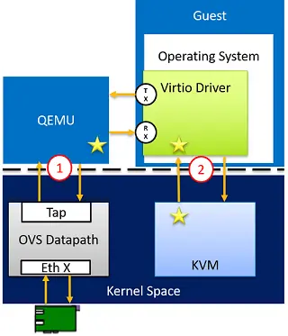
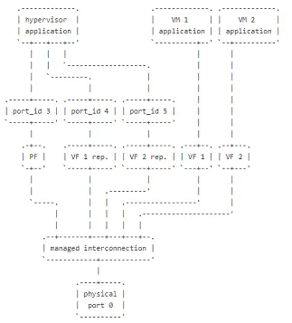

# 网络中虚拟化基础

虚拟化技术旨在将有限的物理资源（CPU、内存等）抽象成更多份的虚拟资源供上层应用使用。最常用的领域有云服务提供商，SDN/NFV，比如：在一台物理服务器上运行成百上千的虚拟机，并将单个虚拟机出租给不同用户。

虚拟化的实现主要由三项关键技术构成：CPU虚拟化、内存虚拟化和I/O虚拟化。其中CPU和内存虚拟化多由硬件支持实现，如intel VT-x、VT-d等IA架构扩展，还有EPT页表等。而I/O虚拟化则没有CPU和内存虚拟化那么统一，由于其大量基于软件实现，因此发展过程中，衍生出了好多种性能、灵活性各异的方案。我们通常所说的全虚拟化和半虚拟化一般都是在网络I/O虚拟化中体现的差异最大。

# 0.virtio

virtio在linux内核和dpdk都有相应的驱动，其中linux内核版本功能更加全面，dpdk版本更注重性能。virtio其实是一个事实上面的标准。

[virtio 1.0标准地址](http://docs.oasis-open.org/virtio/virtio/v1.0/virtio-v1.0.html)

Virtio 是虚拟机 (VM) 环境中虚拟设备的标准化接口。其创建目的在于通过提供可在各种虚拟机管理程序和宿主机的操作系统中实现的一致接口，为虚拟机提供高效的 I/O 操作。

Virtio 涵盖多种类型的设备，包括网络接口 (virtio-net)、块设备 (virtio-blk) 等。

与传统的模拟设备相比，它允许宿主机操作系统通常通过共享内存直接与虚拟机管理程序交互，从而减少了开销。

后面所扫盲的virtio-net、vhost-net和vhost-user。都遵循virtio的标准。下文中的网络I/O半虚拟化就是virtio。

# 1.网络I/O全虚拟化

该方式采用**软件模拟真实硬件设备**。一个设备的所有功能或者总线结构（如设备枚举、识别、中断和DMA）等都可以在宿主机中模拟。而对客户机而言看到的是一个功能齐全的“真实”的硬件设备。其实现上通常需要宿主机上的软件配合截取客户机对I/O设备的各种请求，通过软件去模拟。比如：QEMU/KVM虚拟化中QEMU就可以通过模拟各种类型的网卡。

这种方式的好处是**灵活，不需要专有驱动**，因此能实现既不需要修改客户机、也无需考虑底层硬件，对客户机透明地使用网络资源。但是缺点在于，很多中断信号的处理需要让客户机感觉到自己运行在一个“真实环境”，因此QEMU软件模拟的很底层，**效率低下**。

[mit6.828关于qemu中模拟e1000的资料](https://pdos.csail.mit.edu/6.828/2011/labs/lab6/)

纯虚拟化需要模拟整个硬件，

# 2.网络I/O半虚拟化

在这种虚拟化中，客户机操作系统能够感知到自己是虚拟机，I/O的虚拟化由前端驱动和后端驱动共同模拟实现。**在客户机中运行的驱动程序称之为前端，在宿主机上与前端通信的驱动程序称之为后端。前端发送客户机请求给后端，后端驱动处理完这些请求后再返回给前端。**而在不同的虚拟化机制中，这一过程的实现手段也有所区别，例如：Xen中的共享内存、授权表，KVM中的virtio。它相比于全虚拟化的好处在于，不再需要宿主机上专门的软件去模拟实现I/O请求，因此不会有VM-exit，性能会有所提升。

半虚拟化中的virtio是IBM于2005年提出的一套方案，经过了十多年的发展，其驱动现在基本已经被主流的操作系统接纳编入内核，因此virtio也已经成为半虚拟化的一套事实标准。其主要结构如下图所示，前后端驱动通过虚拟队列通信，虚拟队列中又包含used ring、avail ring和desc ring。下一篇文章中会详解dpdk怎么实现virtio驱动的。

## virtio-net

如下图所示，KVM负责为程序提供虚拟化硬件的内核模块，QEMU利用KVM模拟VM运行环境，包括处理器和外设等；Tap是内核中的虚拟以太网设备，可以理解为内核bridge。

当客户机发送报文时，它会利用消息通知机制通知KVM，并退出到用户空间的QEMU进程，然后由QEMU对Tap设备进行读写（需要说明的是，QEMU是VM运行的主进程，因此才有退出这一说）。
在该模型中，**宿主机、客户机和QEMU存在大量的上下文切换，以及频繁的数据拷贝、CPU特权级切换**，因此性能差强人意。其函数调用路径如下：

**两次报文拷贝**导致性能瓶颈，另外消息机制处理过程太长：报文到达Tap时内核通知QEMU，QEMU利用IOCTL向KVM请求中断，KVM发送中断到客户机。

## vhost-net

针对virtio-net的优化是把QEMU从消息队列的处理中解放出来，直接在宿主机实现了一个vhost-net内核模块，专门做virtio的后端，以此减少上下文切换和数据包拷贝。

其结构如下图所示，以报文接收过程为例。数据通路直接从Tap设备接收数据报文，通过vhost-net内核模块把报文拷贝到虚拟队列中的数据区，从而使客户机接收报文。消息通路是当报文从Tap设备到达vhost-net时，通过KVM向客户机发送中断，通知客户机接收报文。

**在数据通路层面，vhost-net减少了内存拷贝，但是由于其后端运行在内核态，仍然存在性能瓶颈。**

## vhost-user

vhost-user是采用DPDK用户态后端实现的高性能半虚拟化网络I/O。其实现机理与vhost-net类似，但是整个后端包括ovs（openvswitch） datapath全部置于用户空间，更好的利用DPDK加速。

然而由于OVS进程是用户态进程，无权限访问客户机内存，因此需要使用共享内存技术，提前通过socket通信在客户机启动时，告知OVS自己的内存布局和virtio中虚拟队列信息等。这样OVS建立起对每个VM的共享内存，便可以在用户态实现上述vhost-net内核模块的功能。

### vDPA加速的vhost-user

在DPDK加速的vhost-user方案中，还有一次内存拷贝。半虚拟化中仅剩的性能瓶颈也就在这一次拷贝中，intel推出了一款硬件解决方案，直接让网卡与客户机内的virtio虚拟队列交互，把数据包DMA到客户机buffer内，在支持了virtio标准的基础上实现了真正意义上的**零拷贝**。

在18.05以后的DPDK版本中，已经有支持vDPA的feature供选择了。

# 3.I/O透传

对于性能的追求是永无止境的，除了上述全虚拟化、半虚拟化两种I/O虚拟化以外，还有一种非常极端的做法。让物理设备穿过宿主机、虚拟化层，直接被客户机使用，这种方式通常可以获取近乎native的性能。

这种方式主要缺点是：
***1.硬件资源昂贵且有限。***
***2.动态迁移问题，宿主机并不知道设备的运行的内部状态，状态无法迁移或恢复。***

DPDK针对这两点问题都做了一定程度的解决。另外还提供了一种基于硬件的PF（物理功能）转VF（虚拟功能），这相当于在网卡层面上就已经有了虚拟化的概念，把一个网卡的PF虚拟成几十上百个VF，这样可以把不同的VF透传给不同的虚拟机，这就是我们最熟悉的SR-IOV。

对于I/O透传在虚拟化环境中最严重的问题不是性能了，而是灵活性。客户机和网卡之间没有任何软件中间层过度，也就意味着不存在负责交换转发功能的I/O栈，也就不会有软件交换机。那么如果要想有一台server内部的软件交换功能如何实现呢。业界的主要做法是把交换功能完全下沉到网卡，直接在智能网卡上实现虚拟交换功能。这又带来了另一个问题，成本和性能的权衡。

而DPDK 18.05以后的版本似乎也解决了这一灵活性问题，为了充分发掘标准网卡（区别于智能网卡）在flow（流）层面上的功能，推出了VF representer。可以直接将OVS上的流表规则下发到网卡上，实现网卡在VF之间的交换功能，这样就实现了高效灵活的虚拟化网络配置。
