# DPDK LPM库使用指南

**路由**可以理解为路标，它指向了数据包下一跳应该走向哪里。网络是一跳一跳往前推进的，因此在每一跳都要有一系列的指向标(即路由)。对于网络设备，它也是影响转发效率的关键因素。

路由由三元素组成：**目标地址，掩码，下一跳。**

## 路由查找算法干了什么

看一个例子。

下面就是一个典型的网络拓扑图:


该拓扑中RouterA的路由表如下:


接着看下图


如果PC1想要访问PC2或PC3，对于路由器A来说只需要把包送到NextHop(下一跳)192.168.4.2即可，对于路由器而言就是把包送到出接口Ethernet 0/0/0。


同时关键在于，对于路由表而言目的地是：Destination/Mask(目的地址+网段)。

所以路由查找的功能很明确了：**PC想要访问的IP为A，那么通过A查找A属于的网段是否在路由表中，如果没有则返回Destination Unreachble。如果有则返回NextHop。**

## 路由匹配算法

1. EM（精确匹配）：

是最基本的路由匹配算法，对数据包的 IP 5-tuple 执行 Hash function 得到 Hash value，与 Route table 中的 Hash key 完全一致时匹配下一跳。基于 HASH match 具有更高的性能。
然而，它对路由表的依赖较大，需要路由表中有一个完全匹配的项才能成功路由。

2. **LPM（最长前缀匹配）：**

是基于 CIDR 的路由匹配算法，当数据包的 dstIP 地址和 Route table 中最长的 IP/Netmask 匹配时，找到下一跳。具有更好的灵活性。

这里给CIDR做一下扫盲。

如图所示就是CIDR格式划分的网络ip。CIDR的本质是在路由表中加入子网掩码，并根据该列信息对网络进行分割，而不是根据默认的A，B，C进行分割。


下面看一个实际例子:


如果配置的IP为`10.100.122.2/24`来说的话，这个配置不仅表明了这台主机的IP同时隐含了该网段的信息。

原始LPM的实现可以为如下:


根据掩码位数分类为不同的hash表，有多个hash表组成。

随着网络的发展和规模的扩大，原始的LPM算法面临着一系列的挑战，包括查找速度、内存占用和更新效率等问题。

## DPDK LPM中的算法

经过统计分析，查找的IP掩码长度绝大多数是小于等于24位的，因此DPDK中的LPM实现综合考虑了时间和空间问题，做了一个比较好的折中，将32位的地址空间分为两部分：高24位，低8位。

绝大部分可以通过一次内存访问便可以找到对应的路由；当查找的IP掩码长度超过24时，需要两次访问内存，而这种情况相对较少。

下面是其核心算法思想:


DPDK的LPM算法实现就和图中一致。

采用两级hash表，且将32bit的IP地址分为两个部分:

1. tbl24(24bit): 1张2^24规格的hash表
2. tbl8(8bit): 一张2^8规格的hash表

具体查找上文提过了，小于24bit时查tbl24表查一次。大于查两次表。

具体行为如下图所示:


## DPDK LPM浅析

DPDK LPM（Longest Prefix Match）库是一个高性能的前缀路由匹配库，用于在数据包转发过程中快速查找与 dstIP 地址最长匹配的路由表项。

LPM 库支持动态配置路由表，可以在运行时添加、删除或修改路由表项，以适应网络拓扑的变化。

### LPM 主要接口函数


其实核心api就三个:

```c
/**
 * Add a rule to the LPM table. // 添加路由规则到LPM表中
 *
 * @param lpm
 *   LPM object handle // lpm表实例
 * @param ip
 *   IP of the rule to be added to the LPM table // ip地址
 * @param depth
 *   Depth of the rule to be added to the LPM table // 子网掩码
 * @param next_hop
 *   Next hop of the rule to be added to the LPM table // 下一跳
 * @return
 *   0 on success, negative value otherwise
 */
int
rte_lpm_add(struct rte_lpm *lpm, uint32_t ip, uint8_t depth, uint32_t next_hop);

/**
 * Delete a rule from the LPM table. // 从LPM表中删除路由规则
 *
 * @param lpm
 *   LPM object handle  // LPM表实例
 * @param ip
 *   IP of the rule to be deleted from the LPM table // ip地址
 * @param depth
 *   Depth of the rule to be deleted from the LPM table // 子网掩码
 * @return
 *   0 on success, negative value otherwise
 */
int
rte_lpm_delete(struct rte_lpm *lpm, uint32_t ip, uint8_t depth);

/**
 * Lookup an IP into the LPM table. // 从LPM表中查找ip的下一跳
 *
 * @param lpm
 *   LPM object handle                      // LPM表实例
 * @param ip
 *   IP to be looked up in the LPM table    // ip地址
 * @param next_hop
 *   Next hop of the most specific rule found for IP (valid on lookup hit only) // 最符合的规则
 * @return
 *   -EINVAL for incorrect arguments, -ENOENT on lookup miss, 0 on lookup hit
 */
static inline int
rte_lpm_lookup(struct rte_lpm *lpm, uint32_t ip, uint32_t *next_hop)
```

这三个api对应了增，删，查。(先删除再增加就对应了改)

下面从代码角度分析DPDK LPM的相应逻辑。

### LPM结构

一张有2^24条目的一级表叫做tbl24。

多张(默认为256)2^8条目的二级表称为tbl8。


这里以dpdk19.08， rte_lpm的ipv4为例，重要结构为`rules_tbl`、`rule_info`,`rte_lpm_tbl8_entry`和`rte_lpm_tbl24_entry`。

其中`rule_info`是`rules_tbl`的快速访问索引。

`rules_tbl`保存的是实际路由规则。(路由信息,该规则用来确定出接口,当删除的时候该结构可以使得LPM表快速收敛)

下面是一些细节，dpdk怎么计算规则所需内存大小的如下:

```c
#define RTE_LPM_TBL8_GROUP_NUM_ENTRIES  256
rules_size = sizeof(struct rte_lpm_rule) * config->max_rules;
tbl8s_size = (sizeof(struct rte_lpm_tbl_entry) *
      RTE_LPM_TBL8_GROUP_NUM_ENTRIES * config->number_tbl8s);

```

下面是详细`rte_lpm_tbl_entry`结构说明:

```c
struct rte_lpm_tbl_entry {
    uint32_t next_hop    :24;  // 当为 tbl24 节点且此节点上挂载 tbl8 的时候, 此数据表示 tbl8 的开始索引；当为 tbl24 节点, 但是此节点上不存在 tbl8 的时候, 此数据为真实的下一跳。
    uint32_t valid       :1;   // 表明此节点是否有效
    uint32_t valid_group :1;  // 当为 tbl24 节点的时候 valid_group 为 1 表明 next_hop 为 tbl8 的开始索引，为 ０ 则表示真实的下一跳。
    uint32_t depth       :6;
};
```

这个结构可以理解为模板，实际上tbl24和tbl8如下:

```c
struct rte_lpm_tbl24_entry {
    // 该字段为下一跳或tbl8的索引
    union {
        uint8_t next_hop;
        uint8_t tbl8_gindex;
    }
    ....
    // 其余字段和rte_lpm_tbl_entry一致
}

// tbl8结构和rte_lpm_tbl_entry完全一致
```

### LPM创建

```c
/*
功能：创建一个新的 LPM table。

参数：

name：LPM table 的名称。
socket_id：LPM table 在哪个 NUMA socket 上分配。
config：LPM table 的配置信息。
返回值：

成功：指向新创建的 LPM table 的指针。
失败：NULL。
*/
struct rte_lpm *
rte_lpm_create(const char *name, int socket_id,
		const struct rte_lpm_config *config);
```


这个过程中，主要是一些变量的进程和初始化，分配内存，最终把新创建的LPM对象添加到全局LPM表队列的尾部。

下图是dpdk创建后的大致内存布局：


这里说明下，为了提高访问速度，是顺序存储的所有表项。


### LPM添加

根据一个实际例子说明LPM的插入。

这些是创建时候的结构体，右边是tbl24和tbl8的结构体。rules_tbls的长度根据传入的配置参数确定。

1. 初始表的状态如下:

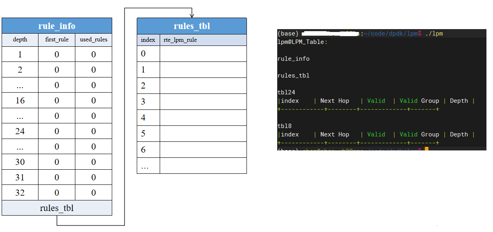


2. 添加 192.168.3.0/24  nexthop=123后表如下:

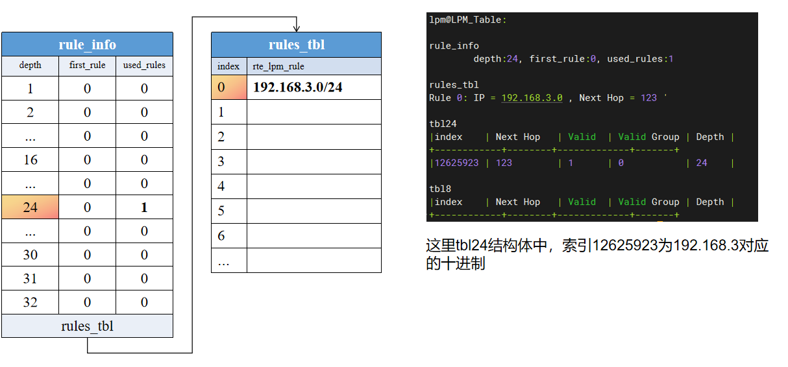

这里以添加192.168.3.0/24的为例，nexthop可以为ip也可以为指定标识，这里以123代替。

`rule_info`中的`first_rule`是该depth对应`rules_tbl`中的索引，`used_rules`是使用的数量。

第一个表中rule_info depth为24。

3. 添加 192.168.3.44/32 nexthop=456后表如下:

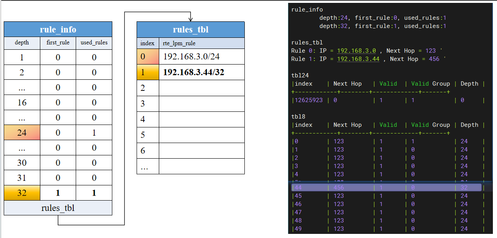

在有24长度的基础上，插入了一个掩码长度为32的，除了`rule_info` ,`rules_tbl`中的变化，可以看到tbl24中 valid group、NextHop Depth 的值也变了
valid group代表是该tbl24还有对应的tbl8，nextHop是指向的tbl8的块数（程序最开始申请了`number_tbl8s`个tbl8，每个固定大小为256）

这里添加了后，再查找其实有问题，后面查找时候解释。


4. 添加 192.168.0.0/16 nexthop=789

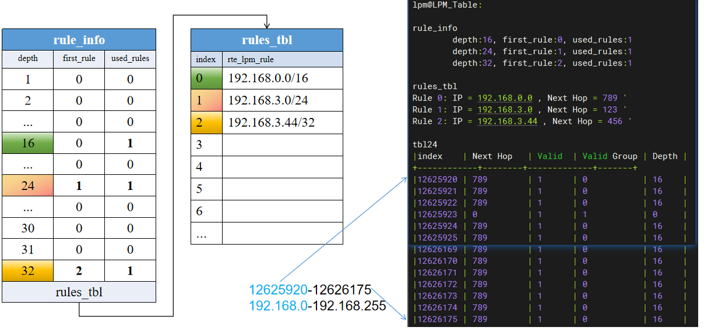

这里直接添加了一个掩码为长度16的，可以看到`rules_tbl`这个地方是有位置改变的，不但添加了192.168.0.0/16，还被移动到了index=0的位置。

右边的话，主要是看tbl24这个表，tb8和之前是没有变化的，tbl24中192.168.0-192.168.255的全部设置为nextHop 789，之前添加过的路由192.168.3.*的除外，并没有更改。

要说明下添加的掩码越短，对应的条目越多。

从刚添加的长度16的掩码的网段可以看出，dpdk的lpm算法有如下特点:

1. 如果该掩码下没有rule组（如下图中的掩码2），此时需要根据前一个掩码位置来计算(图中根据掩码1所占用的rule空间来计算得到)

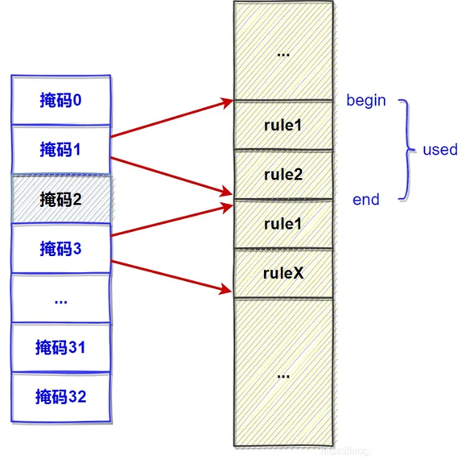

2. 当找到空间后，由于所有的rule全部存储在一个大数组里，如果插入/删除元素需要移动后续元素。
3. **插入元素时，并非将所有后续元素都后移一位**，而是每组移动一个（每组第一个移到下一组第一个位置），这样就可以减少内存拷贝的开销。(如下图)

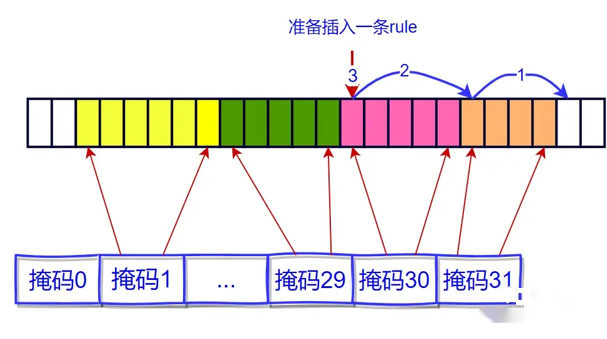

### LPM查找

查找代码的具体实现见右侧，其实比较简单。大多数情况直接查找tbl24就可以，少部分需要二次查找。

由于tbl_entry结构体本身是一个4字节的，这里直接当作uint32_t用，需要某个字段时和对应的标志作位运算。

逻辑简单直接看代码:

1. `ptbl = (const uint32_t *)(&lpm->tbl24[tbl24_index]);`查tbl24。
2. 如果有需要`ptbl = (const uint32_t *)&lpm->tbl8[tbl8_index];`查tbl8。

```c
int rte_lpm_lookup(struct rte_lpm *lpm, uint32_t ip, uint32_t *next_hop)
{
	unsigned tbl24_index = (ip >> 8);
	uint32_t tbl_entry;
	const uint32_t *ptbl;

	/* DEBUG: Check user input arguments. */
	if((lpm == NULL) || (next_hop == NULL))
		errno = -EINVAL;

	/* Copy tbl24 entry */
	ptbl = (const uint32_t *)(&lpm->tbl24[tbl24_index]);
	tbl_entry = *ptbl;

	/* Memory ordering is not required in lookup. Because dataflow
	 * dependency exists, compiler or HW won't be able to re-order
	 * the operations.
	 */
	/* Copy tbl8 entry (only if needed) */
	//unlikely
	if ((tbl_entry & RTE_LPM_VALID_EXT_ENTRY_BITMASK) ==
			RTE_LPM_VALID_EXT_ENTRY_BITMASK) {

		unsigned tbl8_index = (uint8_t)ip +
				(((uint32_t)tbl_entry & 0x00FFFFFF) *
						RTE_LPM_TBL8_GROUP_NUM_ENTRIES);

		ptbl = (const uint32_t *)&lpm->tbl8[tbl8_index];
		tbl_entry = *ptbl;
	}

	*next_hop = ((uint32_t)tbl_entry & 0x00FFFFFF);
	return (tbl_entry & RTE_LPM_LOOKUP_SUCCESS) ? 0 : -ENOENT;
}
```

下面看一个例子:

1. 查找 192.168.3.0  nexthop=?

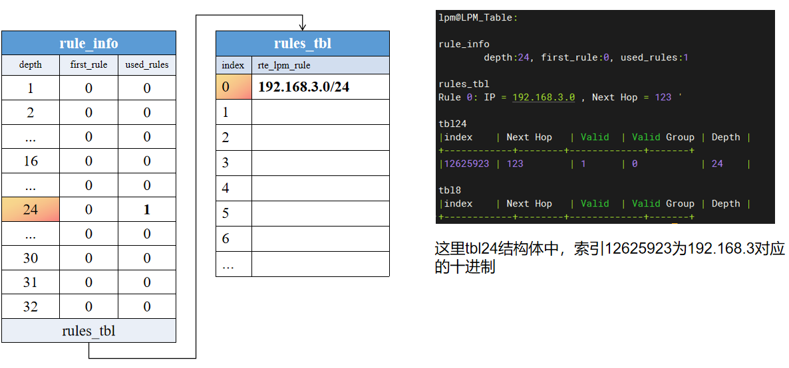

根据代码，在tbl24中找到对应的索引，根据标记该表项没有tbl8，直接使用tbl24中的next hop，得到123

2. 查找 192.168.3.0  nexthop=?

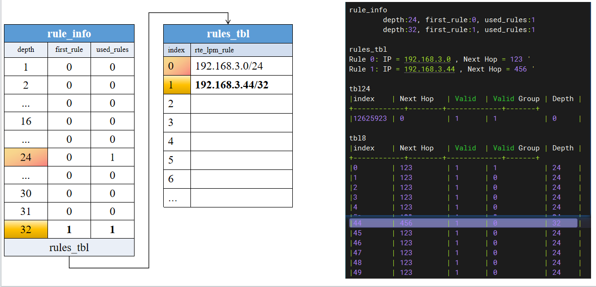

这里还是查找192.168.3.0，只不过是这个时候有插入192.168.3.44/32基础上。这个时候查找3.44不用说，肯定查一次tbl24，一次tbl8。

那么这个时候查找192.168.3.0，可以看到tbl24表中的下一条并不是我们想要的123，根据标志位`valid group`，知道有tbl8表，next hop对应的是第几个tbl8，然后在这个tbl8中，在用ip的低八位为索引找nexthop，这里其实查找192.168.3.0，是查了tbl24和tbl8两张表。最后的结果next hop是正确的但是由于dpdk 算法实现导致了子网存在包含关系的表查找效率下降了。

### LPM删除

路由的删除应该也是最能体现算法效率的地方。如何在删除一个路由后，能快速更新相关子网的路由信息这是问题的关键。(快速收敛)

查找的主要流程如下图:

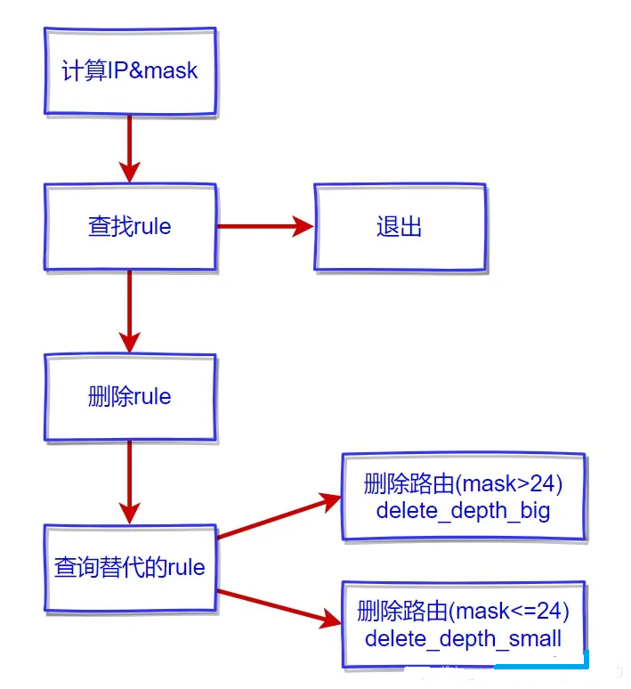

`rule_info`和`rules_tbl`查找时候没有用上，但是插入时候还一直维护来着，这里就是为删除做准备的。

下面可以看一下删除的过程:

假如有路由表如图所示。(删除 192.168.3.0/24 前)

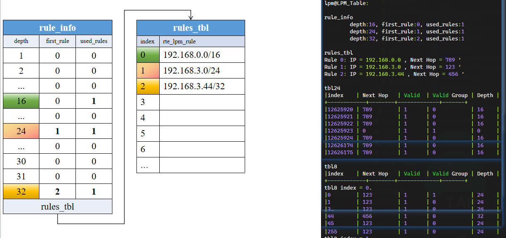

接着将在该表中删除192.168.3.0/24，然后删除192.168.0.0/16。

删除 192.168.3.0/24 后表如下图。

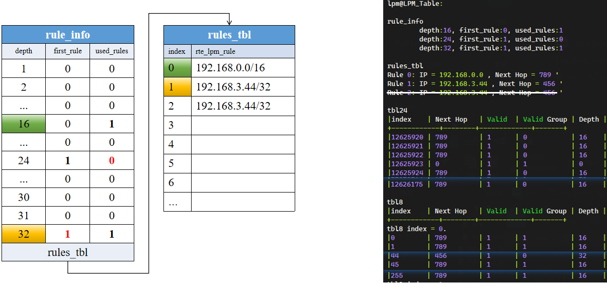

删除后192.168.3.0对应的tbl8里面的所有内容都更新为.0.的下一条了。

接着还原表，删除 192.168.0.0/16 前 。

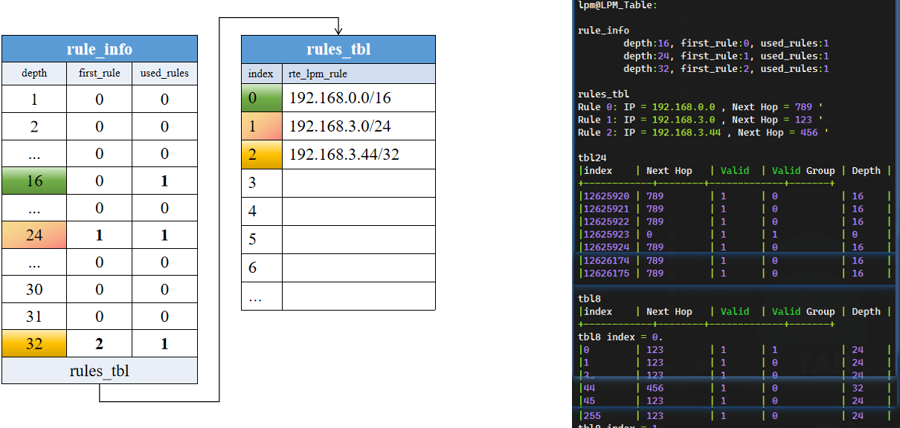

删除 192.168.0.0/16 后,lpm表如下图:

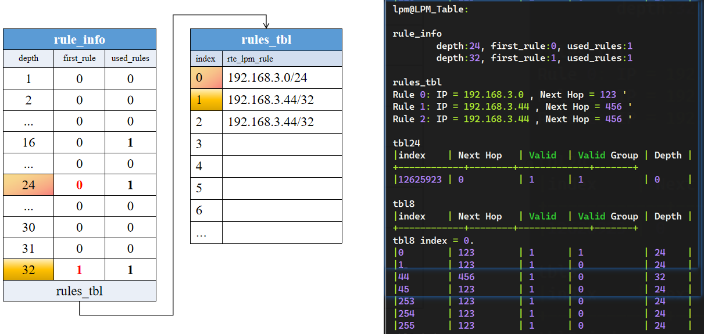

这里可能会有疑惑，如果这个时候把192.168.3.44/32删除了，那么还会有tbl8吗?

这里实验了一下，tbl8中的内容并没有删除，只是把tbl24中的valid group设为0。

本文的所有代码我都实现了一份不依赖dpdk环境的，放在了 example-code/lpm中，编译方法`gcc -o lpm lpm.c main.c`。其中内存有不少注释方便理解。

# 总结

DPDK的LPM表核心是24-8双表查找，使用的话知道增，删，查即可。