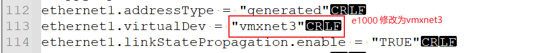
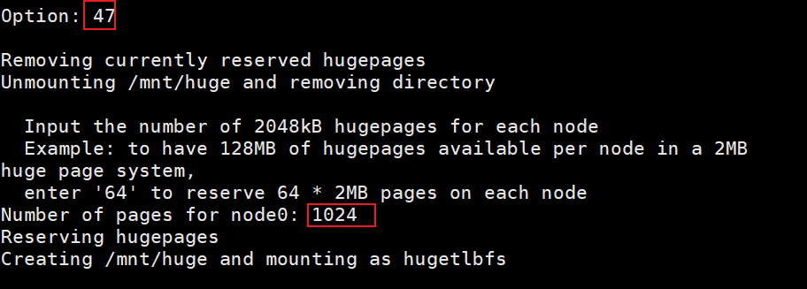

### Dpdk环境搭建

虚拟机搭建dpdk实验环境:需要vmware + ubuntu16.04

#### 1.vmware至少添加两块网卡


dpdk要绕过内核协议栈所以需要直连也就是桥接模式，桥接网卡作为DPDK运行网卡。

nat网卡作为ssh连接的网卡。

#### 2.修改vmware配置文件

打开虚拟机的配置文件即`xxx.vmx`文件,找到对应的网卡设置,将其修改为多队列网卡。在我的虚拟机是将ethernet1.virtualDev由e1000修改为vmxnet3,vmware实现的vmxnet3是支持多队列的网卡。



当然也可以多配置几张桥接网卡,设置相同。

#### 3.查看系统是否支持多队列网卡

执行`cat /proc/interrupts`显示如果如下图网卡不止一个rxtx就可以知道支持该网卡支持多队列:


#### 4.编译dpdk

在 https://core.dpdk.org/download/ 网址选择版本下载。
随便挑选版本，不同版本直接子系统接口会有差异，建议选择 dpdk 19.08.2

解压后dpdk目录如下:


进入usertools目录然后执行`dpdk-setup.sh`脚本。

输入39执行编译:


#### 5.设置dpdk相关的环境变量


```bash
export RTE_SDK=/home/dpdk
export RTE_TARGET=x86_64-native-linux-gcc
```

这里的路径是官网的dpdk源码包解压后的路径,比如我的主机上是`/home/he/dpdk-stable-19.08.2`,所以`export RTE_SDK=/home/dpdk`要改为`export RTE_SDK=/home/he/dpdk-stable-19.08.2`

#### 6.分配大页内存并绑定UIO

设置完对应环境变量后,再次执行`./usertools/dpdk-setup.sh`。

- 分配大页内存的操作为

输入47,然后再输入2M的hugepages的个数,一般为1024即分配2GB的空间给dpdk。

操作如下图:



- 绑定igb_uio到网卡的操作为:

输入43插入IGB_UIO模块，选择网卡为vmxnet3需要加载此驱动
注: 选择44则是插入VFIO模块,选择网卡为e1000需要加载此模块

然后输入49绑定IGB_UIO模块,操作如下图:

还需要输入要绑定的网卡的pci地址。(网络设备是PCI设备驱动,在linux中唯一标识即为pci地址)


当然可以直接通过脚本进行绑定,通过如下两个命令.

```bash
ifconfig eth0 down
./usertools/dpdk-devbind.py --bind=igb_uio eth0
```
dpdk-devbind.py还有以下几个功能:

```bash
# 显示所有网卡的状态
dpdk-devbind.py --status
# 显示特定网卡的状态
dpdk-devbind.py --status-dev net
# 将igb_uio绑定到eth1
dpdk-devbind.py --bind=igb_uio eth1
# 把pci地址为0000:01:00.0的网卡解绑dpdk驱动
dpdk-devbind.py -u 0000:01:00.0
# 把pci地址为02:00.0和02:00.1的网卡绑定为普通的ixgbe驱动
dpdk-devbind.py -b ixgbe 02:00.0 02:00.1
```

#### 7.编译dpdk程序并运行

进入example/helloworld目录
路径如下图:


直接make,或者通过`gcc -o helloword main.c -I /usr/local/include/dpdk/ -ldpdk -lpthread -
lnuma -ldl`即可编译该程序。

输入以下命令运行(最好加入sudo运行):

```bash
./helloworld -l 0-3 -n 4
```

参数-l是指该程序运行在哪几个(cpu)核心列表,是介于0和128之间的数值。-n指定内存通道数。

输出如下,注helloworld程序要成功运行需要绑定dpdk的vfio驱动:


上述即为dpdk的安装流程,新版本和老版本的dpdk安装过程都是类似的。

dpdk更新的版本没有包含驱动需要取网站下载,安装教程如下:

#### 8. 手工安装新版本的dpdk

```shell
tar xJf dpdk-<version>.tar.xz
cd dpdk-<version>
meson -Denable_kmods=true build # enable_kmods要生成dpdk依赖的内核模块
cd build
ninja
ninja install # 需要root权限
ldconfig      # 需要root权限
```

去掉已经加载的uio和igb_uio驱动然后加载igb_uio,由于高版本的dpdk没有驱动了需要去 http://git.dpdk.org/dpdk-kmods/ 下载

```shell
git clone http://dpdk.org/git/dpdk-kmods # 下载dpdk的内核模块
cd dpdk-kmods/linux/igb_uio
make # 编译igb_uio驱动
modprobe uio       # 加载uio
insmod igb_uio.ko  # 加载igb_uio
```
#### 9.dpdk使用

##### 1.dpdk使用前配置

1. 临时配置1024个2M的大页内存

首先分配1024个2M的大页内存,然后创建一个挂载目录,并将大页文件系统挂载至挂载目录上,等待程序使用。

对于单numa设备使用如下命令:

如果是分配1G的大页内存就是在hugepages-1048576kB上分配。

```shell
echo 1024 > /sys/kernel/mm/hugepages/hugepages-2048kB/nr_hugepages
mkdir /mnt/huge
mount –t hugetlbfs nodev /mnt/huge
```

对于双numa设备使用如下:

```shell
echo 1024 > /sys/devices/system/node/node0/hugepages/hugepages-2048kB/nr_hugepages
echo 1024 > /sys/devices/system/node/node1/hugepages/hugepages-2048kB/nr_hugepages
mkdir /mnt/huge
mount –t hugetlbfs nodev /mnt/huge
```

2. 永久配置大页内存

通过修改grub2.cfg,增加内核启动参数,实现系统启动后自动分配大页内存.

找到类似如下语句

```vim
linux16 /vmlinuz-3.10.0-327.el7.x86_64 root=UUID=89757b2e-b7c1-43a6-b20b-0e98ed458e48 ro crashkernel=auto rhgb quiet LANG=zh_CN.UTF-8
```

若配置1G大页内存则在末尾处添加

```vim
default_hugepagesz=1G hugepagesz=1G hugepages=4
```

若配置2M大页内存则在末尾处添加

```vim
default_hugepagesz=2M hugepagesz=2M hugepages=1024
```

3. 加载uio驱动

在运行DPDK程序之前,需要将所需的用户态驱动加载到内核。DPDK提供了igb_uio模块,可通过如下命令加载(和其他内核模块加载方式相同)

```shell
insmod igb_uio.ko 
```

4. 加载VFIO驱动

DDPDK程序选择使用VFIO时,需要加载vfio-pci模块,通过如下命令加载

```shell
modprobe vfio-pci
```


##### l2fwd的使用

```shell
./l2fwd -c 1 -n 2 -- -q 1 -p 1
```

运行参数解析:

```
-c : 设置要运行的内核的十六进制位掩码,此处使用1个核心(其值位十六进制位掩码)
-l : 要运行的核心列表
-n : 每个CPU的内存通道数
--  : 表示之后为次参数
-q : 每个CPU管理的队列数，这里设置为一个队列
-p : PORTMASK: 要使用的端口的16进制位图，此处设置为第一个端口
```

##### kni的使用

```shell
./kni [EAL options] -- -p PORTMASK [-P] [-m] [–config=”(port, lcore_rx, lcore_tx, lcore_kthread…) [, (port, lcore_rx, lcore_tx, lcore_kthread…) ]” ]
```

```
-p PORTMASK : 要使用的端口的16进制位图
-P : 设置的话意味着混杂模式,以便不区分以太网目的MAC地址,接收所有报文。
不设置此选项,仅目的MAC地址等于接口MAC地址的报文被接收。
-m : 使能监控模式并更新以太网链路状态。此选项需要启动一个DPDK线程定期检查物理接口链路状态,同步相应的KNI虚拟网口状态。
意味着当以太网链路down的时候,KNI虚拟接口将自动禁用,反之,自动启用。
EAL选项核心掩码-c或者-l核心列表参数必须包含有以上的lcore_rx和lcore_tx参数中指定的核心,但是,不
需要包含lcore_thread参数指定的核心,因为其实rte_kni模块中用来绑定内核线程的核心（不能超出CPU核心数量）
```

示例：
以下命令首先以多线程模式加载rte_kni内核模块。其次,kni应用指定两个接口（-p 0x3）启动;根据--config参数可知,接口0（0,4,6,8）使用核心4运行接收任务,核心6运行发送任务,并且创建一个KNI虚拟接口vEth0_0,启动一个内核处理线程绑定在核心8上。类似的接口1（0,5,7,9）使用核心5运行接收任务,核心7运行发送任务,并且创建一个KNI虚拟接口vEth1_0,启动一个内核处理线程绑定在核心9上.

```shell
rmmod rte_kni
insmod rte_kni.ko
./kni -l 4-7 -n 4 -- -P -p 0x3 -m --config="(0,4,6,8),(1,5,7,9)"
```
