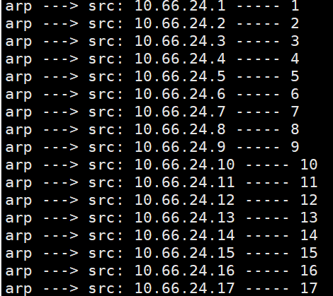
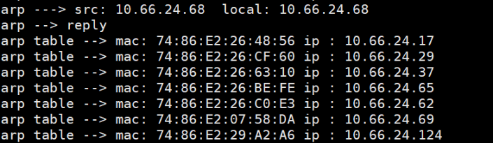
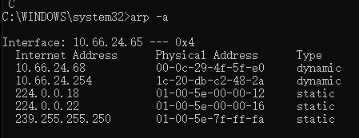

# arp表

在 [arp基础知识](arp_basic.md) 一章中，提到了arp广播和arp表。arp表的作用很明显，通过维护一张ip到mac的表本机可以快速的进行包的转发(查表获取mac地址而无需通过发送arp请求获取对应ip的mac再进行转发)。而怎么获取arp表呢？通过arp广播就能获取到了，此时有个问题。如果一直不停的进行arp广播倒是能获取到最新的ip和mac的映射。但是这种对网络负担太大了所以有了arp表老化时间，最简单的arp表老化实现思路即为等老化的时候再进行arp广播更新arp表。

所以实现arp广播以及arp表的逻辑很简单，定时对该网段的每一个ip发送arp请求获取其arp响应，更新arp响应传递的mac字段到arp表。

本章针对上一章所做的修改 [diff](../../src/example/05_arptable/free_arp.patch)

为了更接近真实的项目，采用内核链表来组织arp表。

将内核链表封装成arp表的代码在 [arp.h](../../src/example/05_arptable/arp.h)

本章目的:

1. 实现arp表
2. 实现arp广播

## arp表实现

**1.arp表结构如下**:

```c
#define ARP_ENTRY_STATUS_DYNAMIC    0
#define ARP_ENTRY_STATUS_STATIC     1

// arp lists
LIST_HEAD(arp_table); // arp table的初始化,其实arp_table是头结点。
int arp_count = 0; // 记录表中的arp entry个数
// arp表中实例结构,通过指针链成双向链表。整个链表即为arp表
typedef struct arp_entry_t {
  uint32_t ip;                          // ip地址
  uint8_t hw_addr[RTE_ETHER_ADDR_LEN];  // mac地址

  uint8_t type;                         // 类型(动态还是静态)

  // 缺少index字段，为了简单去掉

  struct list_head entry; // 前驱 next, 后继是 prev.都在此结构中
}arp_entry;
```
**1.初始化双向链表**

`LIST_HEAD(arp_table)`作用是初始化一个双向链表，声明为arp_table。

**2.声明arp表项**

`arp_entry_t`是arp表中具体内容的结构体。总共有四个成员变量，ip地址，mac地址，arp类型以及链表指针`entry`。

**2.通过arp表查找mac地址的函数实现如下**

```c
// 查表操作,获取发送arp replay的对端的mac地址
uint8_t* ht_get_dst_macaddr(uint32_t dip) {
  struct list_head *cursor;
  list_for_each(cursor, &arp_table) {
    arp_entry *tmp = list_entry(cursor, arp_entry, entry);
    if (dip == tmp->ip) { // dip在表中被查到则找到了
      return tmp->hw_addr;
    }
  }
  return NULL;
}
```

代码非常简单，声明一个`cursor`指针作为游标。然后通过`list_for_each`遍历`arp_table`链表中的所有表项。当目的ip存在与arp表中的时候直接返回hw_addr变量(mac地址)。

## 实现arp表的更新

**1.初始化dpdk的定时器**

```c
// 增加头文件
#include <rte_timer.h>

// 宏定义,每隔TIMER_RESOLUTION_CYCLES广播arp
#define TIMER_RESOLUTION_CYCLES 120000000000ULL // 10ms * 1000 = 10s * 6

// 给本机声明一个自己的mac地址(这里是给dpdk程序)
static uint8_t g_default_arp_mac[RTE_ETHER_ADDR_LEN] = {0xFF, 0xFF, 0xFF, 0xFF, 0xFF, 0xFF};
```

还需要再`main`函数里初始化定时器。以及触发后重置定时器

```c
int main()
{
  ...
  /* 定时器初始化 */
  rte_timer_subsystem_init();
  // 初始化定时器结构arp_timer
  struct rte_timer arp_timer;
  rte_timer_init(&arp_timer);
  // 获取定时器频率,设置定时器
  uint64_t hz = rte_get_timer_hz();
  unsigned lcore_id = rte_lcore_id();
  // PERIODICAL代表多次触发,SINGLE则定时器单次触发
  // 重置定时器,这里也可以当做初始化
  rte_timer_reset(&arp_timer, hz, PERIODICAL, lcore_id, arp_request_timer_callback, mbuf_pool);
  /*end of timer init */
  ...
    // 启动定时器,定时执行arp_request_timer_callback函数回调
    uint64_t prev_tsc = 0, cur_tsc; // 上一次时间, 当前时间
    uint64_t diff_tsc;

    cur_tsc = rte_rdtsc();
    diff_tsc = cur_tsc - prev_tsc;
    if (diff_tsc > TIMER_RESOLUTION_CYCLES) {
      rte_timer_manage();
      prev_tsc = cur_tsc;
  }
}
```

其中`rte_timer_reset`函数的参数为:
```c
int rte_timer_reset (struct rte_timer *  tim,
  uint64_t    ticks, enum rte_timer_type type,
  unsigned    tim_lcore,  rte_timer_cb_t  fct, void *  arg 
)
```

功能:启动或者重置定时器，当定时器经过一定时间间隔超时后，会在tim_lcore指定的core上调用fct函数，函数参数是arg。

如果timer当前处于运行状态(Running)，函数会调用失败，所以应检查函数返回值查看timer是否处于运行状态

如果timer在其他core上被设置，即（CONFIG 状态），函数也返回失败。

1. time:timer句柄

2. ticks:超时时间，参考rte_get_hpet_hz（）的使用

3. type:取值PERIODICAL或SINGLE
    PERIODICAL：定时器触发，并执行后自动加载
    SINGLE：定时器仅仅触发一次。执行后进入STOPPED 状态

4. tim_lcore:指定这个定时器回调函数在哪个core上面运行；，如果tim_lcore 值为LCORE_ID_ANY，则以轮询方式在不同的核上执行回调函数。

5. fct:定时器回调函数,

6. arg:回调函数的参数

其中fct函数原型为`typedef void(* 	rte_timer_cb_t) (struct rte_timer *, void *)`。可知其参数为`struct rte_timer`和`void *`,而函数返回值是`void`类型。

后面调用`rte_timer_manage()`就是到达定时时间后代码再次触发注册的回调函数`arp_request_timer_callback`。

**2.arp_request_timer_callback回调(广播arp)实现详解**

这里的功能其实就是向同网段的所有ip发送一个arp request。

1. 获取发送arp request所需的内存空间
2. 遍历从1到254同网段下的主机ip
3. 每次遍历过程中构造arp request包并进行发送。(这里如果arp表里面存在dst_ip中的mac地址就将其填充到arp协议dmac字段，如果不存在就填默认mac。个人感觉这里填任意值都可以，反正是为了获取arp reply来更新mac表)

先来看定时发送arp请求的实现，即实现`rte_timer_reset(&arp_timer, hz, PERIODICAL, lcore_id, arp_request_timer_callback, mbuf_pool);`调用中的注册的函数`arp_request_timer_callback`。

1,2,3步骤的实现都在这个函数里。

```c
void arp_request_timer_callback(__attribute__((unused)) struct rte_timer *tim,
  void *arg) {
  // 发送arp request所需的mbuf
  struct rte_mempool *mbuf_pool = (struct rte_mempool *)arg;
  // 定时发送
  int i = 0;
  for (i = 1; i <= 254; i++) { // 局域网每一台机器都发送一个arp request
    uint32_t dst_ip = (g_local_ip & 0x00FFFFFF) | (0xFF000000 & (i << 24));

    char ip_buf[16] = {0};
    printf("arp ---> src: %s ----- %d\n", inet_ntoa2(dst_ip, ip_buf), i);

    struct rte_mbuf* arp_buf = NULL;
    uint8_t *dst_mac = ht_get_dst_macaddr(dst_ip);
    // 如果arp table里面没有对应dst ip地址,那么arp hdr和ether hdr中的dmac字段自己构造发送.
    if (dst_mac == NULL) {
			// arp hdr --> mac : FF:FF:FF:FF:FF:FF
			// ether hdr --> mac : 00:00:00:00:00:00
			arp_buf = ht_send_arp(mbuf_pool, RTE_ARP_OP_REQUEST, g_default_arp_mac, g_local_ip, dst_ip); 
    } else { // 常规的arp request发送
      arp_buf = ht_send_arp(mbuf_pool, RTE_ARP_OP_REQUEST, dst_mac, g_local_ip, dst_ip);
    }

    rte_eth_tx_burst(g_dpdk_port_id, 0, &arp_buf, 1);
    rte_pktmbuf_free(arp_buf);
  }
}
```

`for`循环是为了每个ip都发送一次arp request(这里实现很暴力且不完整因为可以去掉本机的ip)。

其中通过位运算来修改待发送的dst_ip地址，实现如下。

`uint32_t dst_ip = (g_local_ip & 0x00FFFFFF) | (0xFF000000 & (i << 24));`

后续的逻辑很简单，构造arp包然后通过`rte_eth_tx_burst`发送到对端即可，同时别忘了释放内存调用`rte_pktmbuf_free`。

这个代码以例子来说明，比如我本机ip是`10.66.24.68`,那么获取到的dst_ip为`10.66.24.1`-`10.66.24.254`。


3.主流程中更新arp表功能详解

发送了arp reply后，存活的主机往往会返回一个arp response给发送方。

此时需要处理arp响应并保存其返回的其本机mac值。

下面是处理arp包的流程:

1. 当arp包的目标ip是当前主机的ip(`g_local_ip`)才进行arp表更新
2. 如果是arp请求，则构造arp响应包发送过去
3. 如果是arp响应包，先查找其mac地址是否在arp表中，不在则插入arp表。
4. 遍历此时的arp表使用`list_for_each`接口输出每个表项的值。

```c
if (ehdr->ether_type == rte_htons(RTE_ETHER_TYPE_ARP)) {
  // 获取arp头
  struct rte_arp_hdr *arp_hdr = rte_pktmbuf_mtod_offset(mbufs[i], 
      struct rte_arp_hdr *, sizeof(struct rte_ether_hdr));
  
  char ip_buf[16] = {0};
  printf("arp ---> src: %s ", inet_ntoa2(arp_hdr->arp_data.arp_tip, ip_buf));
  printf(" local: %s \n", inet_ntoa2(g_local_ip, ip_buf));
  // 由于arp request是广播,判断目标地址相同才返回arp response
  if (arp_hdr->arp_data.arp_tip == g_local_ip) {
    if (arp_hdr->arp_opcode == rte_htons(RTE_ARP_OP_REQUEST)) {
      printf("arp --> request\n");
      // 接收到arp request包后返回arp response。注:request里的源ip是response里的目的ip
      struct rte_mbuf *arp_buf = ht_send_arp(mbuf_pool, RTE_ARP_OP_REPLY, arp_hdr->arp_data.arp_sha.addr_bytes, 
        arp_hdr->arp_data.arp_tip, arp_hdr->arp_data.arp_sip);
      rte_eth_tx_burst(g_dpdk_port_id, 0, &arp_buf, 1);
      rte_pktmbuf_free(arp_buf);
      // 处理arp响应的流程(这里对端发送arp reply,这个值要记录到arp表里)
    } else if (arp_hdr->arp_opcode == rte_htons(RTE_ARP_OP_REPLY)) {
      printf("arp --> reply\n");
      
      uint8_t *hw_addr = ht_get_dst_macaddr(arp_hdr->arp_data.arp_sip);
      // 如果接收到了arp reply,但是查表找不到对应的mac地址则插入表中
      if (hw_addr == NULL) {
        // 结点初始化
        arp_entry *new_entry = rte_malloc("arp_entry", sizeof(arp_entry), 0);

        new_entry->ip = arp_hdr->arp_data.arp_sip;
        rte_memcpy(new_entry->hw_addr, arp_hdr->arp_data.arp_sha.addr_bytes, RTE_ETHER_ADDR_LEN);
        new_entry->type = 0;
        // 线程不安全，这里应该改为cas原子操作
        list_add_tail(&new_entry->entry, &arp_table);
        arp_count++;
      }

      struct list_head *iter;
      list_for_each(iter, &arp_table) {
        arp_entry *addr = list_entry(iter, arp_entry, entry);
        char ip_buf[16] = {0};

        print_ethaddr("arp table --> mac: ", (struct rte_ether_addr *)addr->hw_addr);

        printf(" ip : %s \n", inet_ntoa2(addr->ip, ip_buf));
      }

    }
    rte_pktmbuf_free(mbufs[i]);
  }
  continue;
}
```

下面是实现arp广播的效果:



可以看到同网段的所有主机我们的dpdk程序都进行一次广播。

然后是接收到的arp响应包的处理，效果如下:



可以和windows的arp表对比



可以看到当前我们的arp表已经满足了基本功能。可以优化此功能不是一直打印，而是接收到某个信号才打印当前arp表。

## 总结

arp表是维护了ip到mac的表，通过该表本机可以快速的进行包的转发。

而该表的更新通过定时广播arp请求来实现。
