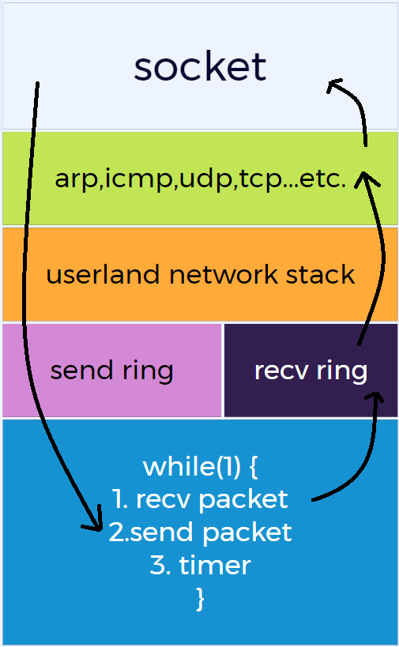

# 实现协议栈

在前五章中其实我们已经实现了一个支持arp和icmp协议的协议栈了,但是还缺少最核心的udp与tcp功能,同时还缺少给用户调用的上层socket.

本文将修改之前的代码,使用dpdk的ring队列来让协议栈的收发包处理能够在两个不同的线程间处理,达到收包在线程A(核心A),发包在线程B(核心B)的效果.

本文目的:
1. 阐述dpdk ring的使用方法.
2. 实现收发包分属不同线程.
3. **阐述协议栈的功能以及架构**.


## 协议栈架构

协议栈其实可以很简单。简单来说协议栈就是一个while(1)一直循环的一个程序,其当包来的时候放入到`recv ring`中,协议栈的包解析模块不断从`recv ring`里面取出数据包进行协议解析.当需要发包的时候把组包模块组装好的包放入到`send ring`中,然后从`send ring`里面取出组好的包发送出去.

下图就是一个网络栈的流程图:



最上层是socket层提供给用户用来实现udp server或tcp server(当然同时可以实现client)。

注意右边的流程，DPDK收到包后送入到`recv ring`里面，然后送入协议栈做L2/L3解码(上图中的arp等协议其实就是用户态协议栈里的功能)，最后到用户层的socket，用户调用`recv`函数收取数据。

发包就是左边的流程，socket层将数据通过`send`发到用户态协议栈，协议栈进行组包然后放入到`send ring`里，最后由dpdk发包。

这里要多说明一点，过程中使用的内存`mbuf`的释放实际发包和收包是不同的。

对于收包来说，可以由用户态协议栈决定，同时用户也可以调用`close`函数主动关闭socket(此时会释放`mbuf`)，来主动释放`mbuf`。

而发包流程的`mbuf`释放只取决于协议栈的消费，从队列中取出数据包并释放后即可释放`mbuf`。

数据包的路径如下:

收包: 
```
                                                                                      Y
recv packet -> en recv_ring -> de recv_ring -> process packet(parser) -> need reply? --> process packet(fill) -> en send_ring -> send packet
                                                                            | N
                                                                            -----> end
```

发包:
```
send packet -> process packet(fill) -> en send_ring -> de send_ring -> send packet
```

收包流程很明确：首先收到包后放入接收队列，然后到协议解析进程出队。出队后，解析数据包解析数据包时判断是否需要回复，如果需要回复则组装回复包送入发送队列，最后在发包线程进行发送(这里一般来说总是需要发送的，如果是发往本机的需要送包到应用程序)。若无需回复则处理结束。

发包逻辑很简单就不赘述了。

## 网络栈总结

网络栈核心转发面逻辑其实很简单: DPDK收包 -> l2/l3解码(数据包处理) -> DPDK发送

如果是防火墙或者企业级路由的逻辑往往如下:

DPDK收包 -> l2/l3解码 -> 流表建立 -> alg协议关联 -> 路由查找 -> ACL策略 -> DPDK发送。

可以看到网络栈的转发路径是简单而清晰的，这也是其设计的思路。转发面要尽可能简单清晰。

DPDK中提供了一套队列API,高性能无锁，可选线程安全，使用该库可以比较容易的写出协议栈，下面就阐述细节。

## 实现细节

### 1.队列相关声明

```c
#include <rte_ring.h> // dpdk 队列库头文件
// 队列大小
#define RING_SIZE	1024

// 两个ring队列,一个收包队列收包后存入用来解析协议
// 一个发包队列待发的包存入
// 这样做收发包可以分别通过两个不同的核心进行
struct ring_buffer {
  struct rte_ring *recv_ring;
  struct rte_ring *send_ring;
};

// 全局变量
struct ring_buffer *g_ring = NULL;
// main函数中调用,初始化全局队列
void init_global_ring() {
  if (g_ring == NULL) {
    g_ring = rte_malloc("recv/send ring", sizeof(struct ring_buffer), 0);
    memset(g_ring, 0, sizeof(struct ring_buffer));
  }
}
```

上述就是完整的队列声明逻辑，引入头文件rte_ring.h，然后声明需要的队列，此时需要一个`recv_ring`用来收包，一个`send_ring`用来发包。

最后声明了唯一一个队列管理的全局变量`g_ring`并实现其初始化的函数。DPDK的队列管理变量需要malloc声明因为希望其生命周期由程序员决定因此调用`rte_malloc`为其分配内存。

目前实现没有释放`g_ring`这个结构，其实可以在exit处调用`rte_free`释放`g_ring`的。

### 2.初始化DPDK队列

main函数中添加如下代码:

```c
+  // 创建ring buffer并初始化
+  init_global_ring();
+  // q全局队列初始化失败,进行差错处理
+  if (g_ring == NULL) {
+    rte_exit(EXIT_FAILURE, "ring buffer init failed\n");
+  }
+
+  if (g_ring->recv_ring == NULL) {
+    // 内存中创建一个ring,第一个参数ring的名字,第二个参数ring的大小,第三个参数网口id,第四个参数是flag表明是单生产者或多生产者
+    g_ring->recv_ring = rte_ring_create("recv ring", RING_SIZE, rte_socket_id(), RING_F_SP_ENQ | RING_F_SC_DEQ);
+  }
+  if (g_ring->send_ring == NULL) {
+    g_ring->send_ring = rte_ring_create("send ring", RING_SIZE, rte_socket_id(), RING_F_SP_ENQ | RING_F_SC_DEQ);
+  }
```

逻辑很简单，初始化队列管理全局变量`g_ring`。然后创建`recv_ring`和`send_ring`。

### 3.主线程收发包,另起线程负责L2/L3解码

main功能代码只做两件事情:

1. 使用`rte_eal_remote_launch`函数，另外开一个线程用来处理数据包，处理数据包的逻辑就是从`recv_ring`中取出数据包然后处理
2. main函数(即主进程或者叫主线程)，`rte_eth_rx_burst`收到包后放入到`recv_ring`里，从`send_ring`里取出封装好的待发送包，调用`rte_eth_tx_burst`发送。

```c
int main()
{
  // 省略
  rte_eal_remote_launch(ht_pkt_process, mbuf_pool, rte_get_next_lcore(lcore_id, 1, 0));

  while (1) {
    struct rte_mbuf *rx_mbufs[BURST_SIZE];

    unsigned num_recvd = rte_eth_rx_burst(g_dpdk_port_id, 0, rx_mbufs, BURST_SIZE);
    if (num_recvd > BURST_SIZE) {
      rte_exit(EXIT_FAILURE, "Error receiving from eth\n");
    } else if (num_recvd > 0) {
      // 接受到的包大于0,入队recv_ring中进行处理
      rte_ring_sp_enqueue_burst(g_ring->recv_ring, (void**)rx_mbufs, num_recvd, NULL);
    }
    struct rte_mbuf *tx_mbufs[BURST_SIZE];
    // 从send_ring中取出然后发送数据包
    unsigned num_send = rte_ring_sc_dequeue_burst(g_ring->send_ring, (void**)tx_mbufs, BURST_SIZE, NULL);
    if (num_send > 0) {
      rte_eth_tx_burst(g_dpdk_port_id, 0, tx_mbufs, num_send);
      unsigned i = 0;
      for (i = 0; i < num_send; i++)
        rte_pktmbuf_free(tx_mbufs[i]);
    }
  }
  // 省略
}
```

### 4.L2/L3解码所作的改动

数据包解析(协议解析)所做的前面几章已经讲解过了，前面实现的对于arp等协议有不少都是需要回包给对端的。

这里只需要把之前的发送流程的部分:

```c
rte_eth_tx_burst(g_dpdk_port_id, 0, &arpbuf, 1);
rte_pktmbuf_free(arp_buf);
```

修改为如下即可:

```c
rte_ring_mp_enqueue_burst(send_ring, (void**)&arp_buf, 1, NULL);
rte_pktmbuf_free(mbufs[i]);
```

注意:**arp_buf是mbuf_pool中获得的内存。而释放的是出队的`struct rte_mbuf *mbufs[BURST_SIZE]`。所以不存在到主线程发包的mbuf被释放的情况**。

其实这里可以使用0拷贝来进行优化，这里实现的不够好。

# 协议栈总结

## **1.协议栈数据流程总结**

核心数据流程: 收包 -> L2/L3解码 -> 发包

所谓协议栈往往核心在于L2/L3解码，这里面存在太多场景可以做了。

其实DPDK简化了收发包，内存管理等过程且性能优秀。这就是其流行的原因。

## **2.DPDK API总结**

DPDK ring的总结使用:

1. rte_ring_create 创建队列
2. rte_ring_mp_enqueue_burst 多生产者安全的入队列 rte_ring_sp_enqueue_burst 非多生产者安全的出队列
3. rte_ring_mc_dequeue_burst 多消费者安全的出队列 rte_ring_sc_dequeue_burst 非多消费者安全的出队列

```c
// 第一个参数ring的名字,第二个参数ring的大小,第三个参数网口id,第四个参数是flag表明是单生产者或多生产者
struct rte_ring *ring = rte_ring_create("recv ring", RING_SIZE, rte_socket_id(), RING_F_SP_ENQ | RING_F_SC_DEQ);

/*
 * 将多个对象放入ring中（多生产者安全）
 * @参数:r
 *   - 指向ring结构的指针。
 * @参数:obj_table
 *   - 指向 void * 指针（对象）表的指针。为mbuf数组
 * @参数:n
 *   - 从 obj_table 中添加到环中的对象数量。
 * @传出参数:空闲空间
 *   - 如果非 NULL，则返回环中的空闲数量
 * 入队操作完成后,
 * @return
 *   - n：实际排队的对象数。
*/
static __rte_always_inline unsigned
rte_ring_mp_enqueue_burst(struct rte_ring *r, void * const *obj_table,
			 unsigned int n, unsigned int *free_space);

/*
 * 将多个对象放入ring中（非多生产者安全）
 * @参数:r
 *   - 指向ring结构的指针。
 * @参数:obj_table
 *   - 指向 void * 指针（对象）的指针。为mbuf数组
 * @参数:n
 *   - 从 obj_table 中添加到环中的对象数量。
 * @传出参数:空闲空间
 *   - 如果非 NULL，则返回环中的空闲数量
 * 入队操作完成后,
 * @return
 *  - n：实际排队的对象数。
*/
static __rte_always_inline unsigned
rte_ring_sp_enqueue_burst(struct rte_ring *r, void * const *obj_table,
			 unsigned int n, unsigned int *free_space)

/*
 * 将多个对象从环中出队（多消费者安全）。
 *
 * @参数:r
 *   - 指向环结构的指针。
 * @参数:obj_table
 *   - 指向将被填充的 void 指针（对象）表的指针。为mbuf数组
 * @参数n
 * 从环中出队到 obj_table 的对象数量。
 * @参数可用
 * 如果非NULL，则返回剩余的环条目数
 * 出队已完成。
 * @返回
 * - n：实际出队的对象数量，如果环为空则为0
*/
static __rte_always_inline unsigned
rte_ring_mc_dequeue_burst(struct rte_ring *r, void **obj_table,
		unsigned int n, unsigned int *available)
/*
 * 将多个对象从环中出队（非多消费者安全）。
 *
 * @参数:r
 *   - 指向环结构的指针。
 * @参数:obj_table
 *   - 指向将被填充的 void 指针（对象）表的指针。为mbuf数组
 * @参数n
 * 从环中出队到 obj_table 的对象数量。
 * @参数可用
 * 如果非NULL，则返回剩余的环条目数
 * 出队已完成。
 * @返回
 * - n：实际出队的对象数量，如果环为空则为0
*/
static __rte_always_inline unsigned
rte_ring_sc_dequeue_burst(struct rte_ring *r, void **obj_table,
		unsigned int n, unsigned int *available)
```

DPDK 另开线程实现功能函数总结:

```c
/**
 * 在另一个 lcore 上启动一个函数。
 *
 * 仅在 MASTER lcore 上执行(即这个函数只能在主线程调用)。
 *
 * 向处于 WAIT 状态的从核心 lcore（由 Slave_id 标识）发送消息（在第一次调用 rte_eal_init() 后为真）。
 * 同时可以通过调用 rte_eal_wait_lcore(slave_id) 等待 lcore 完成其工作。
 *
 * 当远程lcore收到消息时，它切换到RUNNING状态，然后使用参数arg调用函数f。
 * 执行完成后，远端 lcore 切换到 FINISHED 状态，并且 f 的返回值存储在本地变量中，以便使用 rte_eal_wait_lcore() 读取。
 *
 * MASTER lcore在消息发送后立即返回，且不知道f的完成情况。
 *
 * 注意：此功能并非旨在提供最佳性能。这只是在初始化时在另一个 lcore 上启动函数的实用方法。
 * 
 * @参数：f
 *     - 要调用的函数。
 * @参数: arg
 *     - 函数的参数。
 * @参数: slave_id
 *     - 应执行该函数的 lcore 的标识符。
 * @返回
 * - 0：成功。在远程 lcore 上开始执行函数 f。
 * - (-EBUSY): 远程lcore不处于WAIT状态。
 */
int rte_eal_remote_launch(lcore_function_t *f, void *arg, unsigned slave_id);
```