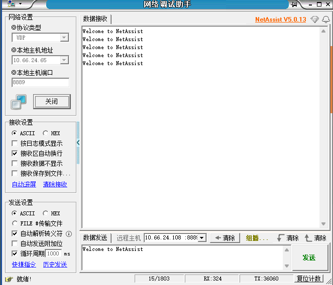
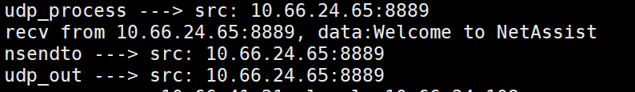

# udp socket的实现

在上一章netarch的基础上，来实现udp socket。和上一章相比所有代码改动在 [pr](../../src/example/07_udp/udp_imp.diff)

本章实现的代码在src/example/07_udp文件夹内部。

对于用户来说他们使用到的为socket api。因此协议栈最重要的就是实现socket层。

## 原始socket

原始的利用Linux socket api的udp server调用流程为：`socket--->bind--->recvfrom--->sendto--->close`

从中可以看到实际上用到的api为：`socket`，`bind`，`recvfrom`，`sendto`，`close`。换言之，协议栈的作用在于提供这5个api供用户使用。

这里做下说明其实ovs或vpp作为软路由将流量导给应用或者rdma直接将包送到程序自行处理是更好的方案，f-stack或思科的tldk这种搞个协议栈只是为了提供socket api个人觉得反而增加了复杂度，这里实现主要为了理解。


## 实现代码详解

所有代码相对于上一章的改动在 [diff](../../src/example/07_udp/udp_impl.diff)

主要实现两个函数`udp_process`和`udp_out`到包处理函数中`ht_pkt_process`。然后`udp_process`是收到udp包的后的处理主要关注其如何和recvfrom函数，`udp_out`是发包的操作主要关注其如何与`sendto`函数关联。

### socket相关结构体

udp socket通过两个结构体来管理，一个为`udp_sock_fd`该结构有前驱(prev)和后继(next)，如果存在多个socket，可以通过当前socket来进行遍历从而达到处理多server的效果。

第二个结构体是`offload`，该结构体作用很明确就是管理单个udp包，用来发送和接收时添加相应处理。

代码添加了注释请自行观看。

这里说下重点`udp_sock_fd`有如下两个结构体:

```c
  struct rte_ring *sndbuf; // sendbuffer
  struct rte_ring *rcvbuf; // recvbuffer
```

`ht_pkt_process`作为包处理的主流程核心就是从队列中取或送包，那么udp处理流程和socket的关联也非常清晰。

下面详解流程。

### udp处理主流程

**一. 初始化socket**，函数为`nsocket`逻辑如下:

主要三步

1. 生成fd。
2. 分配内存生成udp_sock_fd，用来管理当前用户生成的socket，这里核心是socket的rcvbuf和sndbuf队列生成。
3. 该socket添加到全局链表里。

```c
// 实现的基本udp所需的socket api
static int nsocket(__attribute__((unused)) int domain, int type, __attribute__((unused))  int protocol) {
  int fd = get_fd_frombitmap(); // 1.文件描述符fd生成
  // 2.分配一个host
  struct udp_sock_fd *host = rte_malloc("udp_sock_fd", sizeof(struct udp_sock_fd), 0);

  // 构建recv buffer和send buffer
  host->rcvbuf = rte_ring_create("recv buffer", RING_SIZE, rte_socket_id(), RING_F_SP_ENQ | RING_F_SC_DEQ);


  host->sndbuf = rte_ring_create("send buffer", RING_SIZE, rte_socket_id(), RING_F_SP_ENQ | RING_F_SC_DEQ);

  // 略
  // 3.该host(socket)添加到socket链表中
  LL_ADD(host, lhost);

  return fd;
}
```

socket的初始化还需要绑定相应的地址，bind函数实现非常简单直接看`nbind`代码就行。

主要逻辑为：1. 通过socket fd(即id)找到对应socket 2. 设置相应的ip地址

**二. 接收流程**

接收流程主要是两个函数`udp_process`和`nrecvfrom`。

先看recvfrom的实现：

1. 通过socket fd获取相应的udp socket管理结构体
2. 等待数据到来，其实就是从`host->rcvbuf`中取出数据
3. 取出数据为offload结构体，将offload中的data赋值给传出参数buf，用户通过buf获取到该udp包的data数据。

具体代码如下：

```c
static ssize_t nrecvfrom(int sockfd, void *buf, size_t len, __attribute__((unused))  int flags,
                        struct sockaddr *src_addr, __attribute__((unused))  socklen_t *addrlen) {
  // 1.判断host是否存在
  struct udp_sock_fd *host =  get_hostinfo_fromfd(sockfd);
  if (host == NULL) return -1;

  struct offload *ol = NULL;
  unsigned char *ptr = NULL;

  struct sockaddr_in *saddr = (struct sockaddr_in *)src_addr;
  int nb = -1;
  // 2.阻塞等待地接收数据
  // 加入来锁为阻塞地接收数据
  pthread_mutex_lock(&host->mutex);
  // recv buffer里面接收一个数据包(把buffer里面的值放入到ol中)
  while ((nb = rte_ring_mc_dequeue(host->rcvbuf, (void **)&ol)) < 0) {
    pthread_cond_wait(&host->cond, &host->mutex);
  }
  pthread_mutex_unlock(&host->mutex);
  // 填充sockaddr_in地址
  saddr->sin_port = ol->sport;
  rte_memcpy(&saddr->sin_addr.s_addr, &ol->sip, sizeof(uint32_t));
  // 3. 数据放入到buffer中
  if (len < ol->length) { // 出现错误,长度小于包长度,重新分配buf大小
    rte_memcpy(buf, ol->data, len);

    ptr = rte_malloc("unsigned char *", ol->length-len, 0);
    rte_memcpy(ptr, ol->data+len, ol->length-len);

    ol->length -= len;
    rte_free(ol->data);
    ol->data = ptr;
    
    rte_ring_mp_enqueue(host->rcvbuf, ol); // 放入到recv buffer中
    return len;
  } else {

    rte_memcpy(buf, ol->data, ol->length); // 直接拷贝到buf中
    rte_free(ol->data);
    rte_free(ol);
    return ol->length;
  }
}
```

这里面最就会有疑问？`host->rcvbuf`里的接收队列里的数据包从哪里来的？

数据到`nrecvfrom`的流程： dpdk收包 -> 送包`g_ring->recv_ring` -> `ht_pkt_process`(包处理流程,从`g_ring->recv_ring`中取包) -> udp处理流程(`udp_process`) -> udp处理过程中将包送入到`host->rcvbuf`中 -> 用户调用`nrecvfrom`得到udp数据包。


下面是`udp_process`的具体代码：

```c
// udp包的处理(从旧的pkt_process中剥离出来).只做数据包的解析.
// 1.解析数据,填充offload 2.放入到recv buffer里面
static int udp_process(struct rte_mbuf *udpmbuf) {
  // ipv4头和udp头获取
  struct rte_ipv4_hdr *iphdr =  rte_pktmbuf_mtod_offset(udpmbuf, struct rte_ipv4_hdr *, 
        sizeof(struct rte_ether_hdr));
  struct rte_udp_hdr *udphdr = (struct rte_udp_hdr *)(iphdr + 1);

  // 调试用
  char ip[16] = {0};
  printf("udp_process ---> src: %s:%d \n", inet_ntoa2(iphdr->src_addr, ip), rte_ntohs(udphdr->src_port));
  // 根据ip和port获取udp_sock_fd结构体
  struct udp_sock_fd *host = get_hostinfo_fromip_port(iphdr->dst_addr, udphdr->dst_port, iphdr->next_proto_id);
  if (host == NULL) {
    rte_pktmbuf_free(udpmbuf);
    return -3;
  } 

  struct offload *ol = rte_malloc("offload", sizeof(struct offload), 0);
  if (ol == NULL) {
    rte_pktmbuf_free(udpmbuf);
    return -1;
  }

  ol->dip = iphdr->dst_addr;
  ol->sip = iphdr->src_addr;
  ol->sport = udphdr->src_port;
  ol->dport = udphdr->dst_port;

  ol->protocol = IPPROTO_UDP;
  ol->length = rte_ntohs(udphdr->dgram_len);
  // 数据段长度,总长度 - udp首部长度
  ol->data = rte_malloc("unsigned char*", ol->length - sizeof(struct rte_udp_hdr), 0);
  if (ol->data == NULL) {
    rte_pktmbuf_free(udpmbuf);
    rte_free(ol);
    return -2;
  }
  rte_memcpy(ol->data, (unsigned char *)(udphdr+1), ol->length - sizeof(struct rte_udp_hdr)); // 关键步骤,接收到的udp数据段要赋值给offload

  rte_ring_mp_enqueue(host->rcvbuf, ol); // recv buffer

  pthread_mutex_lock(&host->mutex);
  pthread_cond_signal(&host->cond);
  pthread_mutex_unlock(&host->mutex);

  rte_pktmbuf_free(udpmbuf);

  return 0;
}
```

**三. 发送流程**

发送流程核心函数为: `nsendto`与`udp_out`。

这段逻辑和接收流程非常相似只是反过来了。

`nsendto`主要做了两件事：

1. 准备一个offload数据包结构
2. 放入到send buffer（`host->sndbuf`）中

`udp_out`主要做了两件事：

1. 找到对应的udp socket从其`sndbuf`队列中取出数据包。
2. 如果arp table里面没有对应的mac地址，先发arp request(将arp包放入`g_ring->send_ring`)包再发udp包(将udp包放入`g_ring->send_ring`)。

细节可以参考代码。

### 利用实现的socket api来实现udp服务器

下面是服务器实现：

```c
#define UDP_APP_RECV_BUFFER_SIZE	128

static int udp_server_entry(__attribute__((unused))  void *arg) {
  int connfd = nsocket(AF_INET, SOCK_DGRAM, 0);
  if (connfd == -1) {
    printf("sockfd failed\n");
    return -1;
  } 

  struct sockaddr_in localaddr, clientaddr; // struct sockaddr 
  memset(&localaddr, 0, sizeof(struct sockaddr_in));

  localaddr.sin_port = rte_htons(8889);
  localaddr.sin_family = AF_INET;
  localaddr.sin_addr.s_addr = inet_addr("10.66.24.108"); // 0.0.0.0


  nbind(connfd, (struct sockaddr*)&localaddr, sizeof(localaddr));

  char buffer[UDP_APP_RECV_BUFFER_SIZE] = {0};
  socklen_t addrlen = sizeof(clientaddr);
  while (1) {

    if (nrecvfrom(connfd, buffer, UDP_APP_RECV_BUFFER_SIZE, 0, 
      (struct sockaddr*)&clientaddr, &addrlen) < 0) {
      continue;
    } else {
      printf("recv from %s:%d, data:%s\n", inet_ntoa(clientaddr.sin_addr), 
        rte_ntohs(clientaddr.sin_port), buffer);
      nsendto(connfd, buffer, strlen(buffer), 0, 
        (struct sockaddr*)&clientaddr, sizeof(clientaddr));
    }

  }

  nclose(connfd);
}
```

下面是服务器启动:

```c
  // 启动一个dpdk实现的socket api的udp服务器
  lcore_id = rte_get_next_lcore(lcore_id, 1, 0);
  rte_eal_remote_launch(udp_server_entry, mbuf_pool, lcore_id);
```

## 实现效果

利用客户端访问实现的服务器。



可以看到利用udp client访问实现的udp server通信正常。

udp server打印如下:



# 总结

DPDK协议栈实现核心在于队列，如何将包交给提供给用户的api就是通过dpdk ring来实现。

所谓socket api，其实就是在调用socket和bind函数时生成一个socket管理结构其拥有唯一标识fd，并将生成的所有结构组织起来。处理包的时候通过socket的fd(唯一标识)获取其收发队列，将收到的包放入对应socket的收包队列，待发送的包放入对应socket的发包队列。

最后由主流程遍历所有数据包的时候，如果该数据包的四元组(源目的ip和源目的端口)匹配到了用户申请的socket那么将该socket发送队列中的包放入出接口，接收的包传到对应的buf里。