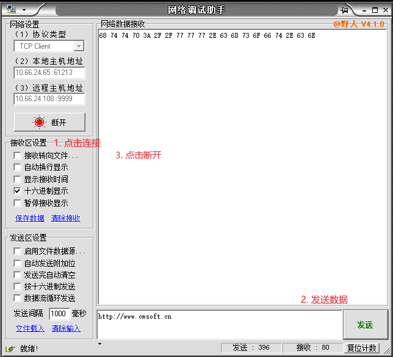
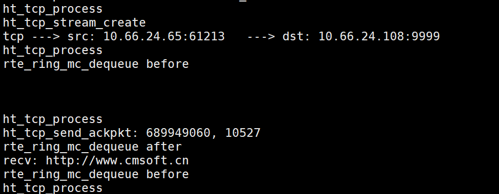
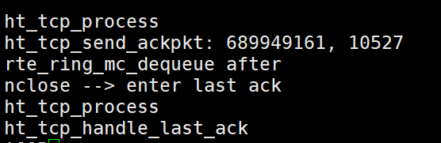

# 实现tcp

本文针对上一章的代码实现改动为: [diff](../../src/example/08_tcp/tcp.diff) 。

其实实现完udp后，再实现tcp已经变得非常简单了。本文主要简述一下怎么实现tcp的状态转移相关功能。从这里你能从socket api来理解tcp是怎么达到可靠的。

实现后的协议栈效果如下：



首先tcp是面向连接的，第一步是连接实现的对应服务器。第二步是客户端发送一些数据

一到二执行后协议栈输出如下：



1. 连接后协议栈发现是tcp包，进入tcp包处理流程。此时如果客户端访问的是注册的socket则创建tcp stream结构。然后发送ack包到客户端。
2. 客户端发送数据后，服务端处理并通过输出客户端的发送信息。

第三步是断开连接，客户端软件断开连接后，协议栈输出如下：



3. 服务端还需要进行挥手操作并执行客户端最后一个ack包对应操作(一般来说即为断开连接，释放此次连接占用的资源)。

上述就是实现效果。下面简述代码细节，这里tcp socket和协议栈的关联和udp一样通过队列。具体逻辑类似请对比udp进行学习。

# 实现tcp代码的细节

**一. tcp管理结构体**

`ht_tcp_stream`为tcp连接的管理结构体，`ht_tcp_table`为所有tcp连接的表，通过它可以遍历所有tcp连接，`ht_tcp_fragment`为实际tcp数据包。

代码在 src/example/08_tcp/netarch.c中。

核心依然是`ht_tcp_stream`里面的两个队列`struct rte_ring *sndbuf;`和`struct rte_ring *rcvbuf;`。socket api和协议栈的联系也是把数据包送入对应tcp连接的相应队列里即可。

**二. tcp状态机机制**

下面直接看tcp的核心处理流程。

先开收包逻辑的代码：

```c
static int tcp_process(struct rte_mbuf *tcpmbuf) {
  struct rte_ipv4_hdr *iphdr =  rte_pktmbuf_mtod_offset(tcpmbuf, struct rte_ipv4_hdr *, 
        sizeof(struct rte_ether_hdr));
  struct rte_tcp_hdr *tcphdr = (struct rte_tcp_hdr *)(iphdr + 1);	
  // 对比校验和
  uint16_t tcpcksum = tcphdr->cksum;
  tcphdr->cksum = 0; // 先置0初始化
  // tcp check sum调用rte_ipv4_udptcp_cksum后无需大端转小端,其内部做了处理
  uint16_t cksum = rte_ipv4_udptcp_cksum(iphdr, tcphdr);
  if (cksum != tcpcksum) {
    printf("cksum: %x, tcp cksum: %x\n", cksum, tcpcksum);
    return -1;
  }
  // 通过源地址,目的地址,源端口,目的端口找到对应的stream(即对应的tcp连接)
  struct ht_tcp_stream *stream = ht_tcp_stream_search(iphdr->src_addr, iphdr->dst_addr, tcphdr->src_port, tcphdr->dst_port);
  if (stream == NULL) return -2;
  
  // 存在该stream,判断当前stream的tcp状态进行对应的处理
  switch (stream->status) {

    case HT_TCP_STATUS_CLOSED: //client 
      break;
      
    case HT_TCP_STATUS_LISTEN: // server
      ht_tcp_handle_listen(stream, tcphdr, iphdr);
      break;

    case HT_TCP_STATUS_SYN_RCVD: // server
      ht_tcp_handle_syn_rcvd(stream, tcphdr);
      break;

    case HT_TCP_STATUS_SYN_SENT: // client
      break;

    case HT_TCP_STATUS_ESTABLISHED: { // server | client
      // tcp包的长度等于包的长度减去ipv4头
      int tcplen = rte_ntohs(iphdr->total_length) - sizeof(struct rte_ipv4_hdr);
      
      ht_tcp_handle_established(stream, tcphdr, tcplen);
      break;
    }

    case HT_TCP_STATUS_FIN_WAIT_1: //  ~client
      break;
      
    case HT_TCP_STATUS_FIN_WAIT_2: // ~client
      break;
      
    case HT_TCP_STATUS_CLOSING: // ~client
      break;
      
    case HT_TCP_STATUS_TIME_WAIT: // ~client
      break;

    case HT_TCP_STATUS_CLOSE_WAIT: // ~server
      ht_tcp_handle_close_wait(stream, tcphdr);
      break;
      
    case HT_TCP_STATUS_LAST_ACK:  // ~server
      ht_tcp_handle_last_ack(stream, tcphdr);
      break;
  }

  return 0;
}
```

这里需要说明下，本文所有都是tcp server端来说明的，然后要明确tcp的stream初始化是在bind的时候，此时连接状态为`HT_TCP_STATUS_CLOSED`。

下面开始解读客户端从连接到发送再到断开发生了什么。

## 一.tcp socket的生成

1. 调用`socket`，初始化tcp stream结构。核心是创建接收和发送队列。已经将该stream插入到tcp表(`g_tcp_tb->tcb_set`)中。
2. 调用`nbind`，这里最重要是给stream的tcp状态字段赋值为CLOSED。此时服务端的状态为CLOSED。

前两步，由于此时socket状态为CLOSED无需任何处理。如果要实现client这里需要增加TIME_WAIT的处理。

## 二.tcp连接建立

3. 调用`listen`，修改当前tcp stream的状态变为。然后将stream状态置为LISTEN。
4. 此时协议栈进入`ht_tcp_handle_listen`函数。

>listen的逻辑如下:
>>1. 判断tcp头是否带有SYN FLAG,有则要进行listen状态处理
>>2. 判断stream是否是LISTEN状态(用户有无调用listen api)，有则为该连接创建一个tcp stream(tcp是面向连接的，客户端和服务端需要建立连接)。然后创建对应ack数据包并把该数据包放入到`stream->sndbuf`发送队列里。然后修改stream状态为SYN_RCVD。

此时客户端还会发送一个ack包用来确认连接建立。

5. 协议栈接收到最后一个ack包后，进入`ht_tcp_handle_syn_rcvd`逻辑。

>SYN_RCVD到ESTABLISHED逻辑如下:
>>1. 判断有无ACK标记,有则进行SYN_RCVD到ESTABLISHED的处理
>>2. 获取ack号，并修改此时stream状态为ESTABLISHED。
>> 注:这里有两个差错处理，当ack number不等于stream->snd_nxt + 1时其实乱序了这里需要处理。二是`ht_tcp_stream_search`找不到刚刚`ht_tcp_handle_listen`创建的stream说明出现了连接创建失败的情况，此时直接退出。

6. 建立连接，此时连接状态保持为ESTABLISHED。函数为`ht_tcp_handle_established`。客户端和服务端的实际信息交互都在此状态。
>ESTABLISHED后逻辑如下:
>>1. 如果是PSH状态的，数据包入收队列然后构造tcp包发送出去。
>>2. 如果是FIN包，置stream状态为CLOSE_WAIT。发ack包到对端。(server要发两个挥手包此为第一个挥手)

## 三.tcp连接断开

这里连接断开有部分是在`ht_tcp_handle_established`处理的，也就是接收到FIN包后进行第一次挥手。

调用`close`函数后，进入LAST_ACK状态。此时函数调用为`ht_tcp_handle_last_ack`。这里为了简略不处理客户端最后一个包，直接关闭连接，释放连接占用资源。

其实应该在`ht_tcp_handle_close_wait`时发送FIN包，`ht_tcp_handle_established`的时候发送挥手的ack包(第一个挥手包)。这里为了简单期间直接发FIN包告知客户端终止连接。

## 四.socket接收和发送实现

参考`naccept`和`nsend`两个函数，和udp类似不过多赘述。

# 总结

tcp是面向连接的协议，需要建立连接后才能进行数据交互。因此实现比udp复杂，但由于dpdk存在可以专注于协议本身而无需画过多的心力在协议到sock层。

从这里可以得出dpdk用户态api核心分为三大部分：

1. 网卡操作
2. dpdk ring队列
3. dpdk mempool内存池

当然dpdk还提供了部分网络中值得使用的库：

1. ACL
2. LPM最长前缀算法
3. hash表

下一章将总结dpdk常用api，这样就基本把dpdk怎么用搞定了。