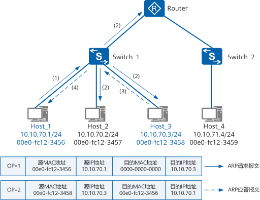
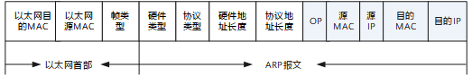
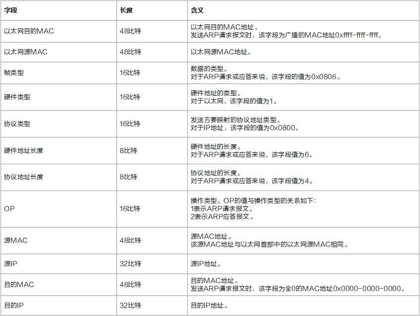

# 什么是arp

ARP（Address Resolution Protocol，地址解析协议）是用来将IP地址解析为MAC地址的协议。主机或三层网络设备上会维护一张ARP表，用于存储IP地址和MAC地址的映射关系，一般ARP表项包括动态ARP表项和静态ARP表项。

## 为什么需要arp

在局域网中，当主机或其它三层网络设备有数据要发送给另一台主机或三层网络设备时，需要知道对方的网络层地址（即IP地址）。但是仅有IP地址是不够的，因为IP报文必须封装成帧才能通过物理网络发送，因此发送方还需要知道接收方的物理地址（即MAC地址），这就需要一个通过IP地址获取物理地址的协议，以完成从IP地址到MAC地址的映射。地址解析协议ARP即可实现将IP地址解析为MAC地址。

## arp的类型


### 动态ARP

动态ARP表项由ARP协议通过ARP报文自动生成和维护，可以被老化，可以被新的ARP报文更新，也可以被静态ARP表项覆盖。

动态ARP适用于拓扑结构复杂、通信实时性要求高的网络。

### 静态ARP

静态ARP表项是由网络管理员手工建立的IP地址和MAC地址之间固定的映射关系。静态ARP表项不会被老化，不会被动态ARP表项覆盖。

正常情况下网络中设备可以通过ARP协议进行ARP表项的动态学习，生成的动态ARP表项可以被老化，可以被更新。但是当网络中存在ARP攻击时，设备中动态ARP表项可能会被更新成错误的ARP表项，或者被老化，造成合法用户通信异常。

静态ARP表项不会被老化，也不会被动态ARP表项覆盖，可以保证网络通信的安全性。静态ARP表项可以限制本端设备和指定IP地址的对端设备通信时只使用指定的MAC地址，此时攻击报文无法修改本端设备的ARP表中IP地址和MAC地址的映射关系，从而保护了本端设备和对端设备间的正常通信。一般在网关设备上配置静态ARP表项。

静态ARP表项分为短静态ARP表项和长静态ARP表项。

- 短静态ARP表项：手工建立IP地址和MAC地址之间固定的映射关系，未同时指定VLAN和出接口。如果出接口是处于二层模式的以太网接口，短静态ARP表项不能直接用于报文转发。当需要发送报文时，设备会先发送ARP请求报文，如果收到的ARP应答报文中的源IP地址和源MAC地址与所配置的IP地址和MAC地址相同，则将收到ARP应答报文的VLAN和接口加入该静态ARP表项中，后续设备可直接用该静态ARP表项转发报文。
- 长静态ARP表项：手工建立IP地址和MAC地址之间固定的映射关系，并同时指定该ARP表项所在VLAN和出接口。长静态ARP表项可以直接用于报文转发。建议用户采用长静态ARP表项。

### 免费ARP

设备主动使用自己的IP地址作为目的IP地址发送ARP请求，此种方式称免费ARP。

免费ARP有如下作用：

- IP地址冲突检测：当设备接口的协议状态变为Up时，设备主动对外发送免费ARP报文。正常情况下不会收到ARP应答，如果收到，则表明本网络中存在与自身IP地址重复的地址。如果检测到IP地址冲突，设备会周期性的广播发送免费ARP应答报文，直到冲突解除。
- 用于通告一个新的MAC地址：发送方更换了网卡，MAC地址变化了，为了能够在动态ARP表项老化前通告网络中其他设备，发送方可以发送一个免费ARP。
- 在VRRP备份组中用来通告主备发生变换：发生主备变换后，MASTER设备会广播发送一个免费ARP报文来通告发生了主备变换。

### Proxy ARP

这个比较复杂暂时略过。

## arp的解析

动态ARP通过广播ARP请求和单播ARP应答这两个过程完成地址解析。

最简单arp模型如下,服务器通过arp请求询问client的mac地址，然后client通过arp响应给出其mac地址，然后server将其存入mac表中。

```
      arp request
server -------------> client
        <-----------
         arp response
```

下面看一个实际的例子。



当需要通信的两台主机处于同一网段时，如上图中的Host_1和Host_3，Host_1要向Host_3发送数据。

1. 首先，Host_1会查找自己本地缓存的ARP表，确定是否包含Host_3对应的ARP表项。如果Host_1在ARP表中找到了Host_3对应的MAC地址，则Host_1直接利用ARP表中的MAC地址，对数据报文进行帧封装，并将数据报文发送给Host_3。如果Host_1在ARP表中找不到Host_3对应的MAC地址，则先缓存该数据报文，并以广播方式发送一个ARP请求报文。如上图中所示，OP字段为1表示该报文为ARP请求报文，ARP请求报文中的源MAC地址和源IP地址为Host_1的MAC地址和IP地址，目的MAC地址为全0的MAC地址，目的IP地址为Host_3的IP地址。
2. Switch_1收到ARP请求报文后，将该ARP请求报文在同一广播域内转发。
3. 同一广播域内的主机Host_2和Host_3都能接收到该ARP请求报文，但只有被请求的主机（即Host_3）会对该ARP请求报文进行处理。Host_3比较自己的IP地址和ARP请求报文中的目的IP地址，当两者相同时进行如下处理：将ARP请求报文中的源IP地址和源MAC地址（即Host_1的IP地址和MAC地址）存入自己的ARP表中。之后以单播方式发送ARP应答报文给Host_1，ARP应答报文内容如上图中所示，OP字段为2表示该报文为ARP应答报文，源MAC地址和源IP地址为Host_3的MAC地址和IP地址，目的MAC地址和目的IP地址为Host_1的MAC地址和IP地址。
4. Switch_1收到ARP应答报文后，将该ARP应答报文转发给Host_1。Host_1收到ARP应答报文后，将Host_3的MAC地址加入到自己的ARP表中以用于后续报文的转发，同时将数据报文进行帧封装，并将数据报文发送给Host_3。

当需要通信的两台主机处于不同网段时，如上图中的Host_1和Host_4，Host_1上已经配置缺省网关，Host_1首先会发送ARP请求报文，请求网关Router的IP地址对应的MAC地址。Host_1收到ARP应答报文后，将数据报文封装并发给网关，再由网关将数据报文发送给目的主机Host_4。Host_1学习网关IP地址对应的ARP表项的过程，以及网关设备学习Host_4的IP地址对应的ARP表项的过程与上述同网段主机Host_1和Host_3之间进行ARP地址解析的过程类似，不再赘述。

## arp老化机制

如上图中所示，如果每次Host_1和Host_3通信前都要发送一个广播的ARP请求报文，会极大的增加网络负担。而且同广播域的所有设备都需要接收和处理这个广播的ARP请求报文，也极大的影响了网络中设备的运行效率。为了解决以上问题，每台主机或设备上都维护着一个高速缓存，这是ARP高效运行的一个关键。在这个高速缓存中，存放主机或设备最近学习到的IP地址到MAC地址的映射关系，即动态ARP表项。

主机或设备每次发送报文时，会先在本地高速缓存中查找目的IP地址所对应的MAC地址。如果高速缓存中有对应的MAC地址，主机或设备不会再发送ARP请求报文，而是直接将报文发至这个MAC地址；如果高速缓存中没有对应的MAC地址，主机或设备才会广播发送ARP请求报文，进行ARP地址解析。

一方面由于高速缓存的容量限制，另一方面为了保证高速缓存中ARP表项的准确性，设备会对动态ARP表项进行老化和更新。

动态ARP表项的老化参数有：老化超时时间、老化探测次数和老化探测模式。设备上动态ARP表项到达老化超时时间后，设备会发送老化探测报文（即ARP请求报文），如果能收到ARP应答报文，则更新该动态ARP表项，本次老化探测结束；如果超过设置的老化探测次数后仍没有收到ARP应答报文，则删除该动态ARP表项，本次老化探测结束。

设备发送的老化探测报文可以是单播报文，也可以是广播报文。缺省情况下，设备只在最后一次发送ARP老化探测报文是广播模式，其余均为单播模式发送。当对端设备MAC地址不变时，可以配置接口以单播模式发送ARP老化探测报文。

当接口Down时设备会立即删除相应的动态ARP表项。

## arp报文格式

arp request和response的报文格式如下图:



报文的长度是42字节。前14字节的内容表示以太网首部，后28字节的内容表示ARP请求或应答报文的内容。报文中相关字段的解释如下图所示。



下面是dpdk中ipv4 arp的代码表示，每一个字段和上图都能对应上。

```c
/**
 * ARP header IPv4 payload.
 */
struct rte_arp_ipv4 {
	struct rte_ether_addr arp_sha;  /**< sender hardware address */
	uint32_t          arp_sip;  /**< sender IP address */
	struct rte_ether_addr arp_tha;  /**< target hardware address */
	uint32_t          arp_tip;  /**< target IP address */
} __attribute__((__packed__));

struct rte_arp_hdr {
	uint16_t arp_hardware;    /* format of hardware address */
#define RTE_ARP_HRD_ETHER     1  /* ARP Ethernet address format */

	uint16_t arp_protocol;    /* format of protocol address */
	uint8_t  arp_hlen;    /* length of hardware address */
	uint8_t  arp_plen;    /* length of protocol address */
	uint16_t arp_opcode;     /* ARP opcode (command) */
#define	RTE_ARP_OP_REQUEST    1 /* request to resolve address */
#define	RTE_ARP_OP_REPLY      2 /* response to previous request */
#define	RTE_ARP_OP_REVREQUEST 3 /* request proto addr given hardware */
#define	RTE_ARP_OP_REVREPLY   4 /* response giving protocol address */
#define	RTE_ARP_OP_INVREQUEST 8 /* request to identify peer */
#define	RTE_ARP_OP_INVREPLY   9 /* response identifying peer */

	struct rte_arp_ipv4 arp_data;
} __attribute__((__packed__));
```