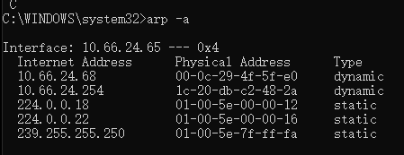

# 实现arp response和icmp reply

看完arp的基础后，下面的实现章节的逻辑将非常简单。

首先，上一章中实现的udp服务器需要手工配置dpdk绑定网卡的mac地址到对端主机上面。这显然不合理，如果这个udp服务器要接收上千台服务器，那么就要手工配置上千台服务器了。

此时，我们需要一种协议让我们把这个udp服务器绑定的网卡的mac地址自动告知所有想访问此服务的主机。

arp协议就应运而生了。上面这段话基本囊括了所有网络协议的本质。比如路由协议是装载了该协议的路由器用来修改(自动添加，修改，删除)各自的路由表的协议。

注意：本章有一个非常重要的功能免费arp没有实现，下一张将阐述为什么需要免费arp和维护一张arp表(如果是路由器或者交换机或者任何一个当作服务器的系统)

本文主要做两件事:

1. 实现arp response
2. 实现icmp协议发送

两者实现了，就能够不用手动添加mac地址了。

本章先实现了arp响应其 [完整代码](../../src/example/03_arp/arp.c)。本章代码是上一章更改而来，所做的更改如左 [diff](../../src/example/03_arp/arp.patch)。

## 代码分析

### arp response实现分析

上一章学会了怎么封装udp的包。其实arp也是类似的。

1. 获取网卡mac地址，放到g_src_mac中
2. 判断对端发送的是arp协议，进行arp解析。由于arp request是广播，该包的判断目标地址是否与本机ip地址相同。相同才返回arp response。(如果都返回就是arp攻击了)
3. 组装arp包
4. 使用dpdk的TX队列将包发送出去。

### 主体流程添加

添加本地ip地址,当别的主机ping 10.66.24.68的时候才会返回arp response。

```c
// 点分十进制ipv4地址变为数字ipv4地址
#define MAKE_IPV4_ADDR(a, b, c, d) (a + (b<<8) + (c<<16) + (d<<24))
// 本地ip,即dpdk端口的ip(由于dpdk绕过了内核协议栈所以需要自己设置)
static uint32_t g_local_ip = MAKE_IPV4_ADDR(10, 66 ,24, 68);
```

在main函数添加arp处理流程:

逻辑为:

解析收到的arp包，其ip和本机ip一致时返回arp response(通过rte_eth_tx_burst发送出去)

```c
int main()
{
    ...
    // 获取网卡mac地址,用于ng_encode_udp_pkt函数中组建ether头
    rte_eth_macaddr_get(g_dpdk_port_id, (struct rte_ether_addr *)g_src_mac);
    // 包处理
    while (1) {
      // 省略
      // 对端发送的是arp协议,对arp进行解析
      if (ehdr->ether_type == rte_htons(RTE_ETHER_TYPE_ARP)) {
        // 获取arp头
        struct rte_arp_hdr *arp_hdr = rte_pktmbuf_mtod_offset(mbufs[i], 
            struct rte_arp_hdr *, sizeof(struct rte_ether_hdr));
        
        char ip_buf[16] = {0};
        printf("arp ---> src: %s ", inet_ntoa2(arp_hdr->arp_data.arp_tip, ip_buf));
        printf(" local: %s \n", inet_ntoa2(g_local_ip, ip_buf));
        // 由于arp request是广播,判断目标地址相同才返回arp response
        if (arp_hdr->arp_data.arp_tip == g_local_ip) {
        // 接收到arp request包后返回arp response。注:request里的源ip是response里的目的ip
          struct rte_mbuf *arp_buf = ht_send_arp(mbuf_pool, arp_hdr->arp_data.arp_sha.addr_bytes, 
              arp_hdr->arp_data.arp_tip, arp_hdr->arp_data.arp_sip);
          rte_eth_tx_burst(g_dpdk_port_id, 0, &arp_buf, 1);
          rte_pktmbuf_free(arp_buf);
          rte_pktmbuf_free(mbufs[i]);
        }
        continue;
      }
      // ipv4处理
    }
}
```

### arp封包相关处理

实际代码如下；和udp的封包类似这里就不多赘述了。然后封好后的包在main函数中通过`rte_eth_tx_burst`发送出去。

```c
// 构建arp response包
static int ht_encode_arp_pkt(uint8_t *msg, uint8_t *dst_mac, uint32_t sip, uint32_t dip) {
  // 1 ethhdr
  struct rte_ether_hdr *eth = (struct rte_ether_hdr *)msg;
  rte_memcpy(eth->s_addr.addr_bytes, g_src_mac, RTE_ETHER_ADDR_LEN);
  rte_memcpy(eth->d_addr.addr_bytes, dst_mac, RTE_ETHER_ADDR_LEN);
  eth->ether_type = htons(RTE_ETHER_TYPE_ARP);

  // 2 arp 
  struct rte_arp_hdr *arp = (struct rte_arp_hdr *)(eth + 1);
  arp->arp_hardware = htons(1);
  arp->arp_protocol = htons(RTE_ETHER_TYPE_IPV4);
  arp->arp_hlen = RTE_ETHER_ADDR_LEN; // 硬件地址长度
  arp->arp_plen = sizeof(uint32_t); // 软件地址长度
  arp->arp_opcode = htons(2); // 2为response,1为request
  rte_memcpy(arp->arp_data.arp_sha.addr_bytes, g_src_mac, RTE_ETHER_ADDR_LEN);
  rte_memcpy(arp->arp_data.arp_tha.addr_bytes, dst_mac, RTE_ETHER_ADDR_LEN);

  arp->arp_data.arp_sip = sip;
  arp->arp_data.arp_tip = dip;
  
  return 0;
}

// 发送arp response
static struct rte_mbuf *ht_send_arp(struct rte_mempool *mbuf_pool, uint8_t *dst_mac, uint32_t sip, uint32_t dip) {
  // 14 + 28, eth头14字节,arp头28字节
  const unsigned total_length = sizeof(struct rte_ether_hdr) + sizeof(struct rte_arp_hdr);

  struct rte_mbuf *mbuf = rte_pktmbuf_alloc(mbuf_pool);
  if (!mbuf) {
    rte_exit(EXIT_FAILURE, "ht_send_arp: rte_pktmbuf_alloc\n");
  }

  mbuf->pkt_len = total_length;
  mbuf->data_len = total_length;

  uint8_t *pkt_data = rte_pktmbuf_mtod(mbuf, uint8_t *);
  ht_encode_arp_pkt(pkt_data, dst_mac, sip, dip);

  return mbuf;
}
```

## arp实现验证

为了验证我的修改，先在windows主机删掉虚拟机对应的arp。在我命令是，直接通过arp -d删除对应ip亦可。

```shell
netsh i i delete neighbors 13
```

用arp -a查看arp表如下图。可以看到此时没有68的地址了。


运行程序，然后`ping`程序中写死的ip地址。效果如下图,这里为什么会timeout很简单，此时程序没有实现imcp的reply，windows的ping无法获得回显:


程序打印如下，可以看到当有ping想访问我写的程序的ip时，我的程序给出了对应的回复:


然后此时再去看我的宿主机的arp表,很明显自动添加上了我这块网卡的mac地址。



## 一些说明

arp响应要判断目标地址相同才响应。原因是免费arp一般来说是广播。如果每个arp请求都回复arp响应那么则是造成arp污染。

# 实现icmp reply

实现完arp响应后，还缺少icmp协议(传输层)的echo reply，这会导致windows系统的ping命令无法获得回显。

添加icmp reply的 [完整代码](../../src/example/04_icmp/icmp_implement.c)。代码是[arp.c](../../src/example/03_arp/arp.c)更改而来，所做的更改如左 [diff](../../src/example/04_icmp/icmp.patch)。

实现逻辑和之前一样的，封包发包。

主流程增加如下代码:

```c
int main(int argc, char *argv[]) {
  // 略
  while (1) {
    // 略
    // 操作数据包
    unsigned i = 0;
    for (i = 0;i < num_recvd;i ++) {
      // 略
      // icmp包的处理
      if (iphdr->next_proto_id == IPPROTO_ICMP) {
        struct rte_icmp_hdr *icmphdr = (struct rte_icmp_hdr *)(iphdr + 1);
        char ip_buf[16] = {0};
        printf("icmp ---> src: %s ", inet_ntoa2(iphdr->src_addr, ip_buf));
        // 接收到的是icmp request,回一个icmp reply
        if (icmphdr->icmp_type == RTE_IP_ICMP_ECHO_REQUEST) {

          printf(" local: %s , type : %d\n", inet_ntoa2(iphdr->dst_addr, ip_buf), icmphdr->icmp_type);
          
          struct rte_mbuf *txbuf = ht_send_icmp(mbuf_pool, ehdr->s_addr.addr_bytes,
            iphdr->dst_addr, iphdr->src_addr, icmphdr->icmp_ident, icmphdr->icmp_seq_nb);

          rte_eth_tx_burst(g_dpdk_port_id, 0, &txbuf, 1);
          rte_pktmbuf_free(txbuf);

          rte_pktmbuf_free(mbufs[i]);
        }
      }
    }
  }
}
```

封装icmp包的代码和发包代码可以自行查看diff，很简单。

下面是其他主机ping我们的dpdk程序的效果。

