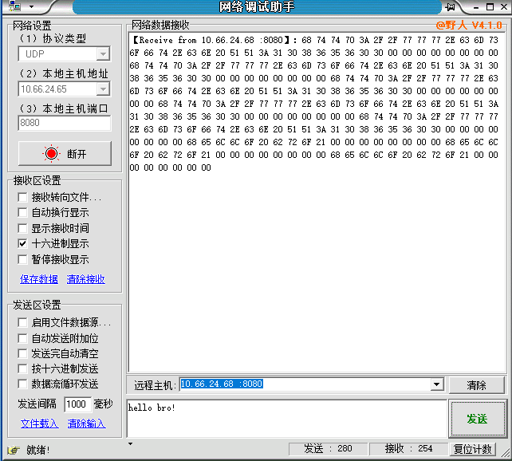
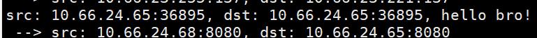

# udp echo server的实现

在上一章我们已经实现了dpdk接管网卡并且收包，然后处理udp的数据包。下面我将用非常简短的代码实现发udp包。

结合上一章的代码实现一个udp echo server(接收到后返回包给发包方)。

由于这个程序没有实现arp response相关的操作，所以能够收到发送方的数据仍然需要手工配置arp表。怎么配置参照 [上一章](./dpdk_udp_recv.md) 即可。

本章 [完整代码](../../src/example/02_udp_echo_server/udp_echo_server.c) 。 本章针对上一章所做的修改(只有绿色部分) [diff](../../src/example/02_udp_echo_server/echo_server.patch)


本章目的:

1. 学会配置dpdk的TX队列
2. 能够手动组装数据包并发送

## 代码分析

程序主体流程和上一章一致。

所谓发包回给发送方。总体来说逻辑很简单

1. 获取到发送方发的udp包，获取到该包的六元组信息:源ip，目的ip，源mac，目的mac，源端口和目的端口
2. 填充六元组信息组装成要回给发送方的包，这里要注意信息全部是相反的。举个例子：回给发送方的包其源ip应该为发送方发的包的目的ip。
3. 使用dpdk的TX队列将包发送出去。

### 增加帮助函数

主要做的更改有以下几个，由于dpdk原生的库相较于Linux提供的都有性能方面的提升。所以优先替换掉系统函数。

删掉了`#include <arpa/inet.h>`,自己实现`htons`,`htonl`,`ntohs`和`ntohl`。还有`inet_ntop`和`inet_ntoa`函数。

为了避免冲突将这些函数改名为如下：

```c
/* utils */
#define rte_htons rte_cpu_to_be_16
#define rte_htonl rte_cpu_to_be_32

#define rte_ntohs rte_be_to_cpu_16
#define rte_ntohl rte_be_to_cpu_32

/* IP network to ascii representation */
const char *
inet_ntop2(uint32_t ip)
{
  // 省略
}

char *
inet_ntoa2(uint32_t ip, char *buf)
{
  // 省略
}
```

### 保存六元组信息

然后组装echo包回给发送方需要知道六元组信息:源ip，目的ip，源mac，目的mac，源端口和目的端口。

声明如下(由于该项目用来实验因此用全局变量):

```c
static uint32_t g_src_ip;
static uint32_t g_dst_ip;

static uint8_t g_src_mac[RTE_ETHER_ADDR_LEN];
static uint8_t g_dst_mac[RTE_ETHER_ADDR_LEN];

static uint16_t g_src_port;
static uint16_t g_dst_port;
```

### 初始化dpdk端口

上一章初始化dpdk端口的代码代表TX队列的变量num_tx_queues是0，同时没有创建TX队列。所以没办法发包，dpdk发包必须初始化TX队列。

```c
  const int num_rx_queues = 1; // 最多8个
  const int num_tx_queues = 0;
```

直接看省略版的代码如下。上一章是5步初始化dpdk端口。

1. 而这里我们在第四步初始化了接收队列后，新增一个步骤：初始化tx队列

```c
struct rte_eth_txconf txq_conf = dev_info.default_txconf;
txq_conf.offloads = port_conf.rxmode.offloads; // 上面的设置:即接收的包多大就发多大的数据包
if (rte_eth_tx_queue_setup(g_dpdk_port_id, 0 , 1024, // 参数为: 对应网口,对应的队列,队列最大包数量,socket id,send的配置
  rte_eth_dev_socket_id(g_dpdk_port_id), &txq_conf) < 0) {
  rte_exit(EXIT_FAILURE, "Could not setup TX queue\n");
}
```

代码和初始化rx队列基本一致。

2. 第三步配置RX和TX队列数量同样需要更改。

```c
  rte_eth_dev_configure(g_dpdk_port_id, num_rx_queues, num_tx_queues, &port_conf);
```

此时`rte_eth_dev_configure`函数的第三个参数tx队列数量此时不为0而是为1。

```c
static void ht_init_port(struct rte_mempool *mbuf_pool) {
  // 1. 检测端口是否合法,是否设置

  // 2. 默认网卡信息获取

  // 3. 配置rx队列和tx队列的数量
  const int num_rx_queues = 1; // 最多8个
  const int num_tx_queues = 1; // 写队列设置为1
  struct rte_eth_conf port_conf = port_conf_default;
  rte_eth_dev_configure(g_dpdk_port_id, num_rx_queues, num_tx_queues, &port_conf);

  // 4. 设置哪一个队列去接收数据, 1024是队列承载的数据包最大数量(程序员配置的)

  // 5. 设置tx队列,tx队列初始化
  struct rte_eth_txconf txq_conf = dev_info.default_txconf;
  txq_conf.offloads = port_conf.rxmode.offloads; // 上面的设置:即接收的包多大就发多大的数据包
  if (rte_eth_tx_queue_setup(g_dpdk_port_id, 0 , 1024, // 参数为: 对应网口,对应的队列,队列最大包数量,socket id,send的配置
    rte_eth_dev_socket_id(g_dpdk_port_id), &txq_conf) < 0) {
    rte_exit(EXIT_FAILURE, "Could not setup TX queue\n");
  }

  // 6. 其实是启动g_dpdk_port_id这个端口,有发送也有接收
}
```

### 包处理

这里包处理分为两步，先完成组包。将其封装成一个函数。

参数msg传出参数是待发送的包的整体数据，data参数是要发送的udp的payload，total_len是包总长度大小。

所谓组包其实很简单就是一个字节一个字节的填充。直接看代码即可。通过指针填充各种字段来填充msg，从而构建待发送的缓存msg。

```c
static int ht_encode_udp_packet(uint8_t *msg, unsigned char *data, uint16_t total_len)
{
  // encode 构建udp包

  // 1. ethernet头,以太网头
  struct rte_ether_hdr *eth = (struct rte_ether_hdr *)msg;
  rte_memcpy(eth->s_addr.addr_bytes, g_src_mac, RTE_ETHER_ADDR_LEN);
  rte_memcpy(eth->d_addr.addr_bytes, g_dst_mac, RTE_ETHER_ADDR_LEN);
  eth->ether_type = rte_htons(RTE_ETHER_TYPE_IPV4);

  // 2 iphdr 设置ip头
  // msg + sizeof(struct rte_ether_hdr) 相当于eth+1
  struct rte_ipv4_hdr *ip = (struct rte_ipv4_hdr *)(msg + sizeof(struct rte_ether_hdr));
  ip->version_ihl = 0x45;
  ip->type_of_service = 0; // ip的类型
  ip->total_length = rte_htons(total_len - sizeof(struct rte_ether_hdr)); // 转成网络字节序(大端序)
  ip->packet_id = 0;
  ip->fragment_offset = 0;
  ip->time_to_live = 64; // ttl = 64
  ip->next_proto_id = IPPROTO_UDP; // ip头要标识下一部分是什么协议
  ip->src_addr = g_src_ip;
  ip->dst_addr = g_dst_ip;
  
  ip->hdr_checksum = 0; // 一开始置0防止checksum计算出错 
  ip->hdr_checksum = rte_ipv4_cksum(ip);

  // 3 udphdr 
  struct rte_udp_hdr *udp = (struct rte_udp_hdr *)(msg + sizeof(struct rte_ether_hdr) + sizeof(struct rte_ipv4_hdr));
  udp->src_port = g_src_port;
  udp->dst_port = g_dst_port;
  uint16_t udplen = total_len - sizeof(struct rte_ether_hdr) - sizeof(struct rte_ipv4_hdr);
  udp->dgram_len = rte_htons(udplen);
  // 数据放到udp头之下(udp payload),udp+1为即是以udp hdr为一单位偏移.实为偏移到udp hdr末尾
  rte_memcpy((uint8_t*)(udp+1), data, udplen);

  udp->dgram_cksum = 0;
  udp->dgram_cksum = rte_ipv4_udptcp_cksum(ip, udp);

  char ip_buf[16] = {0};
  printf(" --> src: %s:%d, ", inet_ntoa2(g_src_ip, ip_buf), rte_ntohs(g_src_port)); // 网络字节序大端序转为主机字节序小端序

  printf("dst: %s:%d\n", inet_ntoa2(g_dst_ip, ip_buf), rte_ntohs(g_dst_port));

  return 0;

}
```

组包完成后，dpdk的TX队列没法直接发送。还需要从mempool中申请mbuf。

这个逻辑的代码如下:

关键代码为
```c
  struct rte_mbuf *mbuf = rte_pktmbuf_alloc(mbuf_pool);
  uint8_t *pktdata = rte_pktmbuf_mtod(mbuf, uint8_t*);
```

可以明确看到组包的指针`pktdata`指向的是`mbuf`。然后组包完成后返回对应的mbuf给TX队列用即可。这里全是指针操作，除了填充必要的字段没有任何拷贝操作。这也是dpdk程序(C程序)的特点。

```c
// 发送数据包,参数分别为:内存池,payload,length(payload)长度
static struct rte_mbuf * ht_send_udp(struct rte_mempool *mbuf_pool, uint8_t *data, uint16_t length) {
  // mempool --> mbuf(从mempool里获取数据buffer流)
  const unsigned total_len = length + 42; // 42是eth header + ip hdr + udp hdr

  struct rte_mbuf *mbuf = rte_pktmbuf_alloc(mbuf_pool);
  if (!mbuf) {
    rte_exit(EXIT_FAILURE, "rte_pktmbuf_alloc\n");
  }

  mbuf->pkt_len = total_len; // 包的长度
  mbuf->data_len = total_len; // 数据的长度
  // 偏移uint8_t也就是一个字节一个字节处理
  uint8_t *pktdata = rte_pktmbuf_mtod(mbuf, uint8_t*);

  ht_encode_udp_packet(pktdata, data, total_len);

  return mbuf;
}
```

### 发包操作

```c
int main()
{
    // 省略
    while(1) {
        // 省略

        // 填充六元组
        // 发送包所需要的六元组dmac,sip,dip,sport,dport获取并填充
        // 由于是发echo reply所以需要交换。比如dmac是取获取到的包的smac
        rte_memcpy(g_dst_mac, ehdr->s_addr.addr_bytes, RTE_ETHER_ADDR_LEN);
        
        rte_memcpy(&g_src_ip, &iphdr->dst_addr, sizeof(uint32_t));
        rte_memcpy(&g_dst_ip, &iphdr->src_addr, sizeof(uint32_t));

        rte_memcpy(&g_src_port, &udphdr->dst_port, sizeof(uint16_t));
        rte_memcpy(&g_dst_port, &udphdr->src_port, sizeof(uint16_t));

        uint16_t length = rte_ntohs(udphdr->dgram_len); // 两个字节以上都要转换ntohs
        *((char*)udphdr + length) = '\0';	// 最后一段置为0
        // 发包操作
        struct rte_mbuf *txbuf = ht_send_udp(mbuf_pool, (uint8_t *)(udphdr+1), length);
        rte_eth_tx_burst(g_dpdk_port_id, 0, &txbuf, 1);// rte_eth_rx_burst发送数据
        rte_pktmbuf_free(txbuf); // 发送用的mbuf同样放回到内存池中
        // 省略
    }
}
```

发包操作有了上一章的代码,发包只需要添加10行代码即可。

1. 填充六元组，解析收到的包，交换源与目的。
2. 执行发包

发包函数为:

```c
rte_eth_tx_burst(g_dpdk_port_id, 0, &txbuf, 1);
```

这个函数和收包函数`rte_eth_tx_burst();`是类似的。

以上就是整体的代码流程。

## 实际操作

编译后。依然通过NetAssist。

NetAssist发送后其接收的数据和发送数据如下图:



和上一章对比可以很明显的发现，NetAssist多了网络数据接收的数据。这个数据即为我们的程序组包发出去的。

dpdk程序输出如下图:



## 结论

1. dpdk发包是传递mbuf到TX队列来实现的
2. 发包相关函数为`rte_eth_tx_burst`