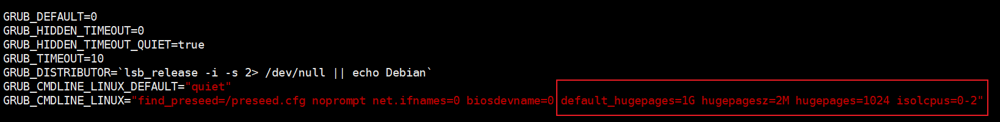

### Dpdk环境搭建

虚拟机搭建dpdk实验环境:需要vmware + ubuntu16.04

#### 1.vmware至少添加两块网卡

dpdk要绕过内核协议栈所以需要直连也就是桥接模式，桥接网卡作为DPDK运行网卡。

nat网卡作为ssh连接的网卡。

#### 2.修改vmware配置文件

打开虚拟机的配置文件即`xxx.vmx`文件,找到对应的网卡设置,将其修改为多队列网卡。在我的虚拟机是将ethernet1.virtualDev由e1000修改为vmxnet3,vmware实现的vmxnet3是支持多队列的网卡。

当然也可以多配置几张桥接网卡,设置相同。

#### 3.修改系统启动参数

ubuntu下修改/etc/default/grub,将GRUB_CMDLINE_LINUX字段的默认配置后面添加如下语句:`default_hugepages=1G hugepagesz=2M hugepages=1024 isolcpus=0-2`,当然如果主机性能很高可以添加如下`default_hugepages=1G hugepagesz=1G hugepages=20 isolcpus=0-7`

具体修改如图所示:

