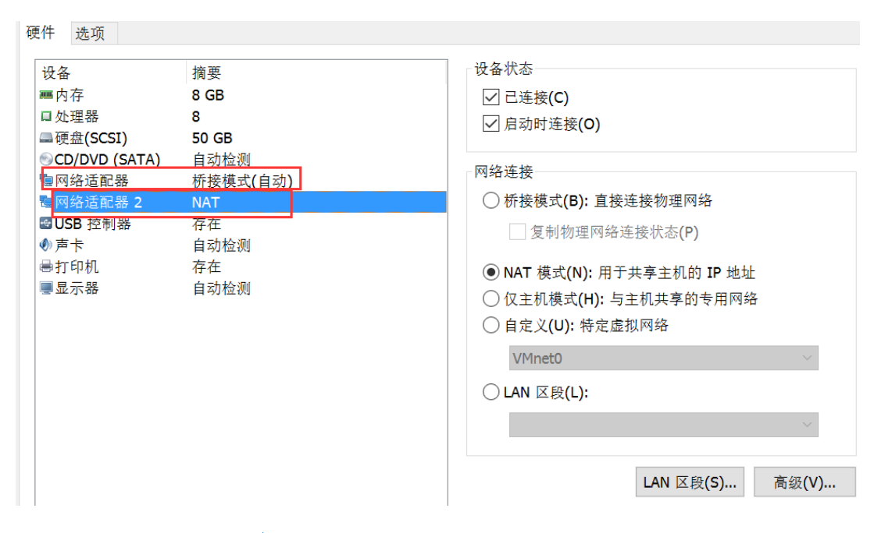
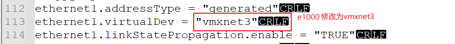
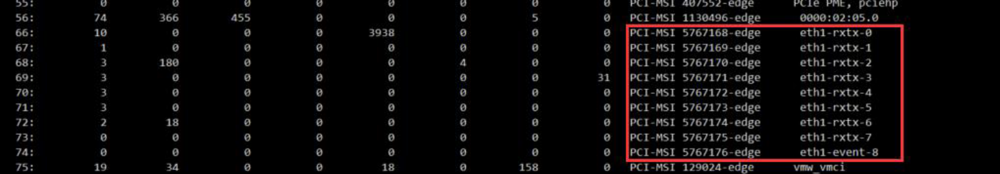
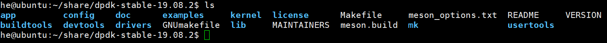
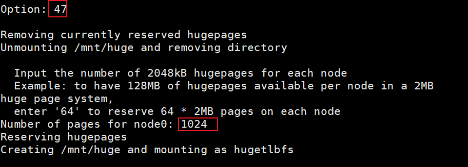
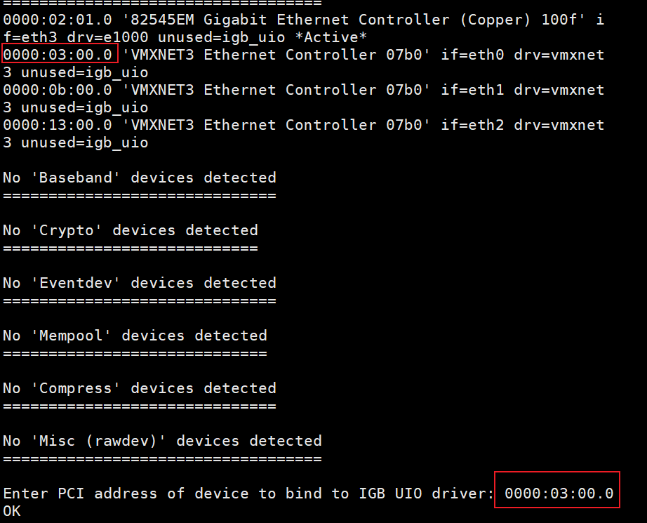
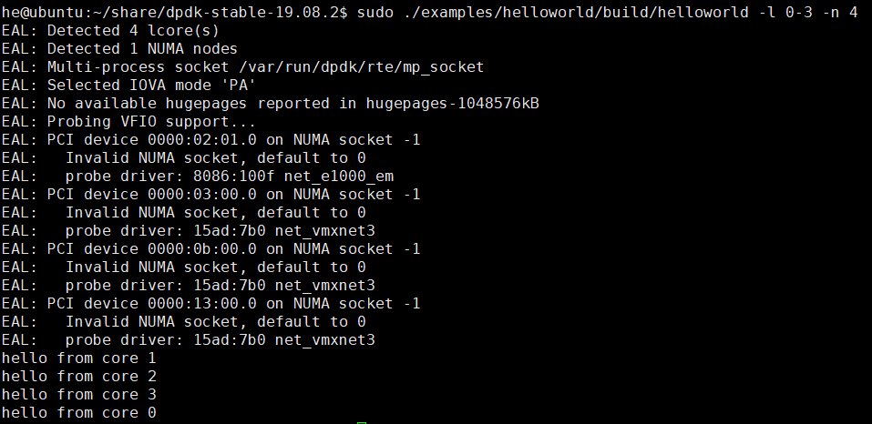

### Dpdk环境搭建

虚拟机搭建dpdk实验环境:需要vmware + ubuntu16.04

#### 1.vmware至少添加两块网卡



dpdk要绕过内核协议栈所以需要直连也就是桥接模式，桥接网卡作为DPDK运行网卡。

nat网卡作为ssh连接的网卡。

#### 2.修改vmware配置文件

打开虚拟机的配置文件即`xxx.vmx`文件,找到对应的网卡设置,将其修改为多队列网卡。在我的虚拟机是将ethernet1.virtualDev由e1000修改为vmxnet3,vmware实现的vmxnet3是支持多队列的网卡。



当然也可以多配置几张桥接网卡,设置相同。

#### 3.查看系统是否支持多队列网卡

执行`cat /proc/interrupts`显示如果如下图网卡不止一个rxtx就可以知道支持该网卡支持多队列:



#### 4.编译dpdk

在 https://core.dpdk.org/download/ 网址选择版本下载。
随便挑选版本，不同版本直接子系统接口会有差异，建议选择 dpdk 19.08.2

解压后dpdk目录如下:



进入usertools目录然后执行`dpdk-setup.sh`脚本。

#### 5.设置dpdk相关的环境变量


```bash
export RTE_SDK=/home/dpdk
export RTE_TARGET=x86_64-native-linux-gcc
```

这里的路径是官网的dpdk源码包解压后的路径,比如我的主机上是`/home/he/dpdk-stable-19.08.2`,所以`export RTE_SDK=/home/dpdk`要改为`export RTE_SDK=/home/he/dpdk-stable-19.08.2`

#### 6.分配大页内存并绑定UIO

设置完对应环境变量后,再次执行`./usertools/dpdk-setup.sh`。

- 分配大页内存的操作为

输入47,然后再输入2M的hugepages的个数,一般为1024即分配2GB的空间给dpdk。

操作如下图:


- 绑定igb_uio到网卡的操作为:

输入43插入IGB_UIO模块，选择网卡为vmxnet3需要加载此驱动
注: 选择44则是插入VFIO模块,选择网卡为e1000需要加载此模块

然后输入49绑定IGB_UIO模块,操作如下图:

还需要输入要绑定的网卡的pci地址。(网络设备是PCI设备驱动,在linux中唯一标识即为pci地址)



同时可以退出并通过脚本进行绑定,通过如下两个命令.

```bash
ifconfig eth0 down
./usertools/dpdk-devbind.py --bind=igb_uio eth0
```
dpdk-devbind.py还有以下几个功能:
```bash
# 显示所有网卡的状态
dpdk-devbind.py --status
# 显示特定网卡的状态
dpdk-devbind.py --status-dev net
# 将igb_uio绑定到eth1
dpdk-devbind.py --bind=igb_uio eth1
# 把pci地址为0000:01:00.0的网卡解绑dpdk驱动
dpdk-devbind.py -u 0000:01:00.0
# 把pci地址为02:00.0和02:00.1的网卡绑定为普通的ixgbe驱动
dpdk-devbind.py -b ixgbe 02:00.0 02:00.1
```

#### 7.编译dpdk程序并运行

进入example/helloworld目录
路径如下图:


直接make,或者通过`gcc -o helloword main.c -I /usr/local/include/dpdk/ -ldpdk -lpthread -
lnuma -ldl`即可编译该程序。

输入以下命令运行(最好加入sudo运行):
```bash
./helloworld -l 0-3 -n 4
```

参数-l是指该程序运行在哪几个(cpu)核心列表,是介于0和128之间的数值。-n指定内存通道数。

输出如下,注helloworld程序要成功运行需要绑定dpdk的vfio驱动:


上述即为dpdk的安装流程,新版本和老版本的dpdk安装过程都是类似的。
