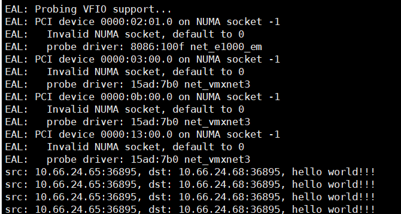

# dpdk实现网卡接收数据包并解析udp包

这篇文档读完能够达到如下两个效果:

1. 了解dpdk的程序模块结构和dpdk程序执行流程
2. 了解使用dpdk库的核心api

### dpdk udp接收程序源码分析

完整代码 [on github](https://github.com/The-Dire/dpdk-by-example/blob/main/src/example/01_recv/recv.c)

dpdk整个程序详解。

#### 程序主题流程

简略版代码调用步骤:

```c
rte_eal_init(argc, argv);  // dpdk环境初始化,巨页,内存,cpu亲和等的设置
struct rte_mempool *mbuf_pool = rte_pktmbuf_pool_create(); // 创建内存池
ht_init_port(); // 初始化端口
while(1) {
	struct rte_mbuf *mbufs[BURST_SIZE]; // mbuf用来存收到的数据包
	unsigned num_recvd = rte_eth_rx_burst(g_dpdk_port_id, 0, mbufs, BURST_SIZE); // mbufs被赋值
	for (i = 0; i < num_recvd; i++)
	{
		// 包处理
	}
}
```

dpdk接收程序一般处理流程：

1. `rte_eal_init`:初始化dpdk所需环境
2. `rte_pktmbuf_pool_create`: 创建内存池
3. 初始化dpdk端口
4. 进入包处理循环
5. 创建mbuf。`struct rte_mbuf *mbufs[BURST_SIZE];`
6. 启动收包。`rte_eth_rx_burst(g_dpdk_port_id, 0, mbufs, BURST_SIZE);`
7. 处理收到的包，进行位偏移


#### dpdk端口初始化流程

初始化端口代码详解(省略了部分代码):

```c
// 声明端口id
int g_dpdk_port_id = 0; // 端口id
// 初始化dpdk端口,参数为mbuf(提供给端口使用)
static void ht_init_port(struct rte_mempool *mbuf_pool) {
	rte_eth_dev_count_avail(); // 1. 检测端口是否合法,是否设置
	// 2. 获取网卡信息, rte_eth_dev_info_get函数将网卡信息赋值给dev_info
	struct rte_eth_dev_info dev_info;
  	rte_eth_dev_info_get(g_dpdk_port_id, &dev_info);
	// 3. 配置rx和tx队列
	// port_conf为用户自己设置的dpdk网卡参数
	struct rte_eth_conf port_conf = port_conf_default;
	// rte_eth_dev_configure中num_rx_queues和num_tx_queues为rx和tx队列的个数(最大值为8)
	rte_eth_dev_configure(g_dpdk_port_id, num_rx_queues, num_tx_queues, &port_conf);
	// 4. 设置哪一个队列去接收数据, 128是队列承载的数据包最大数量
	rte_eth_rx_queue_setup(g_dpdk_port_id, 0 , 128, 
    rte_eth_dev_socket_id(g_dpdk_port_id),NULL, mbuf_pool)
	// 5. 启动接收队列
	rte_eth_dev_start(g_dpdk_port_id)
}
```

初始化端口步骤:

1. 检测端口是否合法,是否设置。关键函数`rte_eth_dev_count_avail`
2. 获取网卡信息。关键函数`rte_eth_dev_info_get`
3. 配置rx和tx队列。关键函数`rte_eth_dev_configure`
4. 设置哪一个队列去接收数据。关键函数`rte_eth_rx_queue_setup`
5. 启动接收队列(在这里只有接收队列,其实是启动g_dpdk_port_id这个端口)。关键函数`rte_eth_dev_start`

#### 包处理

```c
struct rte_ether_hdr *ehdr = rte_pktmbuf_mtod(mbufs[i], struct rte_ether_hdr*); // 1. 获取以太网头
struct rte_ipv4_hdr *iphdr =  rte_pktmbuf_mtod_offset(mbufs[i], struct rte_ipv4_hdr *, sizeof(struct rte_ether_hdr)); // 2. 解析ip头
// 3. 如果是udp则进行打印
if (iphdr->next_proto_id == IPPROTO_UDP) {
	// 4. 输出对应信息或别的处理
	// 5. 处理完成mbuf放回内存池
	rte_pktmbuf_free(mbufs[i]);
}
```

包处理没有什么可讲的，说白了就是位偏移到对应协议头部获取信息即可。

核心在于处理完成必须要把mbuf放回内存池中。
   
### 实际运行

可以使用netassist来验证该接受程序是否生效。

网络top如下:

```
10.66.24.65 --- 10.66.24.68(dpdk程序)
```

使用方法如下:


但是程序起来后直接使用该程序进行发送，目标程序接收不到对应的消息。原因很简单netassist是基于windows宿主机的协议栈的，而windows宿主机中的arp表没有保存我们的程序所对应的网卡的mac地址。

arp协议作用:

```
在传输一个 IP 数据报的时候，确定了源 IP 地址和目标 IP 地址后，就会通过主机「路由表」确定 IP 数据包下一跳。然而，网络层的下一层是数据链路层，所以我们还要知道「下一跳」的 MAC 地址。
```

由于主机的路由表中可以找到下一跳的 IP 地址，所以可以通过 ARP 协议，求得下一跳的 MAC 地址。

下面的操作是将虚拟机对应网卡的mac地址告知windows宿主机的操作步骤。

1. 首先我们要获取到绑dpdk网卡的mac地址

```shell
ifconfig
# 输出如下
eth0      Link encap:Ethernet  HWaddr 00:0c:29:4f:5f:e0  
		  inet6 addr: fe80::20c:29ff:fe4f:5fe0/64 Scope:Link
		  UP BROADCAST RUNNING MULTICAST  MTU:1500  Metric:1
		  RX packets:43 errors:0 dropped:0 overruns:0 frame:0
		  TX packets:9 errors:0 dropped:0 overruns:0 carrier:0
		  collisions:0 txqueuelen:1000 
		  RX bytes:7624 (7.6 KB)  TX bytes:1262 (1.2 KB)
```

据此可知当前绑dpdk的网卡的mac地址为00:0c:29:4f:5f:e0。

2. 在windows主机添加arp信息,以便netassist接收到对应的数据

在windows执行

```shell
arp -s 10.66.24.68 00-0c-29-4f-5f-e0
```

3. 查看网口idx

```shell
netsh i i show in
# 结果如下
Idx     Met         MTU          State                Name
---  ----------  ----------  ------------  ---------------------------
  1          75  4294967295  connected     Loopback Pseudo-Interface 1
  4          25        1500  connected     以太网
 10          35        1500  connected     VMware Network Adapter VMnet1
 12          35        1500  connected     VMware Network Adapter VMnet8
```

可以看到和10.66.24.65(我自己的主机ip)处在同一Idx的是4。

4. 添加网关以及mac地址

```shell
netsh -c i i add neighbors 4 10.66.24.68 00-0c-29-4f-5f-e0
```

然后再使用工具发送消息：

recv程序打印如下:



## 结论

当前了解了dpdk程序的基本结构，后面将总结dpdk核心的几个api。现在基本上dpdk核心api都讲完了，只剩下dpdk ring相关api还未讲解。

上面的代码还存在一个很严重的问题，缺少arp request和arp reply流程即缺少。

一般来说带协议栈的设备都具备支持无回报(免费)ARP包(free arp)的发送来让其他主机获取到本机的mac地址从而让本机能够被访问。

当后续实现了udp reply后我将实现建议的arp处理。