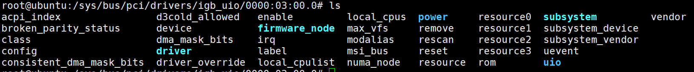
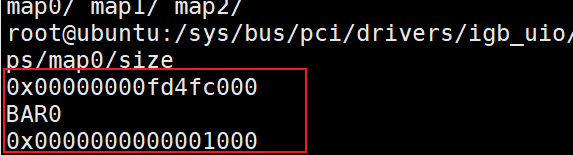
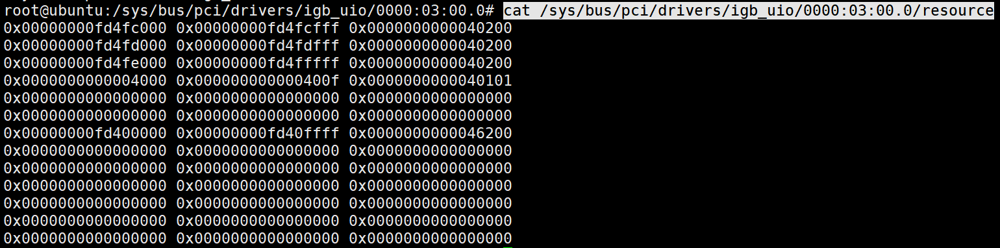

# igb_uio 与 uio 分析

igb_uio 是 dpdk 内部实现的将网卡映射到用户态的内核模块，它是 uio 模块的一个实例。

igb_uio 是一种 pci 驱动，将网卡绑定到 igb_uio 隔离了网卡的内核驱动，同时 igb_uio 完成网卡中断内核态初始化并将中断信号映射到用户态。

igb_uio 与 uio 模块密切相关，我将从 uio 模块着手分析 igb_uio 模块的工作原理。

注意: 市面上的书籍都没讲清楚uio究竟消除了那部分的开销。这里简单做下说明。

驱动程序可以通过两种方式与PCIe设备通信：

1. **设备可以初始化基地址寄存器(BARs)，该寄存器抽象为文件可以让驱动程序访问。(Linux系统一切皆文件)**
2. **设备可以直接通过 (DMA) 访问任意主内存位置，反过来讲网卡在收到数据包后会(能)通过DMA控制器直接把数据包拷贝到指定的内存地址。**

其实这时候直接调用`open()`,`read()`等系统api就能获取到网卡接收到的数据包了，`write()`就是发包。

DPDK的UIO消除了这部分的系统API调用开销。

为了消除系统API调用的开销，DPDK需要解析 PCIe 配置空间或者解析 procfs 和 sysfs 文件系统中的对应的文件。

下面正式进入UIO模块分析。

## 1. uio 模块分析

uio 可以看做是一种字符设备驱动，在此驱动中注册了单独的 file_operations 函数表，uio 设备可以看做是一种独立的设备类型。
file_operations 函数内容如下：

```c
static const struct file_operations uio_fops = {
    .owner      = THIS_MODULE,
    .open       = uio_open,
    .release    = uio_release,
    .read       = uio_read,
    .write      = uio_write,
    .mmap       = uio_mmap,
    .poll       = uio_poll,
    .fasync     = uio_fasync,
    .llseek     = noop_llseek,
};
```

该结构在 `uio_major_init` 中初始化 cdev 结构体时使用，相关代码如下：

```c
    cdev->owner = THIS_MODULE;
    cdev->ops = &uio_fops;
    kobject_set_name(&cdev->kobj, "%s", name);
    
    result = cdev_add(cdev, uio_dev, UIO_MAX_DEVICES);
```

cdev_add会在内核生成相应的设备驱动(是一个文件)，形如/dev/uioX。如果是第2号UIO设备，此时就会生成`/dev/uio2`

对 /dev/uioxx 文件的操作最终都会对应到对 uio_fops 的不同方法的掉用上。


## 2. uio_info 结构体及其实例化过程

uio 模块中的 `idev` 变量是一个指向 `struct uio_device` 的指针，`struct uio_device` 中又包含 一个指向 `struct uio_info` 的指针，`struct uio_info` 结构体内容如下：

```c
struct uio_info {
    struct uio_device   *uio_dev;
    const char      *name;
    const char      *version;
    struct uio_mem      mem[MAX_UIO_MAPS];
    struct uio_port     port[MAX_UIO_PORT_REGIONS];
    long            irq;
    unsigned long       irq_flags;
    void            *priv;
    irqreturn_t (*handler)(int irq, struct uio_info *dev_info);
    int (*mmap)(struct uio_info *info, struct vm_area_struct *vma);
    int (*open)(struct uio_info *info, struct inode *inode);
    int (*release)(struct uio_info *info, struct inode *inode);
    int (*irqcontrol)(struct uio_info *info, s32 irq_on);
};
```

每一个 uio 设备都会实例化一个 `uio_info` 结构体，uio 驱动自身不会实例化 `uio_info` 结构体，它只提供一个框架，可以在其它模块中调用 `uio_register_device` 来实例化 `uio_info` 结构体，在 dpdk 中，常见方式是在驱动绑定 igb_uio 的时候调用 `uio_register_device` 进行实例化。

## 3. igb_uio.c 中初始化当前设备 uio_info 结构过程

可以在 igb_uio.c 的 probe 函数 `igbuio_pci_probe` 中找到实例化的相关代码，摘录如下：

直接看注释即可。

### probe代码

```c
#if LINUX_VERSION_CODE < KERNEL_VERSION(3, 8, 0)
static int __devinit
#else
static int
#endif
igbuio_pci_probe(struct pci_dev *dev, const struct pci_device_id *id)
{
	struct rte_uio_pci_dev *udev;
	dma_addr_t map_dma_addr;
	void *map_addr;
	int err;

#ifdef HAVE_PCI_IS_BRIDGE_API
	if (pci_is_bridge(dev)) {
		dev_warn(&dev->dev, "Ignoring PCI bridge device\n");
		return -ENODEV;
	}
#endif
	// 创建了一个 rte_uio_pci_dev 结构体实例
	udev = kzalloc(sizeof(struct rte_uio_pci_dev), GFP_KERNEL);
	if (!udev)
		return -ENOMEM;
	// 使能 pci 设备并保留设备的 pci 内存区域到 igb_uio 模块中并使能总线控制。
	/*
	 * enable device: ask low-level code to enable I/O and
	 * memory
	 */
	err = pci_enable_device(dev);
	if (err != 0) {
		dev_err(&dev->dev, "Cannot enable PCI device\n");
		goto fail_free;
	}

	/* enable bus mastering on the device */
	pci_set_master(dev);
	/* 调用 igbuio_setup_bars 映射 pci 设备的 6 个 bar，并将内存地址及长度保存到 rte_uio_pci_dev 结构体的 info 字段中，详细信息见此函数注释。 */
	/* remap IO memory */
	err = igbuio_setup_bars(dev, &udev->info);
	if (err != 0)
		goto fail_release_iomem;
	// 设置 dma mask 信息，跳过了 uio_info 结构体初始化过程，这部分代码在探讨 uio 的时候描述。
	/* set 64-bit DMA mask */
	err = pci_set_dma_mask(dev,  DMA_BIT_MASK(64));
	if (err != 0) {
		dev_err(&dev->dev, "Cannot set DMA mask\n");
		goto fail_release_iomem;
	}

	err = pci_set_consistent_dma_mask(dev, DMA_BIT_MASK(64));
	if (err != 0) {
		dev_err(&dev->dev, "Cannot set consistent DMA mask\n");
		goto fail_release_iomem;
	}
	// 填充uio info信息
	/* fill uio infos */
	udev->info.name = "igb_uio";
	udev->info.version = "0.1";
	udev->info.irqcontrol = igbuio_pci_irqcontrol;
	udev->info.open = igbuio_pci_open;
	udev->info.release = igbuio_pci_release;
	udev->info.priv = udev;
	udev->pdev = dev;
	atomic_set(&udev->refcnt, 0);
	// 创建了 igb_uio 内部的 sysfs 属性
	err = sysfs_create_group(&dev->dev.kobj, &dev_attr_grp);
	if (err != 0)
		goto fail_release_iomem;
	// 注册uio驱动
	/* register uio driver */
	err = uio_register_device(&dev->dev, &udev->info);
	if (err != 0)
		goto fail_remove_group;
	// 调用 pci_set_drvdata 将 udev 设置为 pci 设备的私有数据
	pci_set_drvdata(dev, udev);

	/* 如果内核使用 iommu=pt 启动，则执行无害的 dma 映射以将设备附加到 iommu 身份映射。
	 * Doing a harmless dma mapping for attaching the device to
	 * the iommu identity mapping if kernel boots with iommu=pt.
	 * Note this is not a problem if no IOMMU at all. 请注意，如果根本没有 IOMMU，下面代码依然没问题。
	 */
	map_addr = dma_alloc_coherent(&dev->dev, 1024, &map_dma_addr,
			GFP_KERNEL);
	if (map_addr)
		memset(map_addr, 0, 1024);

	if (!map_addr)
		dev_info(&dev->dev, "dma mapping failed\n");
	else {
		dev_info(&dev->dev, "mapping 1K dma=%#llx host=%p\n",
			 (unsigned long long)map_dma_addr, map_addr);

		dma_free_coherent(&dev->dev, 1024, map_addr, map_dma_addr);
		dev_info(&dev->dev, "unmapping 1K dma=%#llx host=%p\n",
			 (unsigned long long)map_dma_addr, map_addr);
	}

	return 0;

fail_remove_group:
	sysfs_remove_group(&dev->dev.kobj, &dev_attr_grp);
fail_release_iomem:
	igbuio_pci_release_iomem(&udev->info);
	pci_disable_device(dev);
fail_free:
	kfree(udev);

	return err;
}
```

如果你对BAR寄存器完全不了解，可以先查看附录了解BAR寄存器。

这里面的核心代码是`igbuio_setup_bars`,调用 igbuio_setup_bars 映射 pci 设备 bar 中的内存区域，此函数代码如下：

```c
static int
igbuio_setup_bars(struct pci_dev *dev, struct uio_info *info)
{
	int i, iom, iop, ret;
	unsigned long flags;
	static const char *bar_names[PCI_STD_RESOURCE_END + 1]  = {
		"BAR0",
		"BAR1",
		"BAR2",
		"BAR3",
		"BAR4",
		"BAR5",
	};

	iom = 0;
	iop = 0;

	for (i = 0; i < ARRAY_SIZE(bar_names); i++) {
		if (pci_resource_len(dev, i) != 0 &&
				pci_resource_start(dev, i) != 0) {
			flags = pci_resource_flags(dev, i);
			if (flags & IORESOURCE_MEM) {
				ret = igbuio_pci_setup_iomem(dev, info, iom,
							     i, bar_names[i]);
				if (ret != 0)
					return ret;
				iom++;
			} else if (flags & IORESOURCE_IO) {
				ret = igbuio_pci_setup_ioport(dev, info, iop,
							      i, bar_names[i]);
				if (ret != 0)
					return ret;
				iop++;
			}
		}
	}

	return (iom != 0 || iop != 0) ? ret : -ENOENT;
}
```

它将 pci 设备每个 bar 的内存空间到 uio_info 结构中，可以分为两个类别：

1. IORESOURCE_MEM
2. IORESOURCE_IO

每个 bar 的 IORESOURCE_MEM 内存信息填充 uio_info 中的 mem 字段，相关代码为函数`igbuio_pci_setup_iomem`如下：

```c
	info->mem[n].name = name;
	info->mem[n].addr = addr;
	info->mem[n].internal_addr = internal_addr;
	info->mem[n].size = len;
	info->mem[n].memtype = UIO_MEM_PHYS;
```

n 从 0 开始，代表每一块独立的内存区域。

每个 bar 的 IORESOURCE_IO 内存信息填充 uio_info 中的 port 字段，相关代码为函数`igbuio_pci_setup_ioport`如下：

```c
	info->port[n].name = name;
	info->port[n].start = addr;
	info->port[n].size = len;
	info->port[n].porttype = UIO_PORT_X86;
```

n 从 0 开始累加，代表每一块有效的 io 内存区域。

igb_uio 中映射的 pci bar 的内存区域并不会被直接使用，在程序执行 mmap 映射 /dev/uio 设备内存时 info 结构中的 mem 与 port 字段的值被使用，通过这样的方式将网卡的 pci 物理地址映射为用户态空间的虚拟地址。

以19.08的DPDK代码为例:`rte_pci_probe` -> `pci_probe_all_drivers` -> `rte_pci_probe_one_driver` -> `rte_pci_map_device` -> `pci_uio_map_resource`。其中`pci_uio_map_resource`函数里面还是mmap的resource文件。

**所以可以得出结论 dpdk 内部代码映射网卡 pci 地址，并不通过UIO这种方式，实际是通过访问 resource 获取 pci 内存资源信息，然后依次 mmap 每个 pci 内存资源对应的 resourceX 文件完成的，执行 mmap 将 resource 文件中的物理地址映射为用户态程序中的虚拟地址。**

我看到这里的时候就想问，uio有啥用？

## 4. uio_info 结构体中 mem 与 port io 字段在 igb_uio 中填充的信息存在的意义

每个 uio 设备示例化过程中，会调用 `sysfs_create_group`和`uio_register_device`，这两个调用会创建 maps 与 portio sysfs 属性，网卡绑定到 igb_uio 后，可以通过访问 sysfs 目录中当前 pci 设备 uio maps 与 uio portio 文件来获取到网卡的 pci bar 中的物理内存信息。

示例如下:

进入对应网卡的uio map的路径：



如果你有多张张网卡且都绑定了igb_uio，如果进入第二张网卡的时候其注册的uio为uio1，进入到第二张网卡的地址后下面的cat指令要变为`uio/uio1/xxx`。

执行命令

```shell
cat uio/uio0/maps/map0/addr uio/uio0/maps/map0/name uio/uio0/maps/map0/size
```

效果如下:



下面看map1映射的什么？

```shell
cat uio/uio0/maps/map1/addr uio/uio0/maps/map1/name uio/uio0/maps/map1/size 
```

输出如下:

```
0x00000000fd4fd000
BAR1
0x0000000000001000
```

接着看portio的映射

```shell
cat uio/uio0/portio/port0/start uio/uio0/portio/port0/name uio/uio0/portio/port0/size uio/uio0/portio/port0/porttype 
```

其输出如下:

```
0x4000
BAR3
0x10
port_x86
```

如上信息说明 0000:03:00.0 pci 接口，

1. 其有效 IORESOURCE_MEM 位于 BAR0 中，物理地址是 0x00000000fd4fc000，长度是 0x0000000000001000。(有多个有效IORESOURCE_MEM)
2. 有效 IORESOURCE_IO 位于 BAR3 中，物理地址是 0x4000，长度为 0x10，类型为 port_x86。

此时查看网卡的resource资源

```shell
cat /sys/bus/pci/drivers/igb_uio/0000:03:00.0/resource
```



resource 文件信息每一行表示一个 pci 资源空间，dpdk 中只使用了前 6 个资源空间。每一个资源空间的第一列为起始物理地址，第二列为终止物理地址，第三列为 flag 标志。

第一行的地址位置和终止位置恰好和map0的信息相对应，起始位置为0x00000000fd4fc000，长度为0x0000000000001000，计算得出终止位置为0x00000000fd4fcfff。

其内容与 uio 生成的 maps 文件及 portio 文件的输出信息是一致的！实际上也可以通过 mmap /dev/uioX 来完成 pci 设备内存资源映射到用户态的工作。

结论:dpdk是初始化的时候为了方便还是调用系统函数`open()`读取resource然后进行初始化，运行时是通过epoll监控uio文件来获取网卡的内存资源。uio核心是减少运行时的开销。

## 5. 如何通过 mmap /dev/uiox 文件来映射网卡 pci 内存资源

从内核文档中找到如下信息：
Each mapX/ directory contains four read-only files that show attributes of the memory:

- name: A string identifier for this mapping. This is optional, the string can be empty. Drivers can set this to make it easier for userspace to find the correct mapping. (此映射的字符串标识符。这是可选的，字符串可以为空。驱动程序可以设置它以使用户空间更容易找到正确的映射。)
- addr: The address of memory that can be mapped. (可映射的内存地址。)
- size: The size, in bytes, of the memory pointed to by addr. (addr 指向的内存的大小，单位为字节)
- offset: The offset, in bytes, that has to be added to the pointer returned by mmap() to get to the actual device memory. This is important if the device’s memory is not page aligned. Remember that pointers returned by mmap() are always page aligned, so it is good style to always add this offset. (必须将 offset 添加到 mmap() 返回的指针上才能获取到实际的设备内存。如果设备的内存不是页面对齐的那么offset将变得非常重要，因为 mmap() 返回的指针需要始终是页对齐的，因此始终添加此偏移量是一种很好的风格。)
From userspace, the different mappings are distinguished by adjusting the offset parameter of the mmap() call. To map the memory of mapping N, you have to use N times the page size as your offset(从用户空间来看，通过调整 mmap() 调用的偏移参数来区分不同的映射。要映射映射N的内存，您必须使用页面大小的N倍作为偏移量):

```c
offset = N * getpagesize();
```

这里隐含了一个信息:不同的 pci 内存区域通过 offset 来区分，这就保证了当存在两个 pci 资源内存大小一致情况时的正常处理。

## 6. igb_uio 模块的初始化与解初始化函数

和其他内核模块一样通过 `module_init`和`module_exit`注册。

```c
module_init(igbuio_pci_init_module);
module_exit(igbuio_pci_exit_module);
```

igb_uio 模块可以看做是一个 pci 驱动的实例，其流程与 pci 驱动初始化过程类似，它实例化了一个 id_table 为空的 pci 驱动，在绑定网卡到 igb_uio 前需要先写入网卡的 vendor id 与 device id 到 igb_uio 驱动的 new_id 文件，DPDK是动态扩充 igb_uio 支持的 pci 设备型号，这与常见的 pci 驱动有所区别。

同样和内核的pci设备驱动实现一直，probe和remove注册即可。

igb_uio pci 驱动实例及初始化代码如下：

```c
static struct pci_driver igbuio_pci_driver = {
	.name = "igb_uio",
	.id_table = NULL,
	.probe = igbuio_pci_probe,
	.remove = igbuio_pci_remove,
};
```

下面是模块初始化函数:

```c
static int __init
igbuio_pci_init_module(void)
{
	int ret;

	if (igbuio_kernel_is_locked_down()) {
		pr_err("Not able to use module, kernel lock down is enabled\n");
		return -EINVAL;
	}

	if (wc_activate != 0)
		pr_info("wc_activate is set\n");
	// 判断 igb_uio 使用的中断模型，根据不同的中断模型申请使能并填充中断信息。
	ret = igbuio_config_intr_mode(intr_mode);
	if (ret < 0)
		return ret;

	return pci_register_driver(&igbuio_pci_driver);
}
```

igbuio_config_intr_mode 配置模块使用的中断模型，intr_mode 是 igb_uio 模块定义的一个模块参数，在加载模块的时候提供，没有指定时，默认使用 MSIX 中断模型。

然后是解初始化函数,逻辑很简单调用`pci_unregister_driver`即可:

```c
static void __exit
igbuio_pci_exit_module(void)
{
	pci_unregister_driver(&igbuio_pci_driver);
}
```

## 7. 网卡绑定到 igb_uio 时 probe 的过程

前文已经将添加注释的probe代码附上去了， 直接看对应注释代码 [probe代码附录跳转](#probe代码) 。

直接看注释即可。

总结probe主要做了如下这几件事:

1. 创建`rte_uio_pci_dev`结构体实例。
2. 使能pci设备并保留设备的pci内存区域到igb_uio模块中并使能总线控制。
3. 调用`igbuio_setup_bars`映射pci设备的6个bar，并将内存地址及长度保存到`rte_uio_pci_dev`结构体的info字段中。
4. 设置dma mask信息。
5. 初始化`uio_info`结构体。
6. 判断igb_uio使用的中断模型，根据不同的中断模型申请使能并填充中断信息。
7. 创建igb_uio内部的sysfs属性。
8. 调用`pci_set_drvdata`将udev 设置为 pci 设备的私有数据。
9. dma 映射以将设备附加到 iommu 映射。

这里的实现是把网卡的resource映射到uio/map中方便实现dpdk的用户态API。

## 8. dpdk 与 uio 设备文件的交互过程

dpdk 通过访问 uio 设备文件来完成物理网卡内核态的中断交互过程，阻塞式读取、通过epoll 监控 uio 文件来监听是否有中断事件，当中断到来后，read、epoll 系统调用返回，用户态处理中断处理完成后清除相应的中断标志位。绑定网卡到 igb_uio 时，实例化一个 uio 设备的过程中会申请 `request_irq`，并传入了中断回调函数 `uio_interrupt`，这是 uio 能够捕获到中断信号的关键！

代码逻辑: `rte_eal_init` -> `rte_eal_intr_init` -> `rte_ctrl_thread_create(&intr_thread, "eal-intr-thread", NULL,eal_intr_thread_main, NULL);`

其中`rte_ctrl_thread_create`即为创建主机线程来等待/处理中断。这里就是DPDK轮询的一种体现。核心函数为两个:

1. `eal_intr_handle_interrupts`：注册的中断的实际处理函数。
2. `eal_intr_process_interrupts`：实际中断回调的执行函数，遍历源注册的所有中断然后进行中断回调。

下面是代码详解：

### dpdk监听中断事件的过程

```c
static __attribute__((noreturn)) void *
eal_intr_thread_main(__rte_unused void *arg)
{
	struct epoll_event ev;

	/* host thread, never break out */
	for (;;) {
		/* 为所有需要等待的描述符构建epoll fd,
		 * 然后将其传递给handle_interrupts函数
		 */
		static struct epoll_event pipe_event = {
			.events = EPOLLIN | EPOLLPRI,
		};
		struct rte_intr_source *src;
		unsigned numfds = 0;

		/* 创建epoll fd */
		int pfd = epoll_create(1);
		if (pfd < 0)
			rte_panic("Cannot create epoll instance\n");

		pipe_event.data.fd = intr_pipe.readfd;
		/**
		 * 将管道pipe fd 添加到等待列表中，
		 * 该管道用于重建等待列表。(重建epoll_wait中的wait list)
		 */
		if (epoll_ctl(pfd, EPOLL_CTL_ADD, intr_pipe.readfd,
						&pipe_event) < 0) {
			rte_panic("Error adding fd to %d epoll_ctl, %s\n",
					intr_pipe.readfd, strerror(errno));
		}
		numfds++;

		rte_spinlock_lock(&intr_lock);
        // 遍历中断源(遍历所有中断)为其注册监听事件
		TAILQ_FOREACH(src, &intr_sources, next) {
			if (src->callbacks.tqh_first == NULL)
				continue; /* skip those with no callbacks 跳过那些没有回调的 */
			ev.events = EPOLLIN | EPOLLPRI | EPOLLRDHUP | EPOLLHUP;
			ev.data.fd = src->intr_handle.fd;

			/**
			 * 将所有 uio 设备文件描述符添加到等待列表中。
			 */
			if (epoll_ctl(pfd, EPOLL_CTL_ADD,
					src->intr_handle.fd, &ev) < 0){
				rte_panic("Error adding fd %d epoll_ctl, %s\n",
					src->intr_handle.fd, strerror(errno));
			}
			else
				numfds++;
		}
		rte_spinlock_unlock(&intr_lock);
		/* serve the interrupt */ // 中断实际处理函数
		eal_intr_handle_interrupts(pfd, numfds);

		/**
		 * 当中断回调返回时，
         * 需要重建要监控的fd列表。
		 */
		close(pfd);
	}
}
// 中断处理函数
static void
eal_intr_handle_interrupts(int pfd, unsigned totalfds)
{
	struct epoll_event events[totalfds];
	int nfds = 0;

	for(;;) {
		nfds = epoll_wait(pfd, events, totalfds,
			EAL_INTR_EPOLL_WAIT_FOREVER);
		/* epoll_wait fail */
		if (nfds < 0) {
			if (errno == EINTR)
				continue;
			RTE_LOG(ERR, EAL,
				"epoll_wait returns with fail\n");
			return;
		}
		/* epoll_wait 超时, 不可能走到这里 */
		else if (nfds == 0)
			continue;
		/* epoll_wait至少有一个fd可供读取,读取中断返回然后处理中断 */
		if (eal_intr_process_interrupts(events, nfds) < 0)
			return;
	}
}
```

`eal_intr_process_interrupts`是中断实际处理函数：

```c
static int
eal_intr_process_interrupts(struct epoll_event *events, int nfds)
{
	bool call = false;
	int n, bytes_read, rv;
	struct rte_intr_source *src;
	struct rte_intr_callback *cb, *next;
	union rte_intr_read_buffer buf;
	struct rte_intr_callback active_cb;

	for (n = 0; n < nfds; n++) {

		/**
		 * if the pipe fd is ready to read, return out to
		 * rebuild the wait list.
		 */
		if (events[n].data.fd == intr_pipe.readfd){
			int r = read(intr_pipe.readfd, buf.charbuf,
					sizeof(buf.charbuf));
			RTE_SET_USED(r);
			return -1;
		}
		rte_spinlock_lock(&intr_lock);
		TAILQ_FOREACH(src, &intr_sources, next)
			if (src->intr_handle.fd ==
					events[n].data.fd)
				break;
		if (src == NULL){
			rte_spinlock_unlock(&intr_lock);
			continue;
		}

		/* mark this interrupt source as active and release the lock. 将此中断源标记为活动并释放锁 */
		src->active = 1;
		rte_spinlock_unlock(&intr_lock);

		/* set the length to be read dor different handle type 设置不同句柄类型对应的读取长度 */
		switch (src->intr_handle.type) {
		case RTE_INTR_HANDLE_UIO:
		case RTE_INTR_HANDLE_UIO_INTX:
			bytes_read = sizeof(buf.uio_intr_count);
			break;
		case RTE_INTR_HANDLE_ALARM:
			bytes_read = sizeof(buf.timerfd_num);
			break;
#ifdef VFIO_PRESENT
		case RTE_INTR_HANDLE_VFIO_MSIX:
		case RTE_INTR_HANDLE_VFIO_MSI:
		case RTE_INTR_HANDLE_VFIO_LEGACY:
			bytes_read = sizeof(buf.vfio_intr_count);
			break;
#ifdef HAVE_VFIO_DEV_REQ_INTERFACE
		case RTE_INTR_HANDLE_VFIO_REQ:
			bytes_read = 0;
			call = true;
			break;
#endif
#endif
		case RTE_INTR_HANDLE_VDEV:
		case RTE_INTR_HANDLE_EXT:
			bytes_read = 0;
			call = true;
			break;
		case RTE_INTR_HANDLE_DEV_EVENT:
			bytes_read = 0;
			call = true;
			break;
		default:
			bytes_read = 1;
			break;
		}

		if (bytes_read > 0) {
			/**
			 * read out to clear the ready-to-be-read flag
			 * for epoll_wait. 读取内容用来清除epoll_wait的ready-to-be-read标志位
			 */
			bytes_read = read(events[n].data.fd, &buf, bytes_read);
			if (bytes_read < 0) {
				if (errno == EINTR || errno == EWOULDBLOCK)
					continue;

				RTE_LOG(ERR, EAL, "Error reading from file "
					"descriptor %d: %s\n",
					events[n].data.fd,
					strerror(errno));
				/*
				 * The device is unplugged or buggy, remove 设备已拔出或有问题，
				 * it as an interrupt source and return to  将其作为中断源移除
				 * force the wait list to be rebuilt.       并返回然后强制重建等待列表。
				 */
				rte_spinlock_lock(&intr_lock);
				TAILQ_REMOVE(&intr_sources, src, next);
				rte_spinlock_unlock(&intr_lock);

				for (cb = TAILQ_FIRST(&src->callbacks); cb;
							cb = next) {
					next = TAILQ_NEXT(cb, next);
					TAILQ_REMOVE(&src->callbacks, cb, next);
					free(cb);
				}
				free(src);
				return -1;
			} else if (bytes_read == 0)
				RTE_LOG(ERR, EAL, "Read nothing from file "
					"descriptor %d\n", events[n].data.fd);
			else
				call = true;
		}
        // 获取锁，再次调用回调并更新状态。
		/* grab a lock, again to call callbacks and update status. */
		rte_spinlock_lock(&intr_lock);

		if (call) {
            // 最终，调用所有中断回调
			/* Finally, call all callbacks. */
			TAILQ_FOREACH(cb, &src->callbacks, next) {
                // 拷贝并解锁。
				/* make a copy and unlock. */
				active_cb = *cb;
				rte_spinlock_unlock(&intr_lock);
                // 调用实际中断回调
				/* call the actual callback */
				active_cb.cb_fn(active_cb.cb_arg);

				/*get the lock back. */
				rte_spinlock_lock(&intr_lock);
			}
		}
		/* we done with that interrupt source, release it. */
		src->active = 0;

		rv = 0;
        // 检查是否应该删除任何回调
		/* check if any callback are supposed to be removed */
		for (cb = TAILQ_FIRST(&src->callbacks); cb != NULL; cb = next) {
			next = TAILQ_NEXT(cb, next);
			if (cb->pending_delete) {
				TAILQ_REMOVE(&src->callbacks, cb, next);
				if (cb->ucb_fn)
					cb->ucb_fn(&src->intr_handle, cb->cb_arg);
				free(cb);
				rv++;
			}
		}
        // 删除该源的所有中断回调
		/* all callbacks for that source are removed. */
		if (TAILQ_EMPTY(&src->callbacks)) {
			TAILQ_REMOVE(&intr_sources, src, next);
			free(src);
		}
        // 通知epoll_wait等待的管道fd重建等待列表
		/* notify the pipe fd waited by epoll_wait to rebuild the wait list */
		if (rv >= 0 && write(intr_pipe.writefd, "1", 1) < 0) {
			rte_spinlock_unlock(&intr_lock);
			return -EPIPE;
		}

		rte_spinlock_unlock(&intr_lock);
	}

	return 0;
}
```

## 9. uio设备控制中断过程分析

对于标准的 uio 设备，通过向设备文件中写入 1 来使能中断，与之类似关闭中断的过程是向设备文件中写入 0。
使用 uio 映射网卡到用户态时，网卡驱动会调用 uio_intr_enable 函数来使能uio 中断。其代码摘录如下：

```c
static int
uio_intr_enable(const struct rte_intr_handle *intr_handle)
{
	const int value = 1;

	if (write(intr_handle->fd, &value, sizeof(value)) < 0) {
		RTE_LOG(ERR, EAL,
			"Error enabling interrupts for fd %d (%s)\n",
			intr_handle->fd, strerror(errno));
		return -1;
	}
	return 0;
}
```

可以看到，这个函数通过写 1 到 uio 设备文件中来完成使能中断的过程。以ixgbe为例，其驱动初始化函数为: `eth_ixgbe_dev_init` 。

`eth_ixgbe_dev_init`使能中断调用栈为如下:

`eth_ixgbe_dev_init` -> `rte_intr_enable(intr_handle);` -> `uio_intr_enable(intr_handle)`。

`rte_intr_enable`作用是:启用 uio或vfio intr/eventfd 映射。

## 10. 写入 uio 设备文件有怎样的影响？

uio_write 是写入 uio 设备文件时内核中最终调用到的写入函数，其代码如下：

```c
static ssize_t uio_write(struct file *filep, const char __user *buf,
            size_t count, loff_t *ppos)
{   
    struct uio_listener *listener = filep->private_data;
    struct uio_device *idev = listener->dev;
    ssize_t retval;
    s32 irq_on;

    if (count != sizeof(s32))
        return -EINVAL;

    if (copy_from_user(&irq_on, buf, count))
        return -EFAULT;

    mutex_lock(&idev->info_lock);
    if (!idev->info) {
        retval = -EINVAL;
        goto out;
    }

    if (!idev->info || !idev->info->irq) {
        retval = -EIO;
        goto out;
    }

    if (!idev->info->irqcontrol) {
        retval = -ENOSYS;
        goto out;
    }

    retval = idev->info->irqcontrol(idev->info, irq_on);

out:
    mutex_unlock(&idev->info_lock);
    return retval ? retval : sizeof(s32);
}
```

可以看到它从用户态获取到 irq_on 这个变量的值，为 1 对应要使能中断，为 0 则表示关闭中断，在获取了这个参数后，它首先占用互斥锁，然后调用 info 结构体中实例化的 irqcontrol 子函数来完成工作。

## 11. write 写入 uio 设备文件的完整过程

上文中已经提到过使用 write 系统调用写入 uio 设备文件最终将会调用到 info 结构体中实例化的 irqcontrol 子函数来完成工作，这里 igb_uio 就完成了这样的过程。

也就是说在绑定网卡到 igb_uio 时，写入接口对应的 uio 设备文件时将会调用 igb_uio 中实例化的 info->irqcontrol 函数来控制中断状态。

probe的时候填充uio info信息的时候注册的`irqcontrol`中断控制回调即为实际执行函数。

```c
	// 填充uio info信息
	/* fill uio infos */
	udev->info.name = "igb_uio";
	udev->info.version = "0.1";
	udev->info.irqcontrol = igbuio_pci_irqcontrol;
	udev->info.open = igbuio_pci_open;
	udev->info.release = igbuio_pci_release;
	udev->info.priv = udev;
	udev->pdev = dev;
```

这里提到的 irqcontrol 的实例化函数，在 igb_uio 中对应的就是 `igbuio_pci_irqcontrol` 函数。其代码如下：

```c
/**
 * This is the irqcontrol callback to be registered to uio_info.
 * It can be used to disable/enable interrupt from user space processes.
 *
 * @param info
 *  pointer to uio_info.
 * @param irq_state
 *  state value. 1 to enable interrupt, 0 to disable interrupt.
 *
 * @return
 *  - On success, 0.
 *  - On failure, a negative value.
 */
static int
igbuio_pci_irqcontrol(struct uio_info *info, s32 irq_state)
{
	struct rte_uio_pci_dev *udev = info->priv;
	struct pci_dev *pdev = udev->pdev;

#ifdef HAVE_PCI_MSI_MASK_IRQ
	struct irq_data *irq = irq_get_irq_data(udev->info.irq);
#endif

	pci_cfg_access_lock(pdev);

	if (udev->mode == RTE_INTR_MODE_MSIX || udev->mode == RTE_INTR_MODE_MSI) {
#ifdef HAVE_PCI_MSI_MASK_IRQ
		if (irq_state == 1)
			pci_msi_unmask_irq(irq);
		else
			pci_msi_mask_irq(irq);
#else
		igbuio_mask_irq(pdev, udev->mode, irq_state);
#endif
	}

	if (udev->mode == RTE_INTR_MODE_LEGACY)
		pci_intx(pdev, !!irq_state);

	pci_cfg_access_unlock(pdev);

	return 0;
}
```

这里需要访问 pci 配置空间，根据不同的中断类型来控制中断状态。

## 12. 完整的uio写过程

```c
write uio -> uio_write -> udev->info->irqcontrol -> igbuio_pci_irqcontrol
```

DPDK中用的是`pwrite`：

```c
int
pci_uio_write_config(const struct rte_intr_handle *intr_handle,
		     const void *buf, size_t len, off_t offset)
{
	return pwrite(intr_handle->uio_cfg_fd, buf, len, offset);
}
```

dpdk 程序在初始化网卡时会写入网卡接口对应的 uio 文件来使能中断，当中断使能后，一旦有中断到来，uio_interrupt 中断回调会被执行。

对于内核来说此回调函数代码是`uio_interrupt`，调用的是 `uio_info` 中的 `handler` 函数。

对 igb_uio 来说，此函数是 `igbuio_pci_irqhandler`，其源码如下：

```c
/**
 * This is interrupt handler which will check if the interrupt is for the right device.
 * If yes, disable it here and will be enable later.
 */
static irqreturn_t
igbuio_pci_irqhandler(int irq, void *dev_id)
{
	struct rte_uio_pci_dev *udev = (struct rte_uio_pci_dev *)dev_id;
	struct uio_info *info = &udev->info;

	/* Legacy mode need to mask in hardware */
	if (udev->mode == RTE_INTR_MODE_LEGACY &&
	    !pci_check_and_mask_intx(udev->pdev))
		return IRQ_NONE;

	uio_event_notify(info);

	/* Message signal mode, no share IRQ and automasked */
	return IRQ_HANDLED;
}
```

对于 Legacy 中断模式，需要设置硬件掩码值，重点是关注返回 `IRQ_HANDLED` 的流程。当 handler 函数调用完成后，如果返回值是 IRQ_HANDLED，则调用 `uio_event_notify` 唤醒阻塞在 uio 设备等待队列中的进程，以通知用户态程序中断到达。

## 13. dpdk监听中断事件的过程

这部分代码解读都放在了前文中， [dpdk监听中断的过程](#dpdk监听中断事件的过程)

总结:

dpdk 单独创建了一个中断线程负责监听并处理中断事件，其主要过程如下：

1. 创建 `epoll_event`
2. 遍历中断源列表，添加每一个需要监听的 `uio` 设备事件的 `uio` 文件描述符到 `epoll_event` 中
3. 调用 `epoll_wait` 监听事件，监听到事件后调用 `eal_intr_process_interrupts` 调用相关的中断回调函数

# 总结

dpdk igb_uio主要是uio内核模块的编程，熟悉字符设备模块编程很容易解读出内容。

回到igb_uio，其核心分为这几个部分:

1. 注册uio ops回调
2. igb_uio驱动probe
3. 网卡resource怎么mmap给用户态程序的流程

# 附录

附录: 基地址寄存器 (BAR) 是 PCIe 架构的基本部分，用于配置和管理设备的内存和 I/O 资源。下面详细介绍一下它们的用途：

BAR 是位于 PCIe 设备的 PCI 配置空间中的特殊寄存器。它们指定设备用来访问系统内存或 I/O 空间的内存映射或 I/O 映射区域的基地址。本质上，BARs用来让 PCIe 设备告诉系统应该在哪里寻找其内存映射寄存器或 I/O 区域。

Base Address Registers（BAR）寄存器的作用

1. 指定资源地址：
        - 内存映射资源：BAR 寄存器用于定义设备所需的内存地址范围。设备通过这些寄存器告诉系统在内存中哪个区域应该用于访问设备的寄存器或内部存储器。
        - I/O 映射资源：对于某些设备，BAR 寄存器也可以用于指定 I/O 地址范围，这样设备可以通过 I/O 地址与系统进行通信。

2. 资源分配：
        - 当系统检测到 PCIe 设备时，操作系统或 BIOS 会读取 BAR 寄存器，确定设备需要的内存或 I/O 空间大小。
        - 系统根据 BAR 寄存器的内容分配相应的地址范围。对于内存映射的 BAR，这意味着将设备的寄存器或存储器映射到系统的物理内存地址空间。

3. 设备初始化：
        - 在系统启动或设备初始化期间，系统会配置 BAR 寄存器。通过读取和设置 BAR 寄存器，系统将为设备分配物理地址，并将这些地址映射到设备的寄存器空- 间或内存空间。

4. 访问设备资源：
        - 配置完成后，设备的资源可以通过 BAR 寄存器指定的地址进行访问。这使得 CPU 或其他系统组件能够直接与设备进行通信，进行数据交换或控制操作。