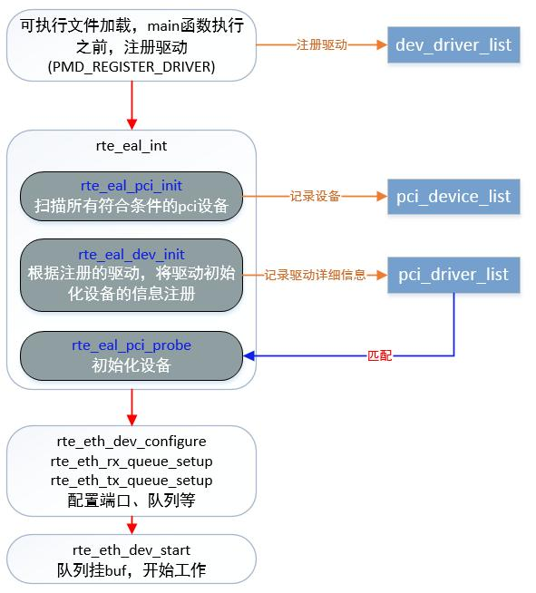

# dpdk初始化过程分析

dpdk核心是收发包都在用户态，因此其初始化过程中实际上进行了相应驱动的绑定。本文重点就在于网卡驱动怎么嵌入到dpdk给用户的runtime library中的。

注：本文的代码基于DPDK 19.08。

## 1. dpdk初始化的两大阶段

dpdk 程序初始化可以以 main 函数为界限划分为两个阶段，第一个阶段为 main 函数之前 dpdk 内部构造函数的执行，执行完成后会初始化几个重要的链表：如 tailq 链表与 dpdk 驱动链表。
第二个阶段为 main 函数中调用 rte_eal_init 来显示的初始化 dpdk 程序的 eal 环境，此函数代码很少，其背后隐藏的细节却非常多，本文中将从这两个阶段入手，描述 dpdk 程序初始化 eal 环境的主要原理。

## 2. dpdk初始化第一阶段

dpdk 支持多个网卡驱动，并且在不断扩展，dpdk 使用 gcc constructor 机制通过构造函数将网卡驱动注册到链表中，统一了驱动注册的框架，增加新的驱动时，只需要声明一个注册语句即可。

老版本的DPDK注册的链表是`dev_driver_list`。

较新的版本DPDK通过`rte_pci_bus`结构统一管理。

```c
struct rte_pci_bus {
	struct rte_bus bus;               /**< Inherit the generic class */
	struct rte_pci_device_list device_list;  /**< List of PCI devices */
	struct rte_pci_driver_list driver_list;  /**< List of PCI drivers */
};

```

网卡驱动注册到`rte_pci_bus`中的`driver_list`链表里的。具体参照`rte_pci_register`函数，DPDK大部分驱动都是通过宏`RTE_PMD_REGISTER_PCI`注册到DPDK的统一管理链表中的，而`RTE_PMD_REGISTER_PCI`宏就是调用了`rte_pci_register`函数。

在第一阶段 dpdk 还初始化了 `rte_tailq_elem_head` 这个 `tailq` 链表，初始化过程仅仅将不同模块中声明的 `tailq` 链起来，真正的初始化在 `rte_eal_tailqs_init` 中完成。

在一些模块中也有一些通过 constructor 声明的函数，不进一步描述。

dpdk 初始化过程相对复杂，这里只分析网卡接口初始化的流程。

## 3. 端口初始化

下图是dpdk 16.04的调用图，与新版本差别不大。



### 3.1 注册设备驱动到rte_pci_bus.driver_list

1. pci总线管理结构初始化driver_list

首先DPDK使用rte_pci_bus这个全局变量来管理所有pci网卡驱动。

dpdk pci初始化driver_list链表的代码如下:

代码在drivers\bus\pci\pci_common.c内部

```c
struct rte_pci_bus rte_pci_bus = {
	.bus = {
		.scan = rte_pci_scan,
		.probe = rte_pci_probe,
		.find_device = pci_find_device,
		.plug = pci_plug,
		.unplug = pci_unplug,
		.parse = pci_parse,
		.dma_map = pci_dma_map,
		.dma_unmap = pci_dma_unmap,
		.get_iommu_class = rte_pci_get_iommu_class,
		.dev_iterate = rte_pci_dev_iterate,
		.hot_unplug_handler = pci_hot_unplug_handler,
		.sigbus_handler = pci_sigbus_handler,
	},
	.device_list = TAILQ_HEAD_INITIALIZER(rte_pci_bus.device_list),
	.driver_list = TAILQ_HEAD_INITIALIZER(rte_pci_bus.driver_list),
};

RTE_REGISTER_BUS(pci, rte_pci_bus.bus);
```

其中`.driver_list = TAILQ_HEAD_INITIALIZER(rte_pci_bus.driver_list),`则是初始化pci总线的driver_list链表。

从bus文件夹中可以得知，dpdk支持dpaa，fslmc，ifpga，pci，vdev，vmbus这6种pci总线。其余总线注册设备驱动到对应的总线的`driver_list`流程是一样的。

2. 注册DPDK PMD驱动然后挂在到`driver_list`上面

以ixgbe为例，下面代码都在drivers\net\ixgbe\ixgbe_ethdev.c能找到。

```c
// probe ixgbe驱动
static struct rte_pci_driver rte_ixgbe_pmd = {
	.id_table = pci_id_ixgbe_map,
	.drv_flags = RTE_PCI_DRV_NEED_MAPPING | RTE_PCI_DRV_INTR_LSC,
	.probe = eth_ixgbe_pci_probe,
	.remove = eth_ixgbe_pci_remove,
};
```

上述代码就代表ixgbe实现了其对应的驱动。

下面的代码则是将实现了的驱动注册到DPDK整个框架里。

```c
RTE_PMD_REGISTER_PCI(net_ixgbe, rte_ixgbe_pmd);
RTE_PMD_REGISTER_PCI_TABLE(net_ixgbe, pci_id_ixgbe_map);
RTE_PMD_REGISTER_KMOD_DEP(net_ixgbe, "* igb_uio | uio_pci_generic | vfio-pci");
```

其中核心是`RTE_PMD_REGISTER_PCI`宏。

```c
/** Helper for PCI device registration from driver (eth, crypto) instance */
#define RTE_PMD_REGISTER_PCI(nm, pci_drv) \
RTE_INIT(pciinitfn_ ##nm) \
{\
	(pci_drv).driver.name = RTE_STR(nm);\
	rte_pci_register(&pci_drv); \
} \
RTE_PMD_EXPORT_NAME(nm, __COUNTER__)
```

该宏调用了`rte_pci_register`函数，作用就是把这个驱动注册到`rte_pci_bus.driver_list`中。

```c
void
rte_pci_register(struct rte_pci_driver *driver)
{
	TAILQ_INSERT_TAIL(&rte_pci_bus.driver_list, driver, next);
	driver->bus = &rte_pci_bus;
}
```

这里要明确一点注册设备驱动的过程在main函数执行之前完成。 这样就有了设备驱动类型、设备驱动的初始化函数。在老版本DPDK 16.04及之前使用了GNU C提供的“attribute（constructor）”机制来保证注册驱动在前。

新版本通过`RTE_REGISTER_BUS`宏机制保证了注册驱动在main函数之前。


