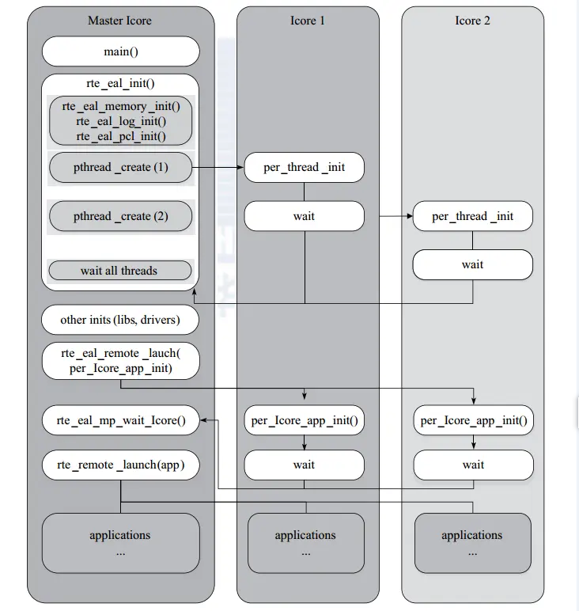
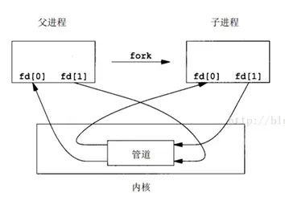

# DPDK多线程浅析

DPDK是一个高性能用户态驱动，同时改网卡驱动由原先的中断为轮询。

## DPDK性能

DPDK一个处理器核心可以处理约33M个报文，大概30ns处理一个报文，在处理器频率2.7GHz的情况下，处理一个数据报文需要80个时钟周期。

传统的网卡驱动到内核协议栈会经历如下:

1. 写接受描述符到内存，填充数据缓冲区指针，网卡接收到报文后就根据该地址把报文内容填进去。
2. 从内存中读取接收描述符（到接收到报文时，网卡会更新该结构），从而确认是否收到报文。
3. 从接收描述符确认收到报文时，从内存中读取控制结构体的指针，再从内存中读取控制结构体，把从接收描述符中读取的信息填充到该控制结构体。
4. 更新接收队列寄存器，表示软件接收到了新的报文。
5. 从内存读取报文头部，决定转发端口。
6. 从控制结构体把报文信息填入到发送队列发送描述符中，更新发送队列寄存器。
7. 从内存中读取发送描述符，检查是否有包被硬件发送出去。
8. 如果有的话，则从内存中读取相应控制结构体，释放数据缓冲区。

这里的步骤，有6次内存读取，而处理器从一级缓存(cache)需要3-5时钟周期，二级缓存是十几个时钟周期，三级缓存几十个，而从内存读取数据，由于NUMA架构的影响，在不同核心间内存读取会花费非常多的时间，所以访问内存平均需要几百个时钟周期。

处理一个报文当保证数据在cache中时需要80个时钟周期，而一旦数据不命中就会需要几百个时钟周期，造成性能骤降。这种现象叫做发生了cache miss。

在操作系统中，最容易造成性能下降的是线程的调度，尤其是核间线程的切换，最容易造成cache miss和cache write back。所以在DPDK中利用的是线程的CPU亲和绑定的方式，来指定任务到不同的核上。再进一步，可以限制一些核不参与Linux的系统调度，这样就可以达到任务独占的目的，最大限度地避免了cache不命中带来的性能下降。

DPDK中的多线程是基于linux系统里的pthread实现的,主要使用了`sched.h`。而freeBSD中主要使用了`pthread_np.h`。lcore指的是EAL线程，并且在命令行参数中使用“-c”带十六进制参数作为coremask，该掩码的意义是:为二进制数上为1的一位即表示将要绑定独占的线程，例如：掩码是16进制的f，二进制对应为1111，即表示cpu0、cpu1、cpu2、cpu3作为逻辑核为程序所用。

## lcore的初始化代码实现

1. rte_eal_cpu_init()函数中，通过`eal_cpu_detected`函数读取/sys/devices/system/cpu/cpuX/下的相关信息，确定当前系统有哪些核，以及分别属于哪些socket（这里的socket是NUMA架构中socket，我更喜欢称之为端口，不是网络中的套接字）。socket的获取在函数`eal_cpu_socket_id`。
2. eal_parse_args()函数，解析-c参数，确认哪些核是可以用的，并且设置第一个核为MASTER。
3. 为每一个SLAVE核创建线程，并调用eal_thread_set_affinity()绑定CPU，每个线程的执行的其实是一个主体是while死循环的调用不同模块注册到lcore_config[lcore_id].f的回调函数eal_thread_loop()。

```c
RTE_LCORE_FOREACH_SLAVE(i) {
	// 省略
	/* create a thread for each lcore */
	ret = pthread_create(&lcore_config[i].thread_id, NULL,
		eal_thread_loop, NULL);
	// 省略
    /* 在所有从 lcore 上启动一个虚拟函数，以便主 lcore 在该函数返回时知道它们已准备就绪。*/
    rte_eal_mp_remote_launch(sync_func, NULL, SKIP_MASTER);
    rte_eal_mp_wait_lcore();
}
```

***注：在eal_thread_loop()中，将线程绑定核，然后置于了等待的状态。绑定核函数基于linux原型函数f_pthread_setaffinity_np，在pthread_shim.c中有对各种pthread函数封装的实现。***

## lcore的注册：

不同模块需要调用`rte_eal_mp_remote_launch()`，将回调函数注册到`config[].f`中。

参考l2fwd:

```c
// 在每个core上运行l2fwd_launch_one_lcore函数
rte_eal_mp_remote_launch(l2fwd_launch_one_lcore, NULL, CALL_MASTER);
```


每个核上的线程都会调用该函数来实现自己的处理函数。lcore启动过程和任务分发如下：



上图也可以理解为一个DPDK的应用程序的大致执行思路。

另外，由于现网往往有流量潮汐的影响，所以为了寻求灵活的扩展能力，EAL pthread与逻辑核之间允许打破1:1的绑定关系，允许绑定一个特定的lcore ID或者lcore ID组。

## DPDK的hello world程序解析

在example文件夹中，可以看到一个最简单的hello world程序。它建立了一个多核运行的环境，每个线程都会打印“hello from core #”，有点类似pthread的入门程序。


**注意：在DPDK代码中，rte（runtime environment）开头的函数是作为给开发者直接调用的接口，也就是说，只是使用DPDK的话，只要知晓这些函数的参数和作用，会调用即可，eal（environment abstraction layer）是DPDK核心库中提供系统抽象的部分，因为虽然现在的源码是基于linux或者FreeBSD系统运行，但它最早期的代码是不依赖于操作系统的，就像自己本身就是个mini-os一样。**

```c
#include <stdio.h>
#include <string.h>
#include <stdint.h>
#include <errno.h>
#include <sys/queue.h>

#include <rte_memory.h>
#include <rte_launch.h>
#include <rte_eal.h>
#include <rte_per_lcore.h>
#include <rte_lcore.h>
#include <rte_debug.h>

static int
lcore_hello(__attribute__((unused)) void *arg)
{
	unsigned lcore_id;
	lcore_id = rte_lcore_id(); // 5. 返回当前执行单元的线程id
	printf("hello from core %u\n", lcore_id);
	return 0;
}

int
main(int argc, char **argv)
{
	int ret;
	unsigned lcore_id;
  	// 1. 初始化eal
	ret = rte_eal_init(argc, argv);
	if (ret < 0)
		rte_panic("Cannot init EAL\n");

	/* call lcore_hello() on every slave lcore */
	RTE_LCORE_FOREACH_SLAVE(lcore_id) { // 2. 遍历除主lcore之外的所有lcore
		rte_eal_remote_launch(lcore_hello, NULL, lcore_id); // 3. 在core上执行lcore_hello函数
	}

	/* call it on master lcore too */
	lcore_hello(NULL);

	rte_eal_mp_wait_lcore(); // 4. 等待lcore完成工作
	return 0;
}
```

`rte_eal_init(argc, argv)`中两个命令行入口参数，可以是一系列很长很复杂的设置，从顶往下追溯：
`rte_eal_init` -> `eal_log_level_parse` -> `eal_parse_common_option`。

`eal_parse_common_option`函数，便是对common opinion进行设置的地方。common opinion如下所示，分别用于命令行设置不同的值。

```c
const char
eal_short_options[] =
	"b:" /* pci-blacklist */
	"c:" /* coremask */
	"d:" /* driver */
	"h"  /* help */
	"l:" /* corelist */
	"m:" /* memory size */
	"n:" /* memory channels */
	"r:" /* memory ranks */
	"v"  /* version */
	"w:" /* pci-whitelist */
	;
```

其中最重要的就是-c，设置核掩码。

整体代码的结构和pthread写的多线程程序类似，先`rte_eal_init()`进行一系列很复杂的初始化工作，在官方文档上写的这些初始化工作包括：

* 配置初始化
* 内存初始化
* 内存池初始化
* 队列初始化
* 告警初始化
* 中断初始化
* PCI初始化
* 定时器初始化
* 检测内存本地化（NUMA）
* 插件初始化
* 主线程初始化
* 轮询设备初始化
* 建立主从线程通道
* 将从线程设置为等待模式
* PCI设备的探测和初始化

然后通过`RTE_LCORE_FOREACH_SLAVE`宏遍历所有EAL指定可以使用lcore，通过`rte_eal_remote_launch`函数在每个lcore上，启动指定的线程。

**需要注意的是lcore_id是一个unsigned变量，其实际作用就相当于循环变量i，因为宏RTE_LCORE_FOREACH_SLAVE里会启动for循环来遍历所有可用的核。**

```c
#define RTE_LCORE_FOREACH_SLAVE(i)					\
	for (i = rte_get_next_lcore(-1, 1, 0);				\
	     i<RTE_MAX_LCORE;						\
	     i = rte_get_next_lcore(i, 1, 0))
```

在函数`int rte_eal_remote_launch(int (*f)(void *), void *arg, unsigned slave_id)`中，第一个参数是slave线程要调用的函数，第二个参数是调用的函数的参数，第三个参数是指定的逻辑核。详细的函数执行过程如下：

```c
int
rte_eal_remote_launch(int (*f)(void *), void *arg, unsigned slave_id)
{
	int n;
	char c = 0;
	int m2s = lcore_config[slave_id].pipe_master2slave[1]; //主线程对从线程的管道，管道是一个大小为2的int数组
	int s2m = lcore_config[slave_id].pipe_slave2master[0]; //从线程对主线程的管道

	if (lcore_config[slave_id].state != WAIT)
		return -EBUSY;

	lcore_config[slave_id].f = f;
	lcore_config[slave_id].arg = arg;

	/* send message */
	n = 0;
	while (n == 0 || (n < 0 && errno == EINTR))
		n = write(m2s, &c, 1);     //此处是调用的linux库函数
	if (n < 0)
		rte_panic("cannot write on configuration pipe\n");

	/* wait ack */
	do {
		n = read(s2m, &c, 1); 
	} while (n < 0 && errno == EINTR);

	if (n <= 0)
		rte_panic("cannot read on configuration pipe\n");

	return 0;
}
```

lcore_config中的`pipe_master2slave[2]`和`pipe_slave2master[2]`分别是主线程到从线程核从线程到主线程的管道，与linux中的管道一样，是一个大小为2的数组，数组的第一个元素为读打开，第二个元素为写打开。在这调用了linux库函数read核write，把c作为消息传递。管道的模型如下图所示：




这样，每个从线程通过rte_eal_remote_launch函数运行了自定义函数lcore_hello就打印出了“hello from core #”的输出。

## 程序主体流程总结

1. 初始化eal。`rte_eal_init(argc, argv)`
2. 遍历除主lcore之外的所有lcore，并且在core上执行lcore_hello函数

```c
RTE_LCORE_FOREACH_SLAVE(lcore_id) { // 2. 遍历除主lcore之外的所有lcore
    rte_eal_remote_launch(lcore_hello, NULL, lcore_id); // 3. 在core上执行lcore_hello函数
}
```

3.  等待lcore完成工作

```c
rte_eal_mp_wait_lcore(); 
```

# 总结

DPDK性能优异除了用户态以及改中断为轮询外做了如下事情:

1. 减少内存拷贝和减少核间通信(减少cache miss和cache write back)
2. 充分利用CPU亲和性，让函数执行集中在一个核心上