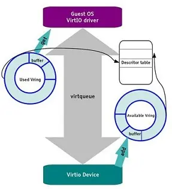

# DPDK中虚拟网卡初始化与收发包分析

DPDK通过`virtio`和`vhost PMD`来实现IO的半虚拟化功能，virtio 是 dpdk 虚拟网卡的典型示例，本文将分析下 virtio 的内部原理。

virtio是一种半虚拟化的设备抽象接口规范，在guest操作系统中实现的前端驱动程序一般直接称为virtio，在host操作系统实现的后端驱动程序通常称为vhost。与guest端纯软件模拟I/O（如e1000,rt18139）相比，virtio可以提供很好的I/O性能，虽然同I/O透传技术或者SR-IOV技术相比，目前在网络吞吐率、时延以及抖动性各方面相比都不具备优势，但是其适用性更广且DPDK有针对于SR-IOV的优化正在不断迭代。此外，使用virtio技术可以支持虚拟机的动态迁移以及灵活的流分类规则。

virtio主要有两个版本，0.95和1.0，其规定的实现接口有PCI，MMIO和Channel IO方式，其中Channel IO方式是在1.0版本中新增的。
virtio 使用 virtqueue 来实现其 I/O 机制，每个 virtqueue 就是一个承载大量数据的 queue。vring 是 virtqueue 的具体实现方式，针对 vring 会有相应的描述符表格进行描述。框架如下图所示：



其中比较重要的几个概念是：

- 设备的配置：初始化、配置PCI设备空间和特性、中断配置和专属配置
- 虚拟队列的配置：virtqueue、vring、descriptor table、avaliable ring和used ring的使用
- 设备的使用
- 驱动向设备提供缓冲区并写入数据
- 设备使用数据及归还缓冲区

## 1.DPDK对virtio的实现

virtio在linux内核和dpdk都有相应的驱动，其中linux内核版本功能更加全面，dpdk版本更注重性能。可以先参考下内核中对virtio的实现抽象层次：

- 第一层抽象：底层PCI-e设备层，负责检测PCI-e设备，并初始化设备对应的驱动程序,提供两个抽象类:`virtio_driver`和`virtio_device`
- 第二层抽像：中间virio虚拟队列层，实现`virtqueue`，提供类：`vring_virtqueue`,`vring`等
- 第三层抽象：上层网络设备层，实现底层的两个抽象类:`virtio_net_driver`和`dev`,能够供应用软件将其看成普通的网口使用

对应的dpdk驱动也是按照这个思路来进行实现的。

在dpdk中第一层抽象对应的结构体是是`rte_pci_device`和`rte_pci_driver`。

第二层抽象对应的结构体是:`virtqueue`，`vring`等几乎和内核名字一致。

第三层抽象是`rte_vdev_driver`->`rte_eth_dev`。这一块实现非常多，比如vhost-user的probe代码在`virtio_user_ethdev.c`。

```c
static struct rte_vdev_driver virtio_user_driver = {
	.probe = virtio_user_pmd_probe,
	.remove = virtio_user_pmd_remove,
};
```

这里不同的实现代码不同。vhost为:

```c
static struct rte_vdev_driver pmd_vhost_drv = {
	.probe = rte_pmd_vhost_probe,
	.remove = rte_pmd_vhost_remove,
};
```

## 2.第一层抽象

第一层抽象为DPDK对于PCI-E设备的抽象。

### 2.1 virtio_pic.h

这里的代码类似于`ixgbe_type.h`往往是厂商提供的，具体来讲就是一款网卡芯片的各个寄存器的地址等(相当于是对于网卡芯片手册的代码版)。

