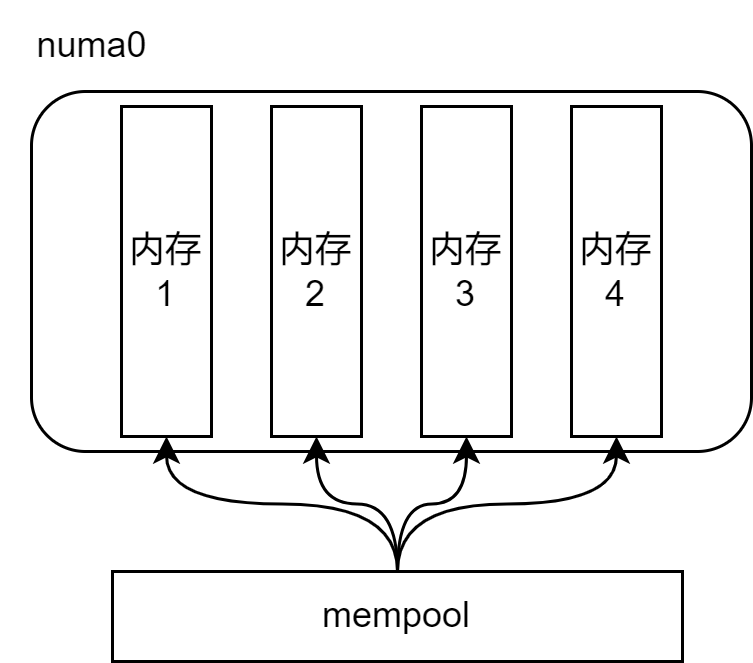
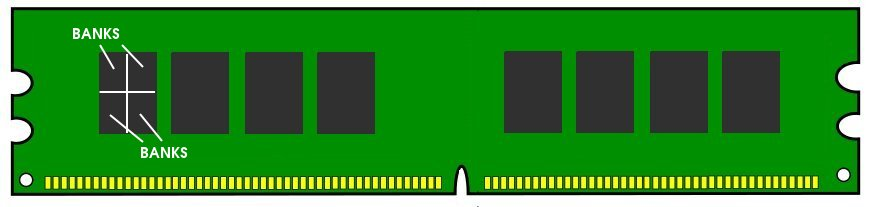
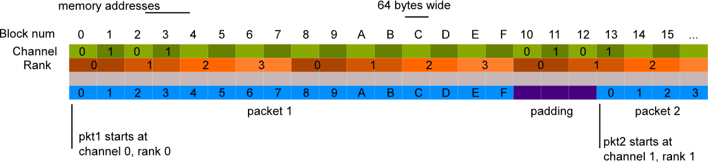

# dpdk内存管理均分优化分析

dpdk性能强劲，其核心原因在于针对优化点做了优化。下面就讲讲dpdk针对内存条特性做的一个软优化。

## 内存从哪里来



首先dpdk采用mempool形式管理内存，而它的内存是来自于其所属的numa节点的内存。

numa节点的内存其实就是内存条提供的。



上图就是一个内存条，内存条由三个东西组成:

1. channel：内存条插在设备插槽里面，插槽对应一个memory channel。也能2个插槽对应一个channel。
2. rank：一根内存条有2面。有芯片的为一个rank
3. bank：每个芯片会细分为多个bank。

再细致一点内存条结构如下:



能用的内存块，分布在ranks和channel中(这里不是很准确，因为其实ranks是channel的下层)。

如果mempool的元素的内存可以均匀分布到每根内存条，那么mempool的访问会充分利用全部的内存channel，性能更好。

原因在于:CPU 可以访问一个rank，而另一个rank可以进行刷新周期（准备好被访问）。刷新周期的屏蔽和流水线通常会为CPU 密集型应用程序带来更好的性能。

## DPDK需要做的以及其所做的优化

dpdk需要做一件事情:**让mbuf的首地址均匀的落在内存的channels和ranks中**。

下面是实现代码:

```c
static unsigned optimize_object_size(unsigned obj_size)
{
	unsigned nrank, nchan;
	unsigned new_obj_size;

	/* get number of channels */
	nchan = rte_memory_get_nchannel();
	if (nchan == 0)
		nchan = 4;

	nrank = rte_memory_get_nrank();
	if (nrank == 0)
		nrank = 1;

	/* process new object size */
	new_obj_size = (obj_size + RTE_MEMPOOL_ALIGN_MASK) / RTE_MEMPOOL_ALIGN;
	while (get_gcd(new_obj_size, nrank * nchan) != 1)
		new_obj_size++;
	return new_obj_size * RTE_MEMPOOL_ALIGN;
}
```

核心是`get_gcd`(最大公约数)代码。

```
举个例子：nrank*nchan=4，那么obj-size若为
不互质 6 mod 4 = 2， 2 * 6 mod 4 = 0 ， 3 * 6 mod 4 = 2, 4 * 6 mod 4 = 0 结果 0,2
 
互质    7 mod 4 = 3， 2 * 7 mod 4 = 2 ， 3 * 7 mod 4 = 1, 4 * 7 mod 4 = 0 , 结果 0,1,2,3
```

当然以上代码仅在X86平台下达到mbuf的首地址均匀的落在内存的channels和ranks中。

在19.11版本中，默认都会调用，在22.11中，这里用宏进行了限定，x86结构中用，非x86结构体中，直接返回obj_size。

# 结论

通过取最大公约数操作能够让内存尽可能的均匀分布在内存条的通道中，优化cpu密集型程序运行效率。