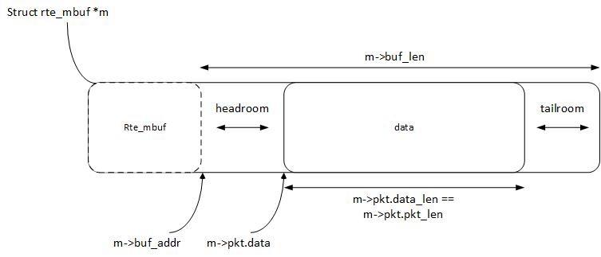

# dpdk mbuf模块分析

mbuf是dpdk中非常重要的一个模块。并且mbuf提供了可扩展字段HEAD_ROOM。通过`mbuf->buf_addr`中的buf_addr就能访问到DPDK的head room。这里的head room类似于vpp中的`vnet_buffer_opaque2_t`专门来为用户扩展的

## 1.内存结构



## 2.分配操作

mbuf由缓冲池`rte_mempool`管理，rte_mempool在初始化时一次申请多个mbuf，申请的mbuf个数和长度都由用户指定。宏MBUF_SIZE是例子程序中使用的mbuf长度：

```c
#define MBUF_SIZE (2048 + sizeof(struct rte_mbuf) + RTE_PKTMBUF_HEADROOM)
```

用下面函数向rte_mempool申请一个mbuf：

```c
struct rte_mbuf *rte_pktmbuf_alloc(struct rte_mempool *mp);
```

## 3.拷贝操作

宏RTE_MBUF_SCATTER_GATHER定义rte_mbuf是否支持拷贝功能。

dpdk接收报文并把报文上送上层应用的过程中，报文传输是“零拷贝”，即不需要拷贝报文内容，只需要传送mbuf地址。然而在一个报文上送给多个应用时，仍然需要对报文做拷贝并送给不同的应用。Librte_mbuf采用“复制rte_mbuf，共享data数据域”的方式实现报文的拷贝函数rte_pktmbuf_clone()，函数原型如下：

```c
struct rte_mbuf *rte_pktmbuf_clone(struct rte_mbuf *md, struct rte_mempool *mp);
```

rte_pktmbuf_clone()函数首先申请一个新的rte_mbuf，我们称这个mbuf为indirect buffer，用mi表示，参数md称为direct buffer。函数将md的各结构体成员（引用计数refcnt除外）一一复制给mi，同时将md的引用计数refcnt增1。此时，mi->pkt.data指向md的data数据域。

Rte_pktmbuf_clone()要求参数md必须是direct buffer，我们可以通过判断md->buf_addr – sizeof(struct rte_mbuf) == md 是否为真，确定md是否为direct buffer，该功能由宏`RTE_MBUF_DIRECT(mb)`实现。

注意：rte_pktmbuf_clone()提供的拷贝机制在某些场景不一定适用，如多个应用竞争data数据域。为避免竞争的发生，使用者可以通过拷贝data数据域实现自己的clone()。具体实现参考openvswitch-dpdk-1.1。

## 4.释放操作

用下面函数释放一个mbuf，释放过程即把mbuf归还到rte_mempool中：

```c
void rte_pktmbuf_free(struct rte_mbuf *m);
```

根据m的引用计数和m的indirect/direct类型，`rte_pktmbuf_free()`分以下方式释放m：
如果m的引用计数大于1，则只将m的引用计数减1，函数返回；
如果m的引用计数是1且m是direct类型，则将m的引用计数置0，然后把m归还mempool，函数返回；
如果m的引用计数是1且m是indirect类型，则rte_pktmbuf_free()将m引用计数置0，同时将m对应的direct buffer的引用计数减1(减1后引用计数为0则把direct buffer归还mempool)，把m归还mempool，函数返回；
`rte_pktmbuf_free()`通过函数`rte_pktmbuf_prefree_seg(struct rte_mbuf *m)`中的`rte_mbuf_from_indirect()`找到m对应的direct buffer，宏实现如下：

```c
static inline struct rte_mbuf *
rte_mbuf_from_indirect(struct rte_mbuf *mi)
{
	return (struct rte_mbuf *)RTE_PTR_SUB(mi->buf_addr, sizeof(*mi) + mi->priv_size);
}
```

通过判断`((mb)->ol_flags & IND_ATTACHED_MBUF)`是否为真判断m的indirect/direct类型。


## 5.解封装操作

rte_mbuf的结构与linux内核协议栈的skb_buf相似，在保存报文的内存块前后分别保留headroom和tailroom，以方便应用解封报文。Headroom默认128字节，可以通过宏`RTE_PKTMBUF_HEADROOM`调整。

可以通过m->pkt.data – m->buf_addr计算出headroom长度，通过m->buf_len – m->pkt.data_len – headroom_size计算出tailroom长度。这些计算过程都由以下函数实现：

```c
uint16_t rte_pktmbuf_headroom(const struct rte_mbuf *m)
uint16_t rte_pktmbuf_tailroom(const struct rte_mbuf *m)
```
假设m->pkt.data指向报文的二层首地址，可以通过以下一系列操作剥去报文的二层头部：

```c
m->pkt.data += 14;
m->pkt.data_len -= 14;
m->pkt.pkt_len -= 14;
```

这些操作已经由`rte_pktmbuf_adj()`实现，函数原型如下：
`char *rte_pktmbuf_adj(struct rte_mbuf *m, uint16_t len)`

同样可以通过以下一系列操作为IP报文封装二层头部：

```c
m->pkt.data -= 14;
m->pkt.data_len += 14;
m->pkt.pkt_len += 14;
```

这些操作由rte_pktmbuf_prepend()实现，函数原型如下：
`char *rte_pktmbuf_prepend(struct rte_mbuf *m, uint16_t len)`

如果需要在tailroom 中加入N个字节数据，我们可以通过以下操作完成：

```c
tail = m->pkt.data + m->pkt.data_len; // tail记录tailroom首地址
m->pkt.data_len += N;
m->pkt.pkt_len += N;
```

这些操作由`rte_pktmbuf_append()`实现，函数原型如下：
`char *rte_pktmbuf_append(struct rte_mbuf *m, uint16_t len)`

librte_mbuf还提供了rte_pktmbuf_trim()函数，用来移除mbuf中data数据域的最后N个字节，函数实现如下：

```c
m->pkt.data_len -= N;
m->pkt.pkt_len -= N;
```

函数原型如下：
`int rte_pktmbuf_trim(struct rte_mbuf *m, uint16_t len)`

## 6.添加自己的业务

还记得上文中的HEAD ROOM吗？vpp支持通过`vnet_buffer2(b)`(其中b为vpp中的mbuf，一般一个数据包为一个mbuf)访问。DPDK也需要支持这样的函数。

假设当前项目扩展结构体为`_HEAD_ROOM`,那么增加如下函数:


```c
// 获取head room中的值
inline _HEAD_ROOM get_headroom_from_mbuf(rte_mbuf * p_mbuf)
{
    return (_HEAD_ROOM)(p_mbuf->buf_addr);
}
```