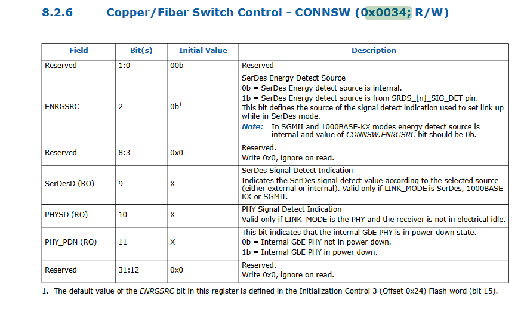

# dpdk光转电的问题

本文的目的是如何让读者了解通过芯片手册修改软驱。

## 网卡热插拔存在的问题

问题描述：
千兆光口网卡，当使用光转电模块时，在接口 up 过一次后，重新插拔一次光转电模块后接口不能 up。问题出现后手动调用一次 down、up 接口能够正常 up。

问题基础知识：

经过分析定位并与厂商沟通，确认 intel 的 igb 千兆网卡不支持光转电热插拔，这也就意味着无法推动厂商解决这个问题。

在上面的问题描述中，我描述了当问题出现时我们手动执行一次 down、up 后接口能够正常 up，这是一个关键的点，有了这个点后可以假设如果存在某种机制让程序能够捕获到光转电热插拔事件，然后执行一次接口 down、up 那么这个问题可能就能够得到解决了。

## 如何实现热插拔

程序如何捕获光转电热插拔事件？

按照上面的思路，我们需要寻找某种机制来让程序捕获光转电热插拔事件，通过阅读网卡的数据手册，的确找到了一个可能的点。

I210 数据手册中有一个与光口电口切换相关的控制寄存器——CONNSW，其全称如下：

`Copper/Fiber Switch Control - CONNSW (0x0034; R/W)`

这里 Copper 表示的是双绞线连接的方式，Fiber 表示的是使用光纤连接的意思。

手册中的寄存器描述信息如下图所示：



此寄存器的第 9 位 SerDesD field 全称是 SerDes Signal Detect Indication，当 I210 的 LINK_MODE 设定为 SerDes、1000BASE-KX、SGMII 的时候，这一位的变化能够反映出 SerDes 信号的变化。

经过测试发现，当我在插拔光转电模块的时候这一位会反转。有了这个基础，或许能够通过检测 CONNSW 寄存器中的第 9 位的变化来捕获到一次光转电热插拔事件。

## 解决方案

在用户程序中中创建一个线程，在线程中调用 dpdk 读取寄存器的接口，获取 CONNSW 寄存器的内容，每次都与旧的值的第 9 位进行对比，当值变化后首先判断上一次的接口状态，上一次的接口状态为up 时就执行一次 down、up 操作重新将接口 up 起来。

驱动中需要实现`rte_eth_dev_get_reg()`函数，该函数第二个参数为`0x0034`即CONNSW的寄存器首地址:

```c
int rte_eth_dev_get_reg(uint8_t port_id,uint32_t reg);
```


注意事项如下：
1. 这里需要保存上一次的接口状态进行判断，一些使用光纤线连接的接口当接口 down 掉后，CONNSW 中的第 9 位也会反转，如果不判断上一次的接口状态， 程序中中的光转电模块热插拔线程检测到这个变化后又会将接口 up 起来，就出现了接口 down 不掉的情况。
2. 需要根据网卡类型来判断是否需要执行相应的逻辑，只针对有这个问题的网卡型号执行操作
3. 上一次的接口状态在调用接口 down、up 的时候进行更新
   
参考代码如下:
1. issetdown 与 last_connsw_reg 变量分被代表接口的上一次状态与
上一次 connsw 寄存器的值，每一个接口都需要这两个变量，并且需要赋予初值

```c
   for(int i = 0;i<RTE_MAX_ETHPORTS;i++)
   {
        g_dpdkintf_stat[i].issetdown = 0;
        g_dpdkintf_stat[i].last_connsw_reg = 0xffffffff;
   }
```

2. 检测光转电模块热插拔事件的线程主体函数代码

```c
static void netcard_cfs_check(Nsintf &intf)  
{  
        uint32_t old_reg = 0, reg = 0;  
        uint32_t REG_CONNSW = 0x0034;/* Copper/Fiber switch control - RW */  
        uint32_t CONNSW_SERDESD = 0x200;/* this Bit of reg CONNSW will be set if any sfp phy sinal detected*/  
        if(intf.issetdown == 1) //有的网卡执行down后，connsw寄存器也会发生变化  
            return;  
        /*the register REG_CONNSW may not be changed when hotplug some sfp module*/  
        if(intf.nettype == I82576 || intf.nettype == I350 || intf.nettype == I210)  
        {  
            reg = rte_eth_dev_get_reg(intf.portid,REG_CONNSW);  
            old_reg = g_dpdkintf_stat[intf.portid].last_connsw_reg;  
            if( (reg != 0xffffffff) &&(old_reg !=0xffffffff)  
                 && ((reg & CONNSW_SERDESD) != (old_reg & CONNSW_SERDESD)))  
            {  
                rte_eth_dev_set_sfp(intf.portid);  
                set_updown("sfpcheck",intf.portid, false,0);  
                set_updown("sfpcheck",intf.portid, true);   
            }  
            g_dpdkintf_stat[intf.portid].last_connsw_reg = reg;  
        }  
    }  
``` 
注意这里调用了 rte_eth_dev_set_sfp 来重新识别插入的接口媒介类型。

3. 接口上一次状态更新的逻辑

```c
int update_network_interface(uint8_t port_id, uint8_t if_up)
{
    printf("Configure network interface of %d %s\n", port_id, if_up ? "up" : "down");
    Interface intf = &(GetInterfaces().m_intf[port_id]);
    int ret = 0;
    if(intf){
        rte_rwlock_write_lock(intf->updown_rw_lock);
        if (if_up != 0) {             
            intf->issetdown = 0;
            rte_eth_dev_stop(port_id);  
            ret = rte_eth_dev_start(port_id);
            if (ret < 0)
            {
                printf("Fail to start network port %d ret %s", port_id, rte_strerror(-ret));
            }
        }else{
            intf->issetdown = 1;
            rte_eth_dev_stop(port_id);            
        }
        rte_rwlock_write_unlock(intf->updown_rw_lock);        
    }
    return 0;
}
```

不使用 kni 口控制接口 up、down 的程序，可以在调用 rte_eth_dev_stop、rte_eth_dev_start 时更新 issetdown 变量。